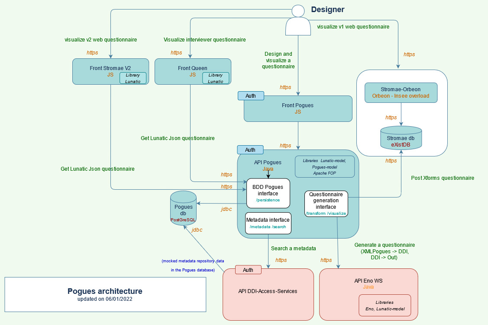

# Get Started : Install Survey Design product

## Before you begin

### Prerequisites

- **Kubernetes** : see getting started [here](https://kubernetes.io/docs/setup/)
- **Helm** : to install Helm, refer to the [Helm install guide](https://github.com/helm/helm#install)
- **kubectl** : to install kubectl, refer to the [kubernetes kubectl install guide](https://kubernetes.io/docs/tasks/tools/)

### Architecture scheme

### Docker Images

The official docker images required to deploy an instance of Survey Design product are available on the [inseefr docker repositories](https://hub.docker.com/u/inseefr) : 

- [Pogues](https://hub.docker.com/r/inseefr/pogues/tags)
- [Pogues-Back-Office](https://hub.docker.com/r/inseefr/pogues-back-office)
- [DDI-Access-Services](https://hub.docker.com/r/inseefr/ddi-access-services/tags)
- [Eno-WS](https://hub.docker.com/r/inseefr/eno-ws/tags)
- [Stromae V1 (1.X.X) et V2 (2.X.X)](https://hub.docker.com/r/inseefr/stromae/tags)
- [Stromae-db](https://hub.docker.com/r/inseefr/stromae-db/tags)
- [Queen](https://hub.docker.com/r/inseefr/queen)

:warning: Warning : don't use the lastest tag (not always updated).

To know the content of a tag, please refer to the corresponding release note in the github repository.

### Add repo Helm
This [repo InseeFr](https://github.com/inseefr/Helm-charts) contains the helm-charts of the product.

The following command allows you to download and install all the helm charts of this repository on Helm  : `helm repo add inseefr https://inseefr.github.io/Helm-Charts`

If you have already added the repository, you can update it like this : `helm repo update inseefr`

## Steps for deploying a new instance on a kubernetes cluster

You will need to install all the required applications for Survey Design product. Some uses a helm chart, others have classic kubernetes contracts.

Do not forget in example files :
- change the properties of the databases (in particular the passwords set by default to "password")
- change the host in the URLs
- change docker image tags (replace X.Y.Z).

Before launching the commands, go to the folder containing the values or the kubernetes contracts.

### Eno-WS

There is currently no helm-chart associated with the deployment of Eno. You must use kubernetes contracts.
You can find an example of contracts [here](./deploiement/Eno-WS/).

The following command allows you to install Eno-WS  : `kubectl apply -f .``

In this example, you can now log into Eno's swagger at https://eno-example.com/swagger-ui/index.html?url=/v3/api-docs&validatorUrl=

### Queen

You can use the [Helm Chart to deploy standard Insee application](https://github.com/InseeFr/Helm-Charts/tree/main/charts/ui-api-std).

You can find an example of values [here](./deploiement/Queen/).

The following command allows you to install Queen  : `helm install queen-demo inseefr/app -f queen-values.yaml`

In this example, you can now log into Queen at https://queen.example.com/queen/visualize

### Stromae-V2

You can use the [Helm Chart to deploy standard Insee application](https://github.com/InseeFr/Helm-Charts/tree/main/charts/ui-api-std).

You can find an example of values [here](./deploiement/Stromae-V2/).

The following command allows you to install Stromae-V2 : `helm install stromae-v2-demo inseefr/app -f stromae-v2-values.yaml`

In this example, you can now log into Queen at https://stromae-v2.example.com/visualize

### Stromae-V1
There is currently no helm-chart associated with the deployment of Stromae-V1. You must use kubernetes contracts of Stromae-V1 and Stromae-bd.

#### Stromae-db

You can find an example of contracts [here](./deploiement/Stromae-db/).

The following command allows you to install Stromae : `kubectl apply -f .` 

In this example, you can now log into Stromae eXist dashboard  at https://stromae-db.example.com/exist/apps/dashboard/index.html

#### Stromae

You can find an example of contracts [here](./deploiement/Stromae-V1/).

The following command allows you to install Stromae-db  :  `kubectl apply -f .` 

In this example, you can now log into Simpsons test questionnaire at https://stromae.example.com/rmesstromae/fr/esa-dc-2018/m1/new?unite-enquete=123456789

### DDI-Access-Services

There is currently no helm-chart associated with the deployment of Eno. You must use kubernetes contracts.
You can find an example of contracts [here](./deploiement/DDI-Access-Services/).

Note : DDI-Access-Services connects to the Pogues database: it is necessary to take the same database configuration (user, password, etc.) in the properties.

The following command allows you to install DDI-Access-Services  : `kubectl apply -f .` 

In this example, you can now log into DDI-Access-Services's swagger at https://ddi-access-services.example.com/swagger-ui/dist/

### Pogues

You can use the [Helm Chart to deploy Pogues UI, Pogues Back Office and initialize Postgre database](https://github.com/InseeFr/Helm-Charts/tree/main/charts/pogues).

You can find the database initialization script [here](./deploiement/Pogues/pogues-bdd-backup.sql)
Ce script initialise la base de données avec des métadonnées de questionnaires (série%2C opération%2C etc) et un premier questionnaire test %3A le questionnaire Simpsons.

You can find an example of values [here](./deploiement/Pogues/pogues-values.yaml).

The following command allows you to install Pogues : `helm install pogues inseefr/pogues -f pogues-values.yaml`

In this example, you can now log into Pogues-Back-Office's swagger at https://pogues-back-office.example.com/swagger-ui/dist/ and Pogues at https://pogues.example.com

**You have finished installing an instance of Survey Design Product in your kubernetes cluster: enjoy !**