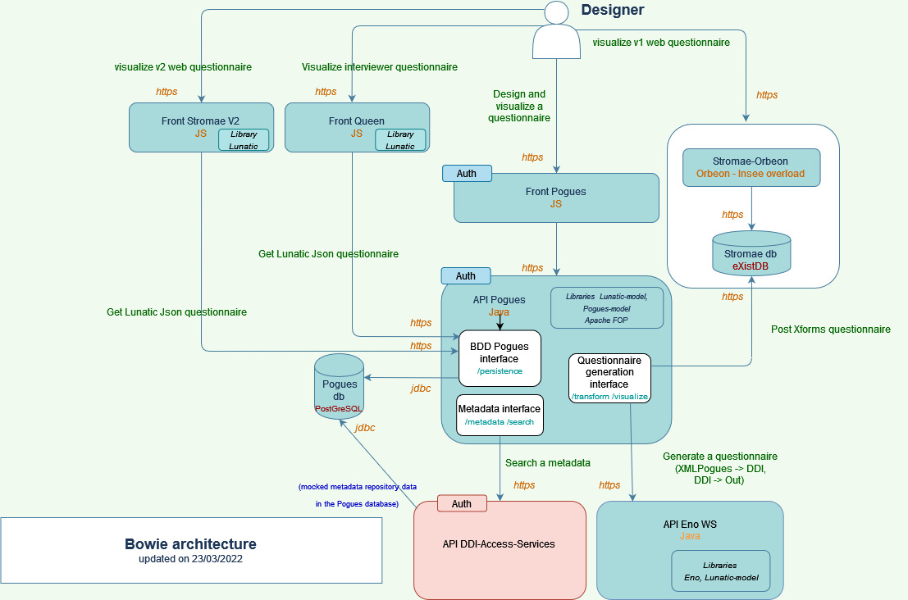

# Get Started : Install Bowie (Survey Design product)

## On a kubernetes cluster

### Before you begin

#### Prerequisites

- **Kubernetes** : see getting started [here](https://kubernetes.io/docs/setup/)
- **Helm** : to install Helm, refer to the [Helm install guide](https://github.com/helm/helm#install)
- **kubectl** : to install kubectl, refer to the [kubernetes kubectl install guide](https://kubernetes.io/docs/tasks/tools/)

#### Architecture scheme

The architecture of the Survey Designer is modular to make a multifunctional service (design, persist, generate, visualize,...). 

The installation of a minimum base is essential to enter a questionnaire: Pogues (FO, BO and DB) and DDI-Access-Services.

Finally, to access the visualization in the different survey tools, you must add Eno-WS (the DDI and PDF visualization will then be possible) and the orchestrators that interest you: (Queen, Stromae V1 or / and Stromae V2).

You can refer to the [Readme](./README.md) for more information.

#### Docker Images

The official docker images required to deploy an instance of Bowie are available on the [inseefr docker repositories](https://hub.docker.com/u/inseefr) : 

- [Pogues](https://hub.docker.com/r/inseefr/pogues/tags)
- [Pogues-Back-Office](https://hub.docker.com/r/inseefr/pogues-back-office)
- [DDI-Access-Services](https://hub.docker.com/r/inseefr/ddi-access-services/tags)
- [Eno-WS](https://hub.docker.com/r/inseefr/eno-ws/tags)
- [Stromae V1 (1.X.X) et V2 (2.X.X)](https://hub.docker.com/r/inseefr/stromae/tags)
- [Stromae-db](https://hub.docker.com/r/inseefr/stromae-db/tags)
- [Queen](https://hub.docker.com/r/inseefr/queen)

:warning: Warning : don't use the "lastest" tag (not always updated).

To know the content of a tag, please refer to the corresponding release note in the github repository and [bowie releases](https://github.com/InseeFr/Bowie/releases)

#### Add repo Helm

This [repo InseeFr](https://github.com/inseefr/Helm-charts) contains the helm-charts of the product.

The following command allows you to download and install all the helm charts of this repository on Helm  : `helm repo add inseefr https://inseefr.github.io/Helm-Charts`

If you have already added the repository, you can update it like this : `helm repo update inseefr`

### Steps for deploying a new instance on a kubernetes cluster

You will need to install all the required applications for Bowie. The majority of installations uses a unique helm chart Bowie.  
Only the optional V1 web visualization have classic Kubernetes objects specs (deployment.yml, ingress.yml, ...).

Do not forget in example files :
- change the properties of the databases (in particular the passwords set by default to "password")
- change the host in the URLs
- change docker image tags (replace X.Y.Z).

Before launching the commands, go to the folder containing the values or the Kubernetes objects specs.

#### Bowie

You can use the Helm [Chart to deploy Bowie](https://github.com/InseeFr/Helm-Charts/tree/dev-survey-design/charts/bowie) : Pogues UI, Pogues Back Office, initialize Postgre database, DDI-Access-Services, Eno, Queen UI and Stromae V2 UI.

You can find the database initialization script [here](./deploiement/Pogues/pogues-bdd-backup.sql). This script initializes the database with metadata (mocked metadata repository data) and a first test questionnaire : the Simpsons questionnaire.

You can find an example of values [here](./deploiement/values-bowie.yaml).

The following command allows you to install Bowie : `helm install bowie inseefr/bowie -f bowie-values.yaml`

:warning: : When the pods are running, you need to delete the pod from the Pogues API (pogues-back-office) with the command `helm delete pod {pod_name}`. 
Indeeed, Pogues-API is a Spring boot application. The configuration is such that the API tests the connection to the database once and if it does not get a response, does not retry. However, the database takes longer to be ready for use than the API. So if the pod is not deleted, there is no retry and the application does not work.
An application solution is being developed.

In this example, you can now find :
- Bowie UI (and Pogues UI) at https://pogues-ui.example.com
- Pogues-Back-Office's swagger at https://pogues-api.example.com/swagger-ui/dist/ 
- Queen at https://stromae-v2-ui.example.com/visualize
- Stromae V2  at https://stromae-v2-ui.example.com/visualize
- Eno at https://eno-ws.example.com/swagger-ui/index.html?url=/v3/api-docs&validatorUrl=
- DDI-Access-Service at https://ddi-access-services.example.com/swagger-ui/dist/

If you wish to have the "Web V1" view (soon to be deprecated), you can follow these instructions to install a Stromae-V1 and its associated database. Don't forget to add the associated properties to Bowie's values in the Pogues API.

#### Stromae-V1

There is currently no helm-chart associated with the deployment of Stromae-V1. You must use kubernetes objects specs of Stromae-V1 and Stromae-bd.

##### Stromae-db

You can find an example of Kubernetes objects specs [here](./deploiement/Stromae-db/).

Before launching the commands, go to the folder containing the values or the Kubernetes objects specs.
The following command allows you to install Stromae : `kubectl apply -f .` 

In this example, you can now find Stromae eXist dashboard at https://stromae-db.example.com/exist/apps/dashboard/index.html

##### Stromae

You can find an example of Kubernetes objects specs [here](./deploiement/Stromae-V1/).

Before launching the commands, go to the folder containing the values or the Kubernetes objects specs.
The following command allows you to install Stromae-db  :  `kubectl apply -f .` 

In this example, you can now find the Simpsons test questionnaire at https://stromae.example.com/rmesstromae/fr/esa-dc-2018/m1/new?unite-enquete=123456789

**You have finished installing an instance of Bowie in your kubernetes cluster: enjoy on https://pogues.example.com !**

## Other installations

We do not provide yet install scripts for other environment than kubernetes. If you would like install the survey desgin product elsewhere, please contribute to the project.
