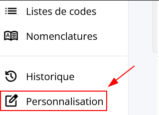
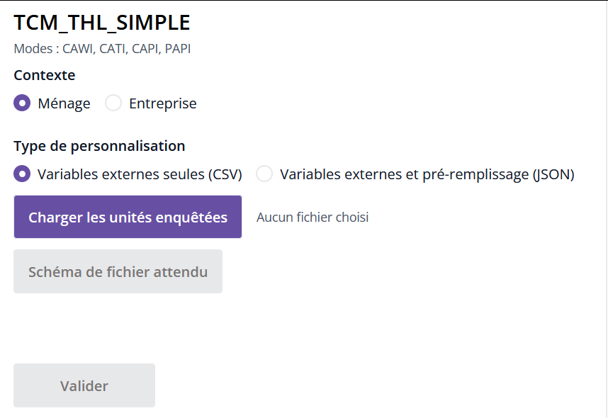

# Premier pas avec la Personnalisation

La manière la plus simple de débuter avec Personnalisation est de cliquer sur le bouton __Personnaliser__ depuis le menu de gauche dans Pogues :

Pour charger une personnalisation, il faut :

- renseigner le `Contexte` de collecte : "Ménages" ou "Entreprise",
- renseigner le `Type de personnalisation` : "Variables externes seules (CSV)" ou "Variables externes et pré-remplissage (JSON)" 
- charger un `Fichier de personnalisation` = donnés correspondant aux unités enquêtées pour les tests que l'on souhaite mener - ce que l'on détaille dans la [:octicons-arrow-right-16: création des unités enquêté](2-guide-perso-echantillon.md).

On peut ensuite **Valider** pour générer la personnalisation, puis [accéder aux visualisations des questionnaires](3-visualisation-questionnaires-perso.md) associés à ces unités enquêtés.