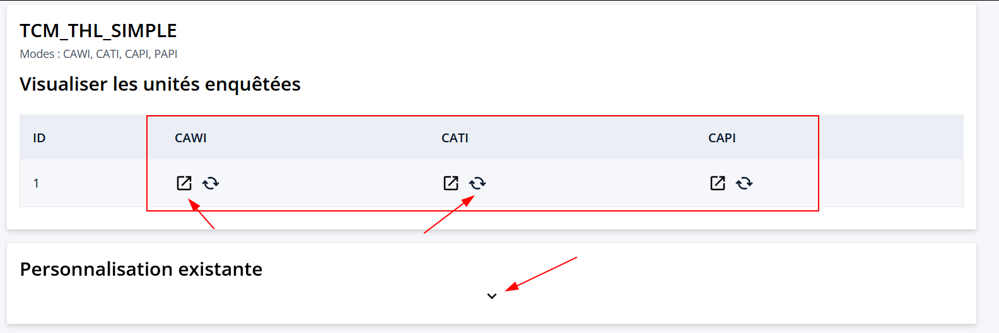
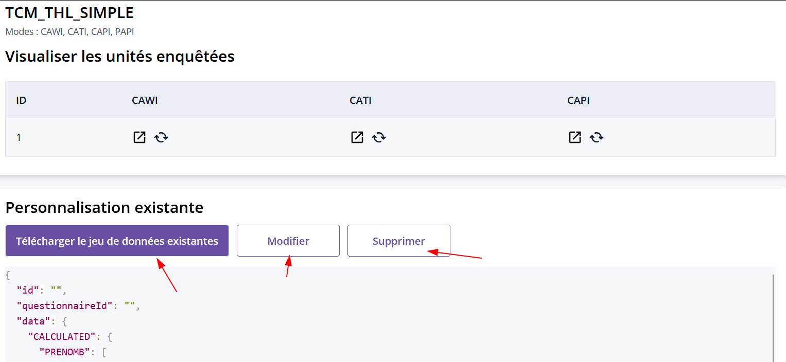
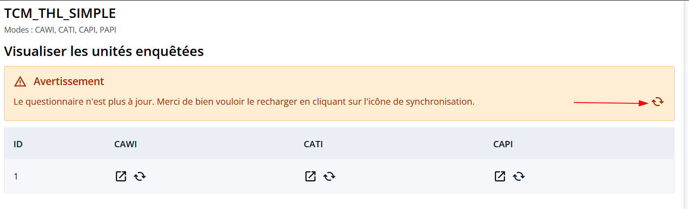

# Visualisation des questionnaires

Une fois l'échantillon chargé, le questionnaire configuré est accessible sur la page de "Personnalisation" :

Pour chaque Mode (CAWI, CAPI, CATI) on peut :

- :octicons-link-external-16: accèder à la liste des visualisations enrichies pour ce mode de collecte.
- :octicons-sync-16: ré-initier toutes les valeurs remplies durant la dernière visualisation.

On peut aussi accéder aux données actuellement chargé via la flèche vers le bas :octicons-chevron-down-16:, via le bandeau "Personnalisation existante". Pour le json c'est le contenu du fichier tel quel. Pour le csv, les données chargées sont affichées sous forme de tableau.

On peut ensuite,

- `Télécharger` le fichier actuellement utilisé pour la personnalisation
- `Modifier` la personnalisation (changer le contexte, le fichier chargé)
- `Supprimer` la personnalisation 

## Questionnaire désynchronisé

Si ce bandeau jaune apparaît, 

c'est que le questionnaire à été modifié depuis le dernier chargement de personnalisation. Un bouton :octicons-sync-16: est accessible tout à droite pour recréer la personnalisation avec la dernière version à jour du questionnaire.