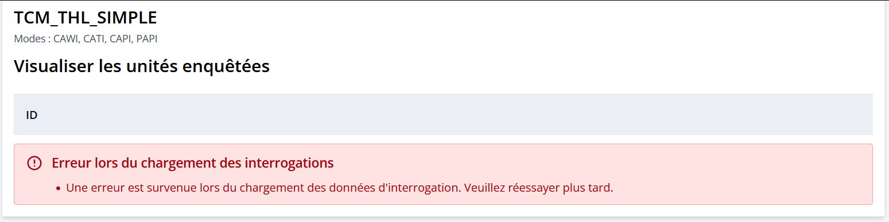
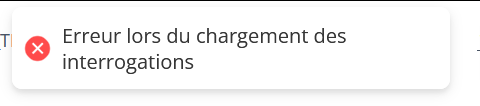
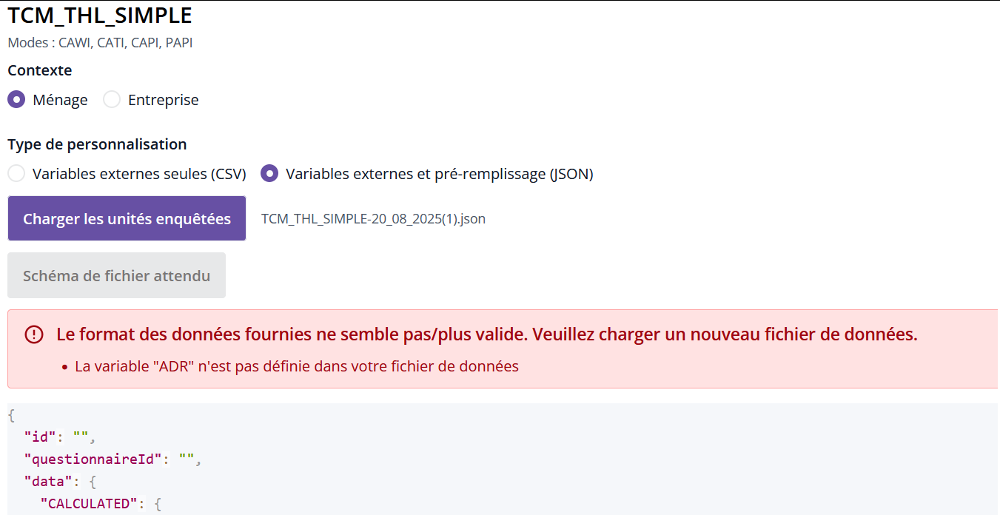

# Gestion des erreurs de personnalisation

## Erreur de synchronisation

Lorsqu'on modifie un questionnaire qui a déjà une personnalisation de chargée, et que c'est changement sont structurants pour le questionnaire (potentiellement le questionnaire est **cassé** entre temps), il se peut qu'apparaisse ce bandeau



De même, si on essaye de créer une personnalisation pour un questionnaire cassé, on la pop-up suivante qui apparaît


!!! tip "Solution"
    - Supprimer la personnalisation et voyez pour corriger le questionnaire avant d'en recréer une.

## Variables externes manquantes
Dans une visualisation simple depuis Pogues, il n'y a pas de variables externes, donc il n'y en a pas dans le json de données téléchargé non plus. Il faut les ajouter si besoin dans l'attribut `"EXTERNAL"`

Ex : dans mon cas il me manque la variable externe `ADR` car elle est définie dans mon questionnaire mais pas dans mon fichier json. Un message d'erreur apparait alors au moment de charger le fichier


Il suffit de modifier le fichier ane ajoutant un attribut `"ADR"` dans `"EXTERNAL"` pour que cela fonctionne.

```json
{
    "data": {
        "CALCULATED": {},
        "EXTERNAL": {
            "ADR": "mon adresse"
        },
        "COLLECTED": {
            "T_NHAB": {
                "COLLECTED": 2
            },
            "T_PRENOM": {
                "COLLECTED": [
                    "Pipo",
                    "Popi"
                ]
            }
        }
    },
    "stateData": {
        "state": "INIT",
        "date": 1755698985271,
        "currentPage": "3"
    }
}
```