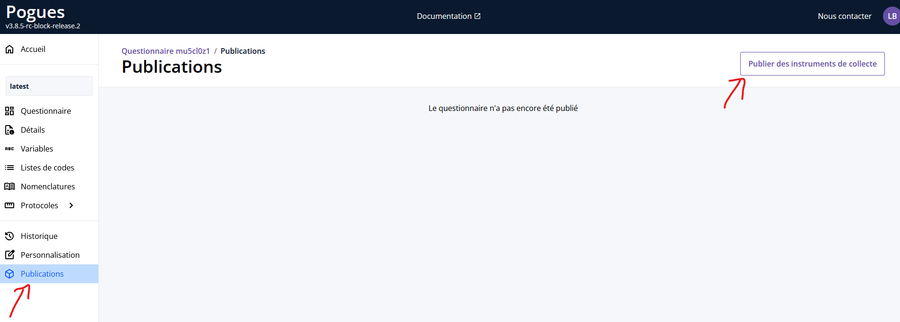
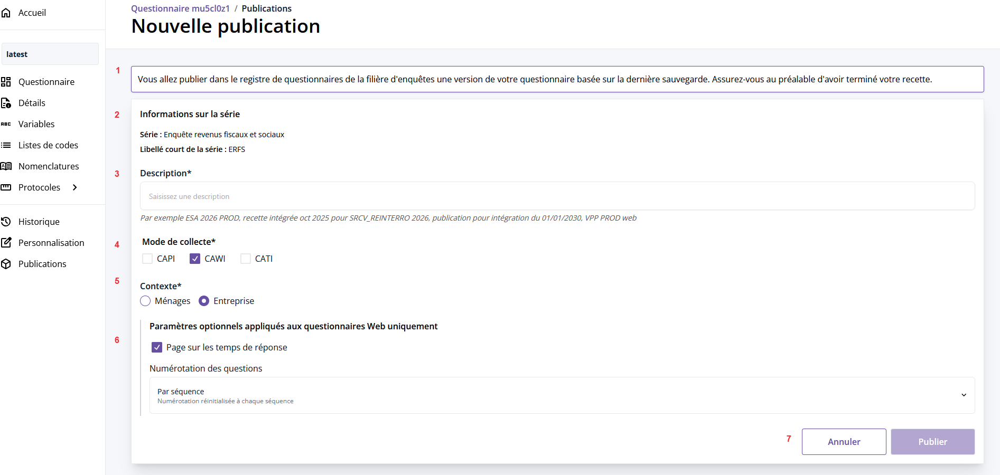
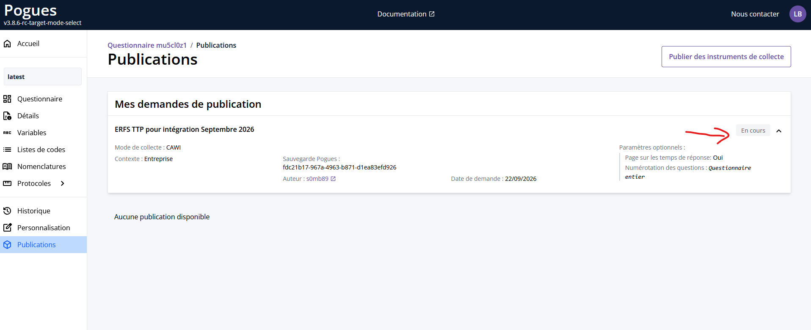
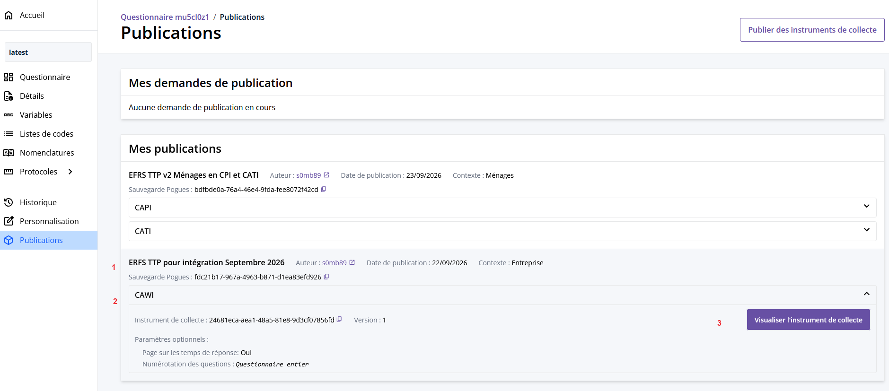

# Les publications au registre de questionnaires

## La publication depuis Pogues dans le registre de questionnaires

Lorsque la spécification du questionnaire sous Pogues est terminée, il est possible de publier, à partir de la sauvegarde courante d'un questionnaire, des instruments de collecte dans le registre de questionnaires.

_Qu'est ce qu'un instrument de collecte ?_

Le terme instrument de collecte désigne la déclinaison du questionnaire Pogues dans une forme adaptée au mode de collecte (sur internet, par enquêteur). Il dépend également du contexte - collecte d'une enquête entreprises ou ménages.
Un même questionnaire peut donc donner naissance à plusieurs instruments, selon les modes de collecte prévus. Ces instruments de collecte sont des fichiers au format Json Lunatic, et utilisés par les orchestrateurs.

La publication dans le registre consiste donc à créer dans le registre, à partir d’une version donnée du questionnaire Pogues, un ou plusieurs instruments de collecte correspondant aux modes de collecte souhaités.

Dans le registre on associe aussi à l'instrument de collecte des métadonnées telles que les nomenclatures et le questionnaire au format xml DDI.

## La création d'une publication

On accède à la page de gestion des publications des instruments de collecte via le menu `Publications` sur la gauche.

### Publier un instrument de collecte
Pour créer une publication au registre de questionnaire, cliquer sur le bouton `Publier un instrument de collecte`

!!! abstract "Légende"
    1. Texte d'information sur l'action de publication : on publie la sauvegarde en cours du questionnaire. Si vous souhaitez publier une autre sauvegarde, il faut la restaurer.
    1. Bloc d'information sur la série à laquelle le questionnaire est rattaché : les libellé et nom court de la série sont rappelés en lecture seule. Pour les modifier il faut aller la page [Détail](../h._Detail/index.md) du questionnaire. Ces deux champs sont obligatoires, si l'un ou l'autre n'est pas disponible dans Pogues, rapprochez-vous de l'unité qualité de l'Insee.
    1. Description de la publication : un champ texte libre
    1. Mode de collecte : sélectionner un ou plusieurs modes de collecte. Les modes proposés sont limités à ceux déclarés dans la page détail du questionnaire. Dans le registre, on générera autant d'instruments de collecte que de modes de collecte sélectionnés
    1. Contexte : Ménages / Entreprise
    1. Paramètres optionnels pour le contexte Entreprise en mode CAWI : page de collecte des temps de réponse et numérotation des questions
    1. Boutons `Annuler` / `Publier` pour annuler la demande et retourner à la page des publication ou valider la demande de publication

!!! warning "Attention"
    Une sauvegarde d'un questionnaire ne peut être publiée au registre qu'une seule fois : si vous souhaitez publier une nouvelle fois une sauvegarde donnée d'un questionnaire, il faut créer une nouvelle sauvegarde.

Le processus de publication est asynchrone : lorsque vous validez la création de la demande de publication d'un instrument de collecte, une nouvelle entrée apparaît dans le bloc `Mes demandes de publication` pendant le temps nécessaire à la génération de l'instrument de collecte (quelques secondes).

### Mes demandes de publication 
Cette entrée comporte le rappel des informations liées à la demande : description de la publication, mode, contexte, paramètres optionnels éventuels, l'identifiant de la sauvegarde Pogues sur laquelle se base la publication, l'auteur, la date de la demande.

Lorsqu'on rafraîchit la page, on voit le résultat de la demande : 

 -  en cas d'échec, l'entrée reste dans le bloc des demandes, le badge de statut passe de "En cours" à "Echec" avec mention de l'erreur qui a conduit à l'échec (en général une erreur de génération Eno lors de la création du questionnaire au format Lunatic). 
    - La notification d'échec peut être effacée grâce à l'icône 🗑️. 
    - Vous pouvez corriger votre questionnaire et recommencer une demande de publication ou contacter l'atelier de conception en cas de difficulté.
 -  en cas de succès, l'entrée passe dans le bloc des publications.

## La liste des publications d'un questionnaire

Le bloc `Mes publications` comporte la liste des publications réussies d'un questionnaire. Chaque publication se base sur une sauvegarde différente. 

On retrouve pour chacune les éléments suivants :
!!! abstract "Légende"
    1. Les informations générales sur la publication : Description, auteur, date de la publication, contexte (Ménages / Entreprise) ainsi que le rappel de la sauvegarde Pogues utilisée
    1. Pour chaque instrument de collecte, un bandeau dépliable avec le résumé des caractéristiques particulières : mode de collecte, numéro de version (incrémenté à chaque fois qu'un questionnaire est publié dans un mode), paramètres optionnels, identifiant de l'instrument de collecte avec un bouton permettant de copier l'identifiant
    1. Un bouton permttant d'ouvrir un nouvel onglet pour visualiser l'instrument de collecte

