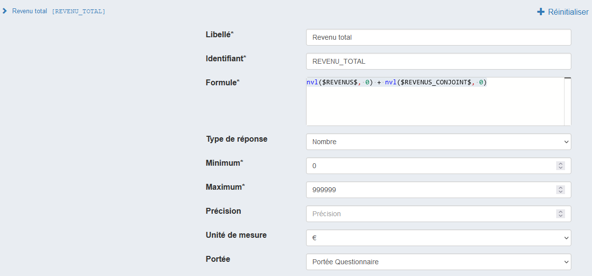

# Guide VTL Pogues

Ce document guide l’utilisateur de Pogues dans son usage du langage VTL.

## VTL

[VTL](https://sdmx.org/?page_id=5096) (Validation and Transformation Language) est un langage de programmation né dans le giron du standard de description de données aggrégées SDMX. Ce langage est adopté ou en cours d’adoption par les mêmes utilisateurs que SDMX, essentiellement des banques centrales et des instituts nationaux de statistiques.

Bien que conçu initialement pour le traitement de données aggrégées (eg des tableaux ou cubes de données), le langage est suffisamment souple pour qu’on puisse l’utiliser pour exprimer des contrôles, comme dans le cas des contrôles mis en oeuvre dans le cadre d’un questionnement.

On a donc choisi ce langage comme expression des contrôles et du dynamisme dans les questionnaires conçus dans Pogues dont la cible est les nouveaux outils de collecte développés dans le cadre du programme Metallica.

Les éléments les plus importants à retenir de l’usage de VTL dans Pogues :

- l’écriture se fait via un éditeur de code VTL,
- les références aux variables doivent être encadrées par des `$`
- il est dans le plus souvent nécessaire de gérer le cas où la variable n’est pas encore ou plus renseignée - sa valeur est nulle : `nvl($MA_VARIABLE$, "valeur si nulle")`,
- VTL fournit un certain nombre de fonctions utilitaires - comme `cast`et`nvl` - on répertorie les plus utiles dans ce document.

## Utiliser VTL

VTL est utilisé dès que l’on souhaite :

- créer un libellé personnalisé
- définir un contrôle
- créer une variable calculée
- définir la condition d’un filtre

Les champs correspondants dans Pogues proposent dans la plupart des cas un **éditeur VTL** :


## Fonctionnalités de l’éditeur

L’éditeur fournit :

- un soulignement syntaxique
- une autocomplétion des fonctions et variables
- une gestion des erreurs de syntaxe

## Bases de la syntaxe

Une chaîne de caractères s’écrit en encadrant du texte par deux double quote ("), par exemple :

```
"Voici un texte."
```

Un entier s’écrira simplement :

```
42
```

Un chiffre avec décimales :

```
3.14159
```

## Libellés

Voici un exemple de syntaxe pour un libellé personnalisé :


On utilise ici l’opérateur VTL `||` qui permet de concaténer des chaînes de caractères, ou une chaîne de caractères et une variable (ici `NOM`).

!!! warning "Attention!"

    Pour des raisons d’implémentation historique, il est encore nécessaire d’encadrer les noms de variables par `$`. Ainsi, **on pourra rechercher la variable** `NOM` **en la tapant telle quelle dans l’éditeur**, puis on ajoutera `$` en préfixe et suffixe, pour obtenir `$NOM$`.

!!! tip

    Dans l’exemple précédent, on ne gère pas le cas où la variable n’a pas été remplie. Pour anticiper ce cas, on peut utiliser la fonction VTL `nvl`, le libellé personnalisé devient ainsi :
    
    _Libellé personnalisé avec gestion de la nullité_

    Plus d’infos sur l’usage de `nvl` plus bas.

On pourra mobiliser dans un libellé personnalisé des variables collectées, calculées ou externes.

### Création d'un lien

Pour créer un lien hypertexte, on s'appuie sur la syntaxe Markdown :

```
"Voici un [lien](http://monlien.fr)."
```

### Infobulles

La syntaxe pour la création d’un infobulle est la suivante :

```
Mon libellé de question avec [une infobulle](. "dont voici le contenu").
```

!!! warning "Attention!"

    Il faut bien respecter la syntaxe pour le contenu de l’infobulle : un `.` avant le texte entouré de guillemets `"`.

## Contrôles

Un exemple de contrôle sur une valeur numérique :

_Libellé personnalisé avec gestion de la nullité_

## Variables calculées

Pogues permet de créer des variables calculées à partir de variables collectées. Par exemple, pour sommer les revenus de l’enquêté et de son conjoint on écrira :



L'expression VTL étant :

```
nvl($REVENUS$, 0) + nvl($REVENUS_CONJOINT$, 0)
```

## Filtres

Voici un exemple de filtre simple exprimé en VTL :

_Un filtre simple_

<span class="label label-rounded label-primary">À noter</span> À ce jour, le champ “Condition d’affichage” du filtre n’utilise pas l’éditeur VTL.

Toutes formes d’expression booléenne est valide :

```
# Possible
$MA_VARIABLE_CHAINE$ = "a value"

# Ou
$MA_VARIABLE_NUMERIQUE$ = 42

# Plus direct
$MA_VARIABLE_BOOLEENNE$
```

Un exemple plus complexe combinant plusieurs variables avec des “et” (`and`) et des “ou” (`or`) :

```
nvl($VARIABLE_EXCLUSIVE$, false) and
(nvl($AUTRE_VARIABLE_1$, false) or nvl($AUTRE_VARIABLE_2$, false) or nvl($AUTRE_VARIABLE_3$, false))
```

## Fonctions et opérateurs

L’usage de VTL dans Pogues et les outils de collecte s’appuie sur les bibliothèques Lunatic (pour les composants graphiques) et Trevas (qui fournit le moteur VTL).

C’est l’état d’avancement de cette dernière qui permet de connaître les opérateurs et fonctions disponibles : la référence est donc la [page de suivi de l’implémentation](https://inseefr.github.io/Trevas-TS/docs/coverage).

### Logique

| Nom | Symbole | Exemple        |
| --- | ------- | -------------- |
| Ou  | or      | true or false  |
| Et  | and     | true and false |

### Chaînes de caractères

#### Remplacer

| Nom          | Symbole | Exemple                            |
| ------------ | ------- | ---------------------------------- |
| Remplacement | replace | `replace("bag", "g", "c") # → bac` |

!!! tip "Aide"
    Une page référençant les fonctions les plus utilisées avec des exemples est disponible [ici](fonctions-vtl.md)

## Cookbook

### Durée

#### Calcul de durée

Pour calculer une durée à partir de variables collectées de type Date :

```
cast($ARRIVEE$, date, "YYYY-MM-DD") - cast($DEPART$, date, "YYYY-MM-DD")
```

Qui fournira le résultat en millisecondes. Pour avoir l'équivalent en jour on pourra écrire :

```
(cast($ARRIVEE$, date, "YYYY-MM-DD") - cast($DEPART$, date, "YYYY-MM-DD")) / 86400000
```

Pour plus de clarté, le calcul de la durée brute pourra être déportée dans une variable calculée, nommée par exemple `DUREE`, l'obtention du nombre de jours se fera alors à travers la formule :

```
$DUREE$ / 86400000
```

#### Contrôler un dépassement de borne

Une variable de type Durée aura une des formes suivantes :

- pour une mesure en "années/mois" : `PnaYnmM` où `na` sera le nombre d'années et `nm` le nombre de mois (par exemple : `P3Y10M` pour "trois ans et dix mois")
- pour une mesure en "heures/mois" : `PTnhHnmM` avec `nh` le nombre d'heures et `nm` le nombre de minutes (`PT12H30M` pour "douze heures et trente minutes").

Un contrôle typique est de s'assurer qu'on ne dépasse pas une borne max par exemple. Dans ce cas-là, on modifiera la valeur jusqu'à obtenir une valeur numérique, comme dans l'exemple ci-dessous :

``` title="valeur initiale de DUREE : PT12H30M"
cast(
    replace(
        replace(
            replace($DUREE$, "PT", ""), // "12H30M"
        "M", ""),                       // "12H30"
    "H", "."),                          // "12.30"
number)                                 // 12.30
> 7.3                                   // true
```

### Liste à choix multiples

#### Compter le nombre de choix

On souhaite calculer le nombre de cases cochées dans une liste à choix multiples. Les variables considérées sont nommmées dans notre cas `QCM1` à `QCM4`. Le code sera alors :

```
(if (nvl($QCM1$, false) = true) then 1 else 0) +
(if (nvl($QCM2$, false) = true) then 1 else 0) +
(if (nvl($QCM3$, false) = true) then 1 else 0) +
(if (nvl($QCM4$, false) = true) then 1 else 0)
```

<span class="label label-rounded label-primary">À noter</span> Cette solution est fastidieuse et difficile à mettre en place pour des longues listes. Des fonctionnalités non-encore disponibles dans VTL permettront à terme une expression plus directe de ce calcul.

### Boucles

#### Premiet et dernier éléments

Imaginons une boucle permettant de collecter des prénoms (à travers la variable `$PRENOM$`). Les fonctions `first_value` et `last_value` permettent de récupérer respectivement le premier élément de la variable vectorielle `$PRENOM$` en écrivant :

```
first_value($PRENOM$ over())
```

ou

```
last_value($PRENOM$ over())
```

...par exemple à travers une variable calculée.