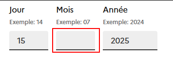
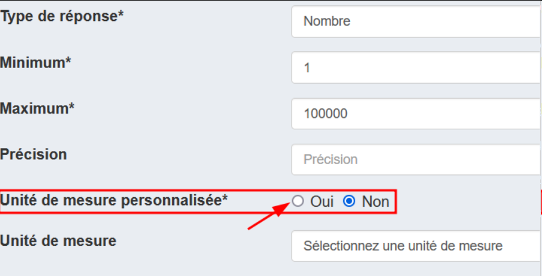
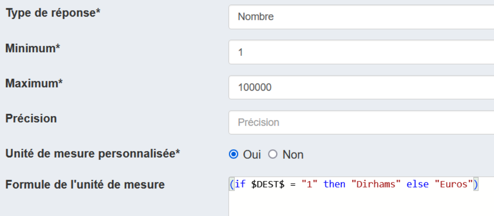
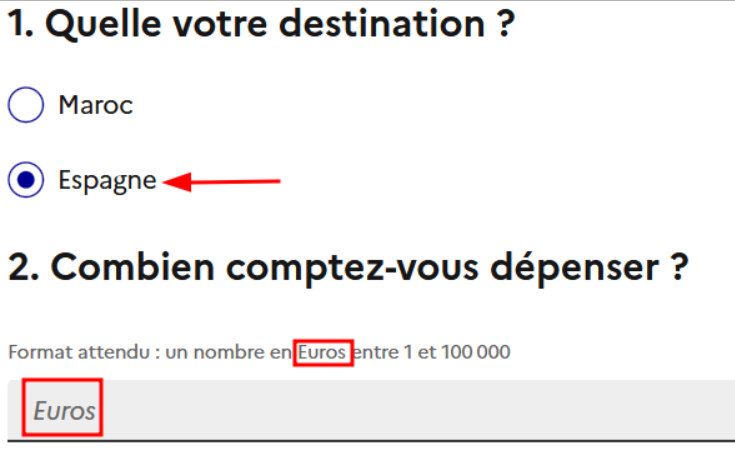
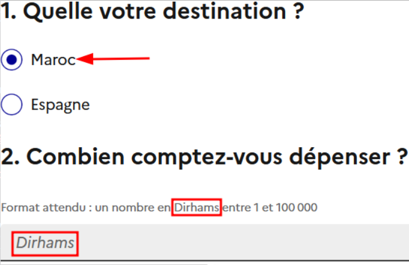

# Les questions de type Réponse simple

Pour créer une question de type **Réponse simple**, remplir, pour toutes les variables :

- le caractère _Obligatoire_ de la réponse (en 2024, l'information n'a pas d'effet sur l'affichage de la question au sein du questionnaire).
- le _type de réponse_ (Texte, Date, Nombre, Booléen, Durée)

## Type de réponse Texte
**Paramètres :**

- la _longueur maximale_ de la réponse (nombre de caractères)

!!! info
    - A l'initialisation du questionnaire, tout champ texte vaut `null`
    - Quand on saisie une valeur, ex `"mon texte"`, puis qu'on efface cette valeur du champ, alors le champ texte vaut `""` et non pas `null` comme au début.
    
    C'est pourquoi, pour gérer les cas de champ texte vide, il faut **[gérer la nullité](../Le%20VTL%20dans%20Pogues/vtl.md/#gestion-de-la-nullite)**. On remplace ainsi les valeurs `null` par `""` . <br>
    Ex de condition d'affichage d'un contrôle pour indiquer qu'un champ texte est vide
    ```
    nvl($VAR$, "") = ""
    ```

## Type de réponse Date
**Paramètres :**

- le _format_ parmi `AAAA-MM-JJ`, `AAAA-MM` et `AAAA`
- un _minimum_ et un _maximum_

!!! info
    - A l'initialisation du questionnaire, tout champ date vaut `null`
    - Quand on saisit une valeur, ex pour juste une année `2025`, puis qu'on efface cette valeur du champ, alors le champ date vaut `null` comme au début.
    - Pour gérer un champ Date vide il suffit d'utiliser [isnull()](../Le%20VTL%20dans%20Pogues/fonctions-vtl.md/#isnull)
        ```
        isnull($DATE$)
        ```

!!! warning "Type d'une point de vue VTL"
    - D'un point de vue Pogues, on parle bien d'un type *Date*, mais d'un point de vue VTL, une variable de type *Date* va en réalité être collectée en tant que **texte** sous l'un des formats cités plus haut.
    
        ??? example "Exemple"
            Si on collecte une date `ANNEE_NAIS` sous le format `AAAA-MM-JJ` et que l'on saisie les valeurs suivantes
            

            alors la variabel `ANNEE_NAIS` aura la valeur `"2025-02-01"` est sera un texte

        C'est pourquoi il est nécessaire de transtyper en utilisant la fonction [cast()](../Le%20VTL%20dans%20Pogues/fonctions-vtl.md/#cast) ces variables en `date` pour les comparer. Voir [exemple d'utilisation](../Le%20VTL%20dans%20Pogues/fonctions-vtl.md/#__tabbed_5_3)

    - Dans cette même logique, cela veut dire que l'on peut directement afficher une variable de type date dans un libellé dans utiliser

!!! danger "Précaution"
    - Si on laisse **vide** l'un des champs d'une date, alors **aucune valeur ne sera collectée** pour la variable associée. 
    <br>
    _Dans cet exemple Quand on regarde la valeur de la variable collecté correspondante, on a `null` car il manque le mois_

    - Comme le champ date est incorrect, si on clique sur continuer et qu'on fait précédent, tous les champs de date sont vides 


## Type de réponse Nombre
**Paramètres :**

- le _minimum_ et le _maximum_ 
- la _précision_ (nombre de chiffres après la virgule, par défaut : aucun)
- l'_unité de mesure_ fixe ou personnalisée

    ??? example "Exemple d'utilisation d'une unité de mesure personnalisée"
        ___Choix de l'unité de mesure___
        
        ___Exemple d'une expression VTL pour l'unité de mesure. `(if $DEST$ = "1" then "Dirhams" else "Euros")`___
        
        ___Si on choisi "Espagne" (`DEST=2`) alors on tombe dans le `else` et l'unité mesurée est "Euros"___
        
        ___Si on choisi "Maroc" (`DEST=1`) alors on tombe dans la condition du `if` et l'unité mesurée est "Dirham"___
        

!!! info
    - A l'initialisation du questionnaire, tout champ nombre vaut `null`
    - Quand on saisie une valeur, ex `86`, puis qu'on efface cette valeur du champ, alors le champ nombre vaut `null` comme au début.
    - Pour gérer un champ Nombre vide il suffit d'utiliser [isnull()](../Le%20VTL%20dans%20Pogues/fonctions-vtl.md/#isnull)
        ```
        isnull($NOMBRE$)
        ```
    
## Type de réponse Booléen
**Pas de paramètres**
!!! info
    - A l'initialisation du questionnaire, tout champ booléen vaut `null`. La case est visuellement décochée.
    - Quand on coche la case, alors la valeur collectée est `true`, puis quand on décoche, alors la valeur collectée est `false`.
    
    Comme pour le champ texte, il faut **[gérer le cas de la nullité](../Le%20VTL%20dans%20Pogues/vtl.md/#gestion-de-la-nullite)**, on remplace les valeurs `null` par `false` pour gérer les cas où la case est décochée. <br>
    Ex de condition d'affichage d'un contrôle pour indiquer qu'une case de type booléen n'est pas cochée.
    ```
    nvl($VAR$, false) = false
    ```
  
## Type de réponse Durée
**Paramètres :**

- le _format_ parmi

    - **années/mois** : `PnaYnmM` où `na` sera le nombre d'années et `nm` le nombre de mois (ex : `P3Y10M` pour "trois ans et dix mois")
    - **heures/minutes** : `PTnhHnmM` avec `nh` le nombre d'heures et `nm` le nombre de minutes (ex : `PT12H30M` pour "douze heures et trente minutes").


!!! info
    - A l'initialisation du questionnaire, tout champ durée vaut `null`.
    - Quand on saisie une valeur, ex `2025` et `12` pour année/mois, puis qu'on efface ces deux valeurs des champs, alors le champ durée vaut `null` comme au début.
    - Pour gérer un champ Durée vide il suffit d'utiliser [isnull()](../Le%20VTL%20dans%20Pogues/fonctions-vtl.md/#isnull)
        ```
        isnull($DUREE$)
        ```