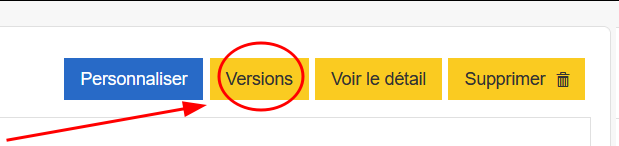
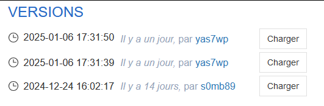

# La gestion de versions

## Accéder à la liste de versions

Pour accéder à la liste des versions d'un questionnaire, il suffit de cliquer sur le bouton "Versions" dans un questionnaire Pogues.

La liste des versions est affichée dans une modale. Chaque version contient les infos suivantes :

- **Date/Heure** à laquelle la version a été enregistrée;
- **Durée** écoulée depuis cette date;
- **idep** de la personne ayant enregistré cette version.

!!! info "Règle de conservation des versions"
    - Uniquement les 10 dernières versions de la journée actuelles sont conservées
    - Uniquement la dernière version des journées précédentes est conservée.

??? info "Précisions sur la dernière journée sauvegardée"
    Le "nettoyage" des versions pour les jours précédents n'est déclenché que lorsqu'on sauvegarde une nouvelle version.
    
    **Exemple :** On est le 17/02/2025 à 15:00
    
    1. On va sur un questionnaire qui a été dernièrement modifié le 01/02/2025.
    2. On clique sur le bouton `Versions`, la modale s'ouvre.
    3. On observe une liste de 5 versions : 
        - 3 versions du 01/02/2025 à 09:30, 11:00 et 11:35
        - 1 version du 28/01/2025 à 14:00
        - 1 version du 04/01/2025 à 09:00
    4. On retourne sur le questionnaire, on l'édite, on sauvegarde. Un nouvelle version du questionnaire est donc créée.
    5. On clique sur le bouton `Versions`, la modale s'ouvre.
    6. On observe une liste de 4 version :
        - 1 version du 17/02/2025 à 15:02
        - 1 versions du 01/02/2025 11:35 :exploding_head: Les deux premières versions du 01/02/2025 ne sont plus là.
        - 1 version du 28/01/2025 à 14:00
        - 1 version du 04/01/2025 à 09:00

    **Explication :** Au moment où on sauvegarde une nouvelle version, pour des raisons d'optimisation, on va ne garder que la dernière version du dernier jour (ici le 01/02/2025)

## Charger une ancienne version

On peut charger une version depuis la liste avec le bouton "Charger".  
Une confirmation apparaît "*Êtes vous sur ?*" avec deux choix  

- :heavy_check_mark: = charge la version associée
- :heavy_multiplication_x: = fait disparaître le message  

Si une modification du questionnaire est en cours, un avertissement est également affiché  
":warning: Vos modifications ne sont pas sauvegardées !"

Une fois la version chargée, on affiche le questionnaire Pogues. Quand on clique sur sauvegarder, cela crée une nouvelle version avec ces modifications.
