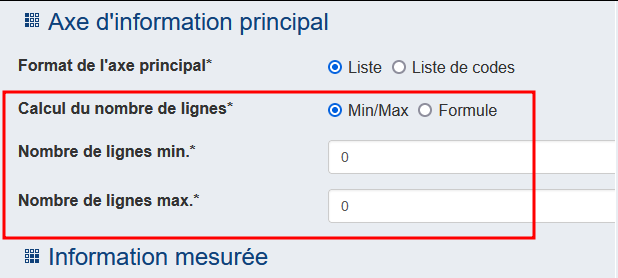
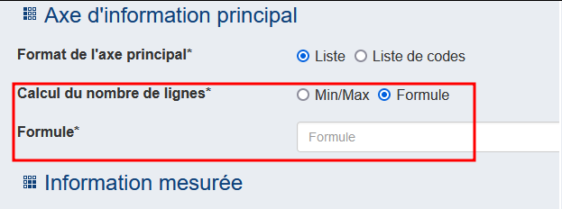
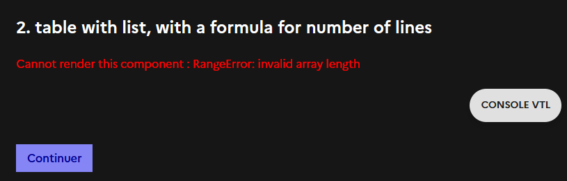
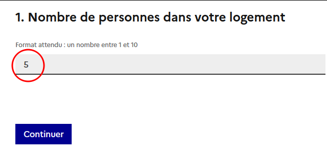
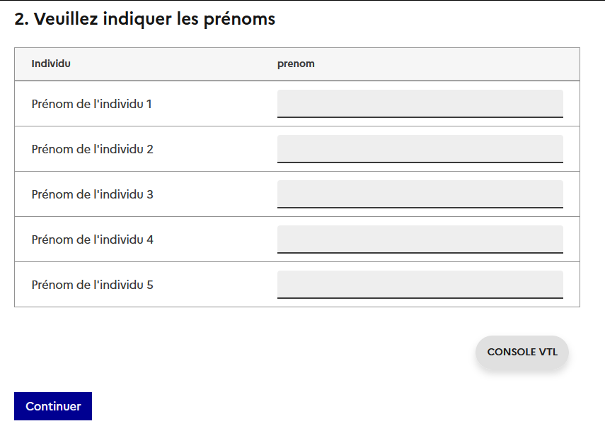
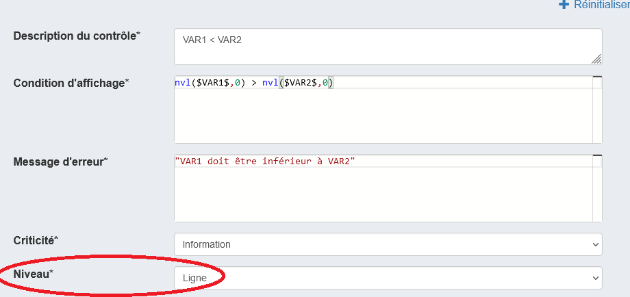

# Les tableaux dynamiques

On peut vouloir créer des tableaux dont on ne connait pas à l'avance le nombre de lignes (Tableau dynamique). Ces tableaux se présenteront : 

- sans en-tête de lignes en première colonne
- avec un bouton _Ajouter une ligne_ (sous le tableau)
- et un bouton _Supprimer une ligne_ (la dernière).

Pour ce faire, on créera une question de type Tableau avec pour axe principal une liste.

### Choix de l'axe d'information principal :  

Pour avoir un tableau dynamique, choisir `Liste`.  
On a ensuite 2 choix pour le calcul du nombre de lignes : `Min/Max` ou `Formule`

#### Nombre de lignes déterminés par `Min/Max`

- Indiquer le nombre de lignes minimum (aujourd'hui un nombre mais une évolution permettra à terme de saisir un champ VTL)
- Indiquer le nombre de lignes maximum (aujourd'hui un nombre borné à 300 mais une évolution permettra à terme de saisir un champ VTL)).

#### Nombre de lignes déterminés par `Formule`

- Indiquer une formule VTL qui doit retourner **un nombre**, imaginons `n`.
- Le tableau généré aura exactement `n` lignes 

??? danger "VTL non valide"

    Si le résultat du VTL n'est pas interprété avec le type 'Nombre', ex `Formule = "Du texte"`, on a l'erreur suivante
    

???+ example "Exemple de tableau dynamique avec formule VTL"
    
    - Si on a un questionnaire avec une question `NB_PERSONNE` de type _Nombre_
    
    - On peut alors créer ensuite un tableau dynamique avec pour formule de nombre de lignes `$NB_PERSONNE$`.
    Dans le cas où l'utilisateur réponds 5 à la question `NB_PERSONNE`, alors le tableau aura exactement 5 lignes    
    

### Information(s) mesurée(s) : 
renseigner une information de type _Réponse simple_ ou _Réponse à choix unique_
Si on souhaite qu'une de ces informations mesurées ne soit pas "collectée", voir l'item [données non-collectées](https://inseefr.github.io/Bowie/pogues/Le%20guide/Tableaux/3-cases-non-collectees)

## Calculer des totaux de lignes ou de colonnes

Ces totaux peuvent être ensuite utilisées dans deslibellés, des filtres ou des contrôles

- cf. [Total en ligne](./3-cases-non-collectees.md/#total-en-ligne)
- cf. [Total en colonne](./3-cases-non-collectees.md/#total-en-colonne)

## Contrôles

Dans l'onglet Contrôles, décrire classiquement le contrôle en VTL mais préciser son niveau : si le contrôle concerne les informations relatives à une ligne du tableau, préciser "Niveau : ligne"

## Préremplir un tableau avec des données non collectées

Pogues permet de préremplir certaines __colonnes__ des tableaux dynamiques, que ce soit par de la donnée externe ou par des variables calculées. Ces __colonnes__ ne sont alors pas modifiables en collecte.

[Spécifier des données non-collectées](./3-cases-non-collectees.md)

## Supprimer une ligne qui n'est pas la dernière

Impossible. 
