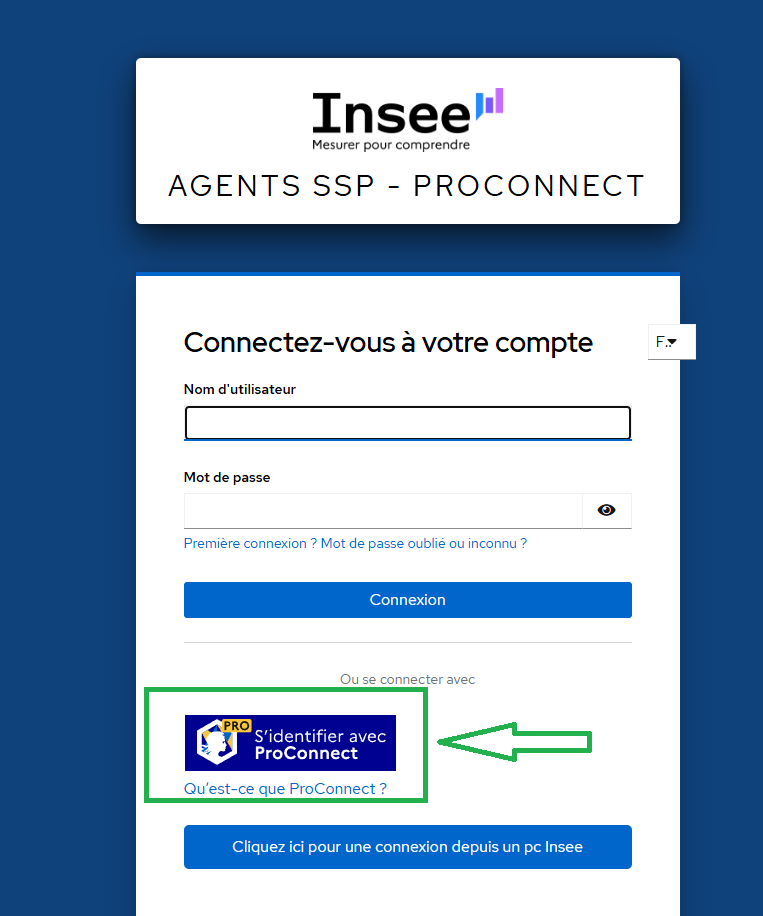
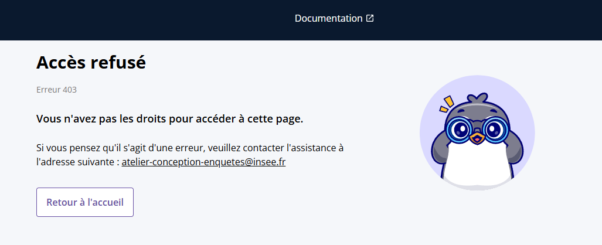

# Accéder à Pogues via ProConnect
Depuis l'été 2026, tous les utilisateurs utilisent la même [plateforme :materialopen-in-new:](https://conception-questionnaires.insee.fr/) pour accéder aux services de conception de questionnaires.

L'accès à Pogues et aux applications associées nécéssite une authentification et une habilitation s'appuyant entre autre sur **ProConnect**. Tous les utilisateurs, à l'Insee comme en SSM, doivent être habilités en tant qu'`utilisateur des outils CONCEVOIR de la filière d'enquête` pour utiliser l'application. 

Une revue de droits annuelle est réalisée.

!!! note
    Pour obtenir l'habilitation `utilisateur des outils CONCEVOIR de la filière d'enquête`, [contactez l'atelier de conception](mailto:atelier-conception-enquetes@insee.fr).

     

## Connexion pour un utilisateur Insee

Après habilitation par l'atelier de conception, il suffit d'utiliser [l'url de l'application :materialopen-in-new:](https://conception-questionnaires.insee.fr/). L'authenfication se fait automatiquement via ProConnect sinon vous pouvez utiliser le bouton `Cliquez ici pour une connexion depuis un pc Insee`.

## Connexion pour un utilisateur SSM ou statistique publique

Lors de votre première connexion depuis [l’url de l’application :materialopen-in-new :materialopen-in-new:](https://conception-questionnaires.insee.fr/), pensez bien à utiliser **le bouton « S'identifier avec ProConnect »** avant de saisir votre identifiant / mot de passe, la connexion directe avec identifiant  / mot de passe est inopérante.

Deux cas de figure : 

-	Vous êtes connu de notre annuaire et vous avez été habilité par l’atelier de conception : félicitation, vous faites partie des chanceux qui peuvent utiliser Pogues ;
-   Vous n'êtes pas connu de notre annuaire : votre authentification via ProConnect a réussi mais Pogues vous renvoie une erreur 403, dommage ! Rien n'est perdu car votre profil va remonter dans notre annuaire et l'atelier de conception pourra vous habiliter, [contactez-nous](mailto:atelier-conception-enquetes@insee.fr) pour y remédier.

Maintenant que vous êtes authenfié et habilité, vous pouvez démarrer la conception de vos questionnaires.