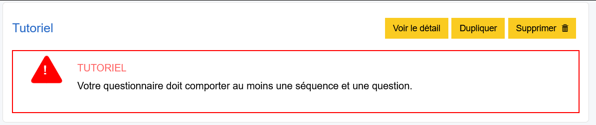
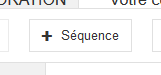
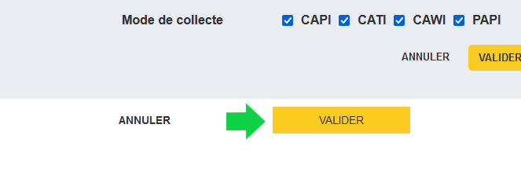
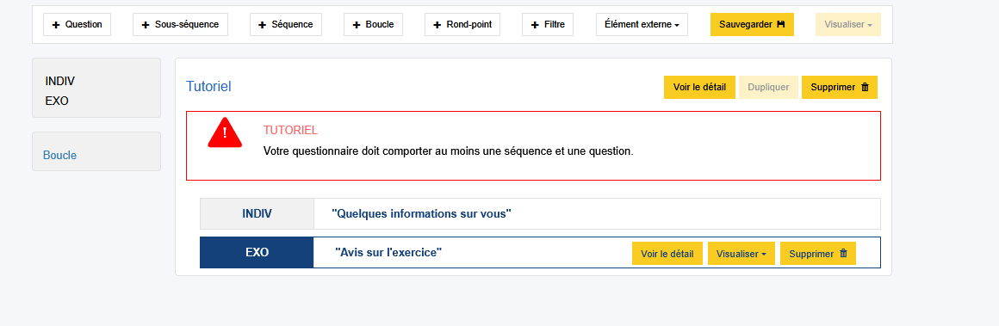
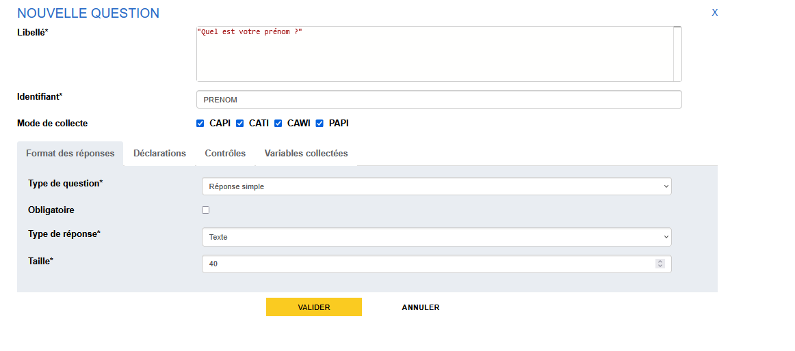
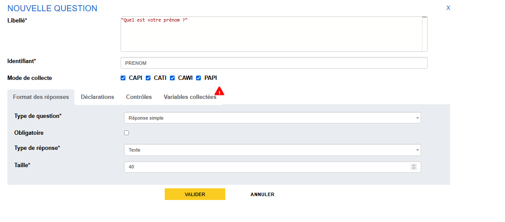
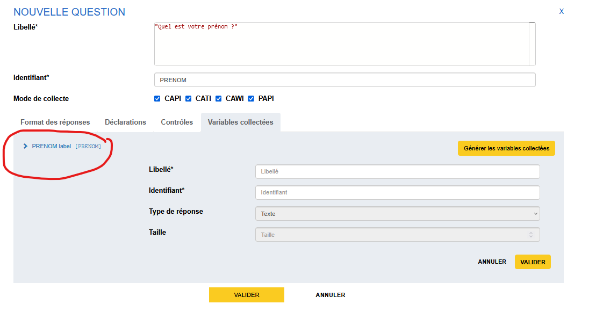
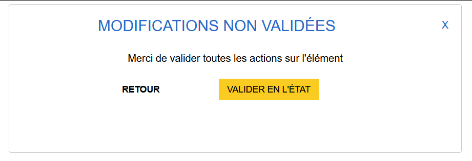
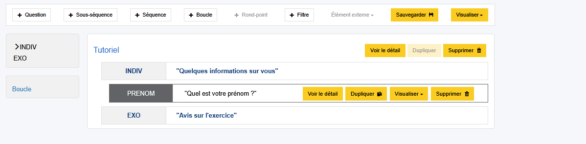

# Création d'une première séquence

Une fois le questionnaire créé, on arrive sur la vue d'ensemble (dite _vue structurelle_) du questionnaire.
Le questionnaire est vide et une alerte nous invite (lourdement !) à créer une séquence et une question. 

Donnons-lui du contenu ! :smile:

!!! tip
    Un questionnaire est composé de séquences, sous-séquences et questions. Les possibilités d'articulation sont les suivantes :

    ```
    Questionnaire
    |-- [Séquence]
        |-- [Question]
        |-- [Sous-séquence]
            |-- [Question]
    ``` 

    Un questionnaire doit contenir au moins une séquence et une question.
    Une séquence contient des questions et/ou des sous-séquences. Une sous-séquence peut contenir des questions.

## Création de la séquence

Pour créer la première séquence, il suffit de cliquer sur le bouton "+ Séquence" de la barre d'actions :



Une fenêtre modale s'ouvre avec deux champs à remplir obligatoirement :

- _Libellé_ : Titre de la séquence tel qu'il va apparaître dans le questionnaire aux enquêtés ou enquêteurs
- _Identifiant_ : Identifiant métier de la séquence. Par défaut l'application propose les premiers caractères du libellé de la séquence, il est modifiable.

Les modes de collecte restent les mêmes que ceux du questionnaire.

!!! example "Cas pratique"
    Saisissons la première séquence avec le *libellé* `"Quelques informations sur vous"`.
    
    Quand on sort du champ *libellé*, on voit que le champ *identifiant* est automatiquement rempli avec `QUELQUESIN`. Ici Pogues prend les 10 premiers caractères alphanumériques du libellé les concatène et les met en majuscule. Ce nom est arbitraire et peu parlant pour la suite du questionnaire. Donnons lui l'identifiant `INDIV` pour individu.

Pour finaliser la création, on appuie sur le bouton "Valider" en bas de la fenêtre :



!!! example "Cas pratique"
    Vous allez créer les 2 séquences qui constituent notre questionnaire "Tutoriel"

    | Identifiant | Libellé |
    | - | - |
    | `INDIV` | `"Quelques informations sur vous"` |  
    | `EXO` | `"Avis sur l'exercice"` | 

??? success "Solution"
      

!!! abstract "Pour aller plus loin"
    - [Les Séquences](../🚀_Guide/10-sequences.md)

Mais ce n'est pas fini... On peut voir que le questionnaire est toujours mécontent et nous indique qu'il faut aussi créer au moins une question, ce que nous allons faire de ce pas ! 

## Création d'une question
Nous allons maintenant créer la première question de notre questionnaire et la placer dans la première séquence.

!!! example "Cas pratique"
    1. Placez vous sur la première séquence `INDIV` : cliquer sur le bloc associé à `INDIV`.     
        _Vous devez voir qu'une fois sélectionné, le bloc est mis en évidence par l'encadré en bleu._
    2. Dans la barre des actions, le bouton "+ Question" permet la création d'une question.
    3. Suivez les prochaines indications afin de spécifier une question avec les informations suivantes : 
        - Un identifiant `PRENOM` 
        - Une réponse simple 
        - Un type texte de taille 40


On revient dans la section suivante sur le détail des options, mais terminons d'abord la création de cette première question en cliquant sur "VALIDER".



Pogues nous alerte d'une anomalie dans l'onglet "Variables collectées" : nous n'avons pas généré les variables collectées !
Il reste une dernière étape, la création de la variable collectée associée (variable sous-jacente).




### Création de la variable

Pogues distingue **la question** de **la réponse** de **la donnée collectée (= la variable)**. Il faut donc explicitement créer cette dernière.

Pour cela, on se dirige vers l'onglet "Variables collectées" puis on clique sur le bouton "Générer les variables collectées".

On voit alors apparaître une variable `PRENOM`. On peut enfin valider la question en cliquant sur le plus gros bouton "Valider" en bas de la fenêtre.


!!! Note
    Lorsque vous validez une question, une fenêtre peut apparaître avec le texte "Modifications non validées. Merci de valider toutes les actions sur l'élément.".
    

    Cela signifie tout simplement que certains champs à l'intérieur de la question n'ont pas été explicitement validés (à l'aide d'un bouton de validation dédié).

    Si vous êtes sûr du contenu de ces éléments, vous pouvez tout simplement cliquer sur _Valider en l'état_, l'ensemble de ce que vous avez saisi sera sauvegardé.

### Gestion de la variable collectée

Lorsqu'on est sur l'onglet des "Variables Collectées". On peut cliquer sur la variable afin de voir les informations associées.
    


Ici, seuls les champs _Identifiant_ et _Libellé_ sont modifiables. Ces champs sont importants pour la documentation de vos variables dans la suite du processus de l'enquête ! Le libellé (description) et l'identifiant doivent vous permettre de vous repérer dans l'ensemble des variables du questionnaire.

!!! warning 
    À chaque fois qu'on régénère les variables, Pogues va écraser tous les noms des libellés et identifiants et il faudra tout renommer à la main. Cela peut vite devenir fastidieux sur de gros tableaux ou QCM.

Les autres champs ne sont pas modifiables car sont **directement associés aux paramètres de la question**. Si jamais ces informations sont incorrectes, c'est que votre question l'est aussi. Il faut alors retourner sur l'onglet "Format des réponses" et changer ces paramètres en conséquence.

??? success "Solution"
    Pogues est enfin content ! Il ne râle plus et on peut enfin **sauvegarder** notre questionnaire.
    
    
!!! abstract "Pour aller plus loin"
    - [Les questions](../🚀_Guide/Questions/index.md)
    - [Variables Collectées](../🚀_Guide/Variables/variables-collectees.md)
    - [Nommage des variables](../🚀_Guide/Variables/nommage.md)
    - [Les questions simples de type texte](../🚀_Guide/Questions/13-reponse-simple.md/#type-de-reponse-texte)

## Sauvegarde du questionnaire

Nous disposons maintenant d'un questionnaire simple, contenant une séquence et une question, il est temps de :material-content-save: __sauvegarder__ !

Un simple clic sur le bouton "Sauvegarder" de la barre d'action fait l'affaire.

!!! tip
    Vous pouvez facilement gérer la liste de vos sauvegardes avec le menu [**historique**](../🚀_Guide/29-historique.md) ✨

## Suite
Nous allons maintenant [visualiser le questionnaire](12-visualisation-questionnaire.md).
