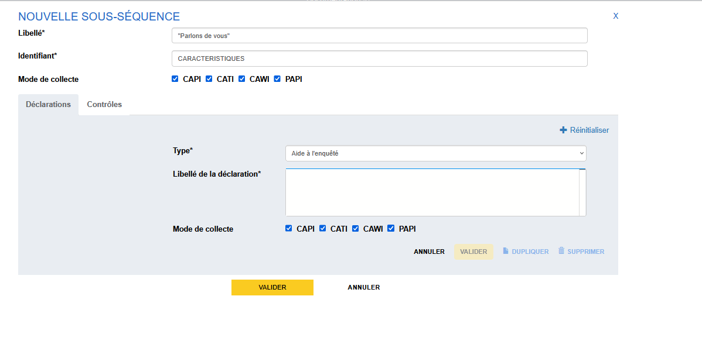
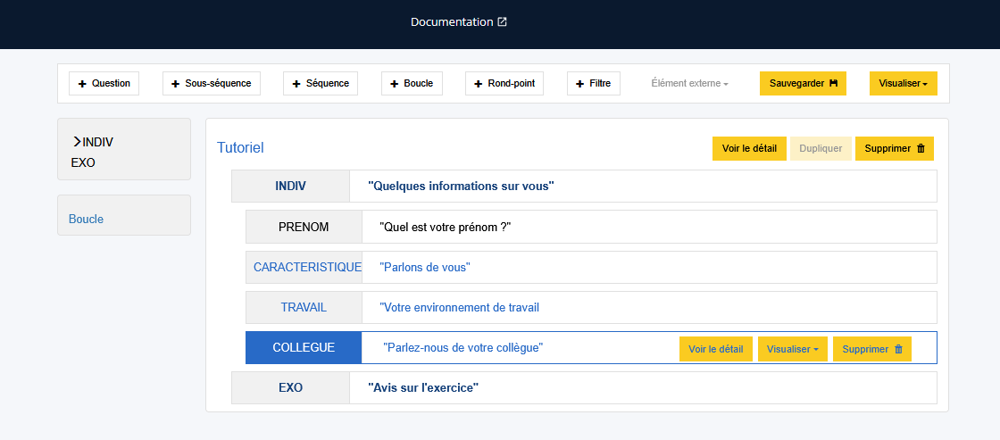
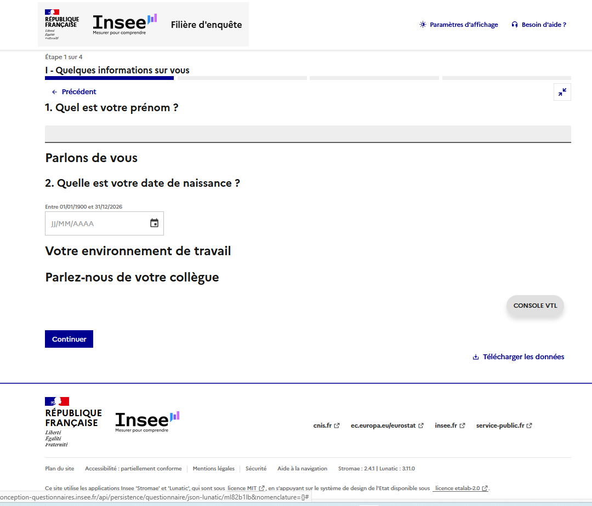

# Construction de la structure du questionnaire


## Structure de la séquence "Quelques informations sur vous"
Nous poursuivons la construction du questionnaire en spécifiant les sous-séquences et les questions de la première séquence "Quelques informations sur vous". Pour rappel, la composition de cette séquence ressemble à ça :

```
Questionnaire
|-- [Séquence] INDIV
|   |-- [Question simple] PRENOM
|   |-- [Sous-séquence] CARACTERISTIQUES
|   |   |-- [Question simple] T_DATENAIS 
|   |   |-- [Question à choix unique] T_SEXE 
|   |   |-- [Question à choix multiple] T_NATIO 
|   |   |-- [Question à choix unique, recherche sur liste] T_NATIONETR 
|   |-- [Sous-séquence] TRAVAIL
|       |-- [Tableau] ACTIVITES
|       |-- [Question simple] COMBIEN_PARTAGE
|   |-- [Sous-séquence] COLLEGUE
|   |   |-- [Question à choix unique] TEMPS_PARTIEL 
|   |   |-- [Question à choix unique] COLLABORATION
|-- [Séquence] EXO
```

## Création des sous-séquences
D’abord, créons les trois sous-séquences. 

Commençons par la sous-séquence `CARACTERISTIQUES`. Pour cela on se place dans la séquence qui nous intéresse, sur l'élément sous lequel on veut voir apparaître notre sous-séquence : on clique sur la question `PRENOM` puis on clique sur le bouton "Sous-séquence" dans le bandeau du haut.


Il suffit ensuite de remplir la modale qui vient de s'ouvrir avec les informations suivantes et valider.

- _Identifiant_ : `CARACTERISTIQUES`
- _Libellé_ : "Parlons de vous"



Faire de même avec les deux autres sous-séquences :

- sous-séquence `TRAVAIL` ayant le libellé "Votre environnement de travail";
- sous-séquence `COLLEGUE` ayant le libellé "Parlez-nous de votre collègue".

??? success "Solution"
    

!!! abstract "Pour aller plus loin"
    - [Les sous-séquences](../🚀_Guide/11-sous-sequences.md)


### Question sur la date de naissance
Nous allons créer maintenant une question simple, `T_DATENAIS`, mais avec un nouveau type de réponse, le type "Date".

On a besoin pour ce type de question de spécifier un format (AAAA-MM-JJ, AAAA-MM, AAAA) et des bornes minimum et maximum, décrites selon le format choisi.

!!! example "Cas pratique"
    Placez vous sur la sous-séquence `CARACTERISTIQUES` puis créez une nouvelle question simple avec les informations suivantes :

    - _Libellé_ : "Quelle est votre date de naissance ?"
    - _Identifiant_ : `T_DATENAIS`
    - _Type de question_ : Réponse simple
    - _Type de réponse_ : Date
    - _Format_ : AAAA-MM-JJ
    - _Minimum_ : `1900-01-01`
    - _Maximum_ : `2026-12-31`

??? success "Solution"
    

Générez la variable puis validez.

!!! abstract "Pour aller plus loin"
    - [Les questions simples de type date](../🚀_Guide/Questions/13-reponse-simple.md/#type-de-reponse-date)

Ici on récupère bien une date au format année/mois/jour. Nous verrons plus tard comment réutiliser cette variable collectée pour calculer l'âge via justement ce qu'on appelle une "variable calculée".


### Visualiser, c'est tester !

!!! info "On n'oublie pas de Visualiser et Sauvegarder si la visualisation est valide !"
    Nous avons fait quelques changements dans le questionnaire. Une bonne pratique est de ne pas attendre d'avoir fait trop de changements avant de visualiser pour les valider. Il faut aller pas à pas pour bien maîtriser ce que l'on fait.

Cette fois, utilisons la visualisation "Web entreprise". Cette visualisation a la particularité de mettre **toutes les questions d'une même séquence sur la même page**. 

On observe ainsi toute la structure de la première séquence, avec l'enchaînement des sous-séquences et les questions qu'elles contiennent.



Sur la page suivante, on retrouve la deuxième séquence "Avis sur l'exercice" qui reste à construire.


Lorsqu'on est satisfaits des changements réalisés, **on sauvegarde !**

!!! tip "N'hésitez pas à varier les contextes de visualisation durant tout ce tutoriel"

!!! abstract "Pour aller plus loin"
    - [La visualisation web](../../5._Orchestrateurs/Stromae-DSFR/index.md)

## Suite
Nous allons maintenant voir comment créer une [question à choix unique (QCU)](14-creation-liste-qcu.md).
