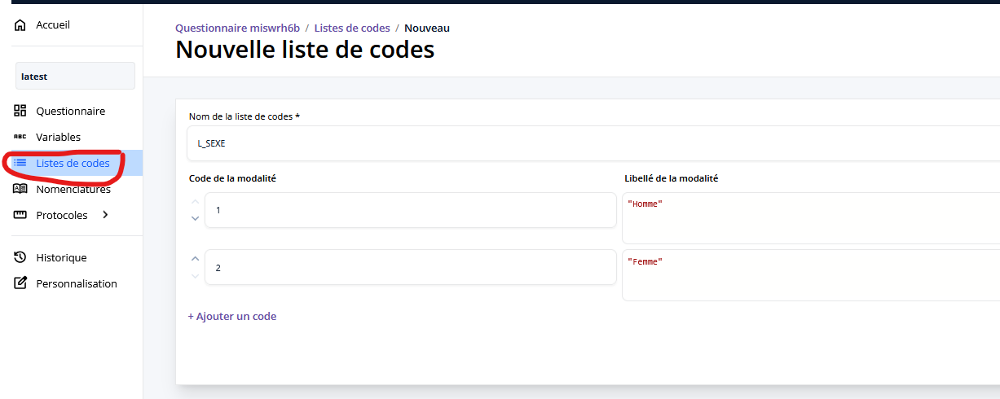

# Création d'une réponse basée sur une liste

Pour collecter le sexe du répondant, nous allons créer une question de type question à choix unique (QCU) : on va laisser le répondant choisir la modalité qui décrit le mieux sa situation dans une liste fermée de réponses.
Avant de créer la question, on va créer la liste de codes avec les modalités de réponse. 

## Création d'une liste

Dans le menu de gauche, cliquer sur "Liste de codes" pour ouvrir la page de gestion des listes de codes puis sur "Créer une liste de codes".

On crée une nouvelle liste L_SEXE avec les modalités classiques "1" = "Homme", "2" = "Femme".

!!! abstract "Pour aller plus loin"  

    

    - __[Les listes de codes :material-arrow-right-bold-box-outline:](../🚀_Guide/14-liste-codes.md)__

    

## Création de la question

Maintenant que notre liste de codes est prête, on peut créer notre question !

On retourne au questionnaire en cliquant sur "Questionnaire", puis on se place sur l'élément sous lequel on veut positionner la nouvelle question (ici c'est la question sur la date de naissance) et on clique sur "Question".
On crée une question de type "Réponse à choix unique", de type saisie "Bouton radio", et dans le menu déroulant des listes de codes on choisit la liste de codes "L_SEXE" qu'on vient de créer.

!!! example "Cas pratique"
    Placez vous sur la question `T_DATENAIS` puis créez une nouvelle question avec les informations suivantes :

    - _Libellé_ : "Quel est votre sexe ?"
    - _Identifiant_ : `T_SEXE`
    - _Type de question_ : Réponse à choix unique
    - _Type de saisie_ : Bouton radio
    - _Choix de la liste de codes_ : L_SEXE

Comme d'habitude, on n'oublie pas de générer les variables collectées avant de valider la question.

## Suite
[Création de questions à choix multiples et recherche sur liste](15-creation-qcm.md){ .md-button }
