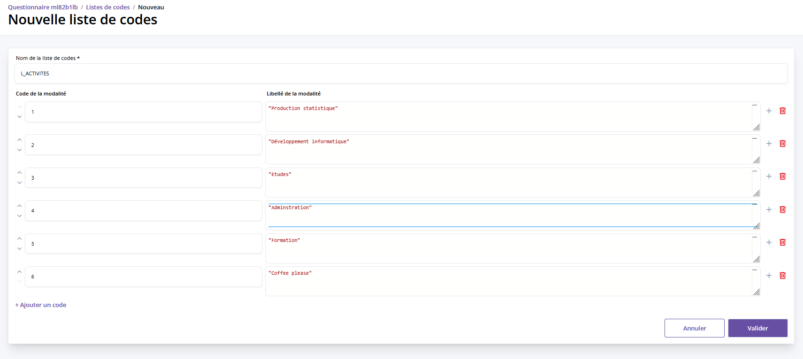
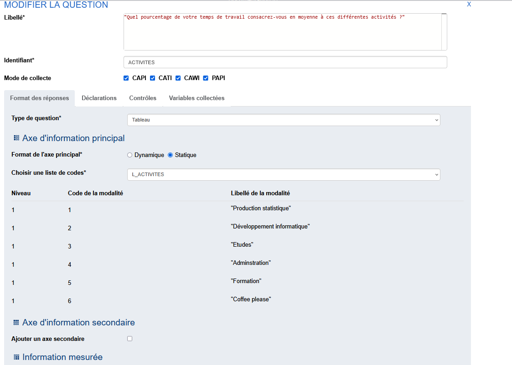
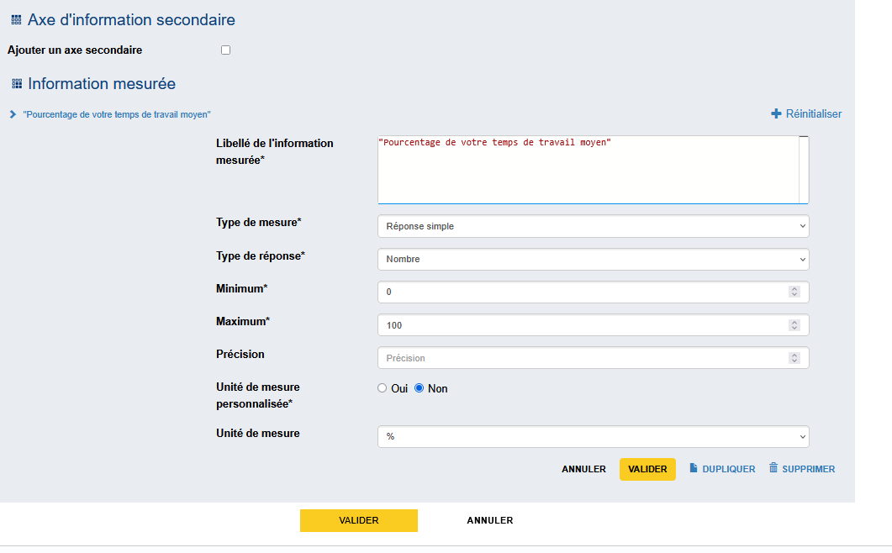
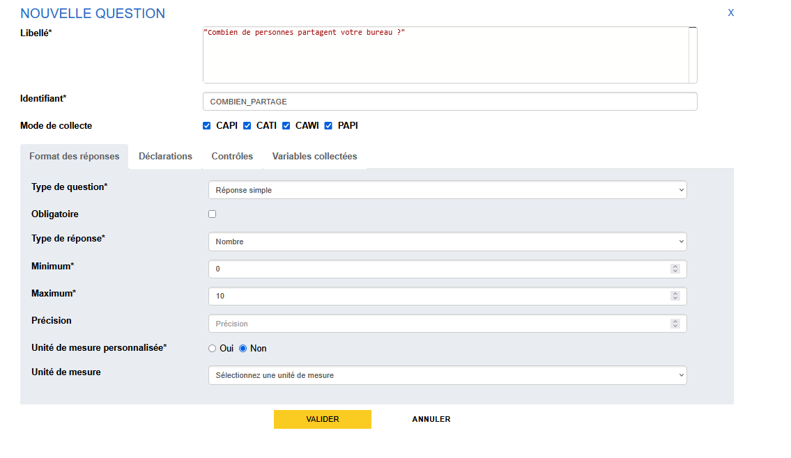
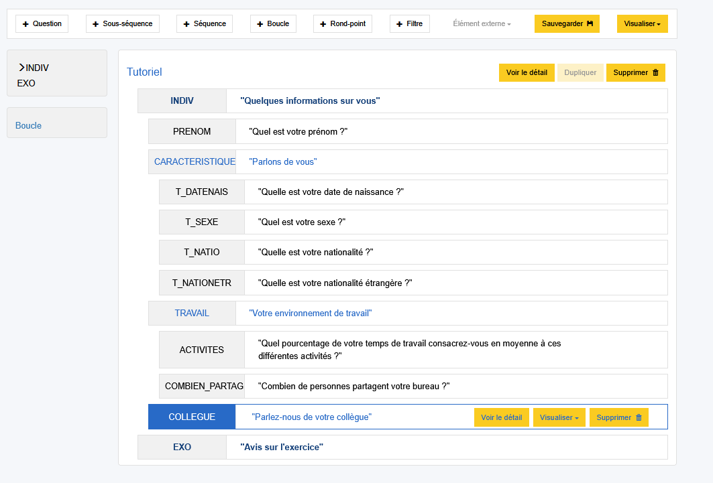

# Création d'un tableau

Passons aux questions de la sous-séquence "Votre environnement de travail".

La prochaine question se présente sous la forme d'un tableau dans lequel nous allons capter la ventilation des activités de la personne que l'on interroge à partir d'une liste de modalités L_ACTIVITES à créer dans l'onglet des listes de codes.

Créons la question avec avec les éléments suivants:

- le libellé "Quel pourcentage de votre temps de travail consacrez-vous en moyenne à ces différentes activités ?",
- et l'identifiant "ACTIVITES".

Nous choisissons ensuite le type de question "Tableau".

## Définition des lignes

Le choix suivant du format de l'axe principal va permettre de déterminer le type de tableau que l'on va construire :

- _Dynamique_ → pour la création d'un tableau dynamique, c'est à dire d'un tableau dont le nombre de lignes min et max est déterminé en cours de passation du questionnaire, 
- _Statique_ → pour la création d'un tableau disposant d'entêtes de lignes créés à partir d'une liste de code.

Ici, on choisit le format "Liste de codes".

On sélectionne une liste de codes parmi celle disponibles : L_ACTIVITES.

## Définition des colonnes

Pour créer les colonnes du tableau, rendez-vous un peu plus bas dans la section "Information mesurée". Ici, nous souhaitons créer une colonne pour collecter le pourcentage de temps de travail alloué à chacune des activités de la liste.

On remplit donc le _Libellé de l'information mesurée_ avec "Pourcentage de votre temps de travail moyen" (ce sera le titre de la colonne), puis l'on choisit  :

- _Type de mesure_ "Réponse simple"
- _Type de réponse_ "Nombre" avec un min à 0 et un max à 100
- _Unité de mesure_ "%"

Puis on valide.

Il ne reste qu'à générer les variables puis à valider la question.

!!! note

    La génération des variables ici va générer autant de variables que de cases dans le tableau.

!!! abstract "Pour aller plus loin"  

    

    - __[Les tableaux :material-arrow-right-bold-box-outline:](../🚀_Guide/Tableaux/index.md)__

    

Pour finir cette sous séquence, on va créer une question simple de type numérique pour interroger notre enquêté sur le nombre de collègues qui partagent son bureau.

??? success "Solution"
    
    

## Suite
[Finalisation de la structure du questionnaire](17-finalisation-structure.md){ .md-button }