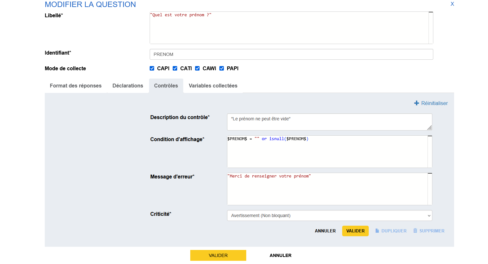

# Ajout d'un contrôle

On souhaite pouvoir s'assurer d'une bonne qualité de réponse aux différentes questions que l'on propose. Pour cela, on peut utiliser le mécanisme de contrôle inhérent aux outils de l'atelier.

!!! abstract "Pour aller plus loin"
    - [Les contrôles](../🚀_Guide/23-controles.md)

Ici, on va créer un contrôle affichant un message d'incitation si l'on ne donne pas son prénom.

## Création du contrôle

Pour cela, on va modifier la question dont l'identifiant est PRENOM (en cliquant sur _Voir le détail_).

On choisit ensuite l'onglet _Contrôles_.

Pour créer un contrôle, il faut remplir quatre champs :

- _Description du contrôle_ Un texte permettant de décrire le contrôle,
- _Condition d'affichage_ Une expression VTL qui déclenche le contrôle,
- _Message d'erreur_ Le texte qui s'affiche lorsque l'erreur est levée,
- _Criticité_ Un champ informatif sur le degré d'importance de l'erreur (_Avertissement (Non bloquant)_ ou _Erreur (Bloquant)_).

On veut déclencher le contrôle en cas de non-réponse, on va tester dans notre cas :

- si l'on n'est jamais entré dans le champ de réponse (la variable est `null` au sens VTL),
- si l'on est entré dans le champ mais qu'on n'a rien saisi (la variable est égale à une chaîne de caractères vide, ou `""`).

L'expression VTL sera donc 
```    
$PRENOM$ = "" or isnull($PRENOM$)
```

!!!note

    On notera l'utilisation de la fonction `isnull` qui permet de détecter si une variable n'a pas été valorisée (cf. guide VTL).

On aura une configuration sensiblement similaire à :point_down:




## Suite
Nous allons maintenant poursuivre avec la [création d'une infobulle](22-ajout-infobulle.md).