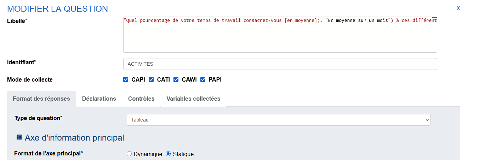

# Insertion d'une infobulle


## Syntaxe
L'ajout d'une [infobulle](https://fr.wikipedia.org/wiki/Infobulle) est possible dans les libellés des questions en appliquant une syntaxe particulière :

```md
Le texte de ma question contenant [une infobulle](. "Contenu de l'infobulle.").
```

!!! asbtract "Pour aller plus loin"

    <div class="grid cards" markdown>

    - __[Les infobulles :material-arrow-right-bold-box-outline:](../🚀_Guide/22-info-bulle.md)__

    </div>

## Création de l'infobulle

Pour notre questionnaire, on propose l'ajout d'une infobulle sur le terme "en moyenne" dans la question "Quel pourcentage de votre temps de travail consacrez-vous __en moyenne__ à ces différentes activités ?", avec le contenu suivant pour l'infobulle : "En moyenne sur un mois".




## Suite
[Implémentation d'une variable calculée](23-utilisation-variable-calculee.md){ .md-button }