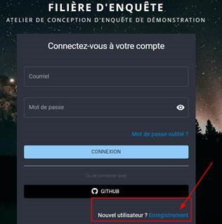
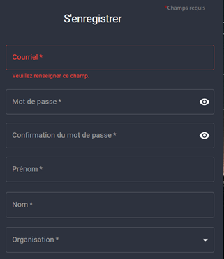

# Environnement de démo
Les environnements de Pogues « interne Insee » et le Pogues SSM proposé sur demo.insee.io sont mis à jour simultanément et synchronisés (même version, même paramétrage). Vous retrouverez donc les mêmes fonctionnalités dans les deux environnements.

!!! note
    - **Il sera demandé à l’utilisateur de créer un compte à la première connexion**.
    - En cas d'oubli de mot de passe, contacter l'atelier de conception

## Créer un compte à la première connexion

- Cliquer sur le bouton Enregistrement

- Remplir les champs avec vos informations professionnelles 

- Choisir l'organisation parmi la liste déroulante

!!! note
    Pour l’organisation, prenez celle qui vous correspond. Ensuite créer vos questionnaires dans le timbre de votre unité.
