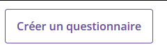
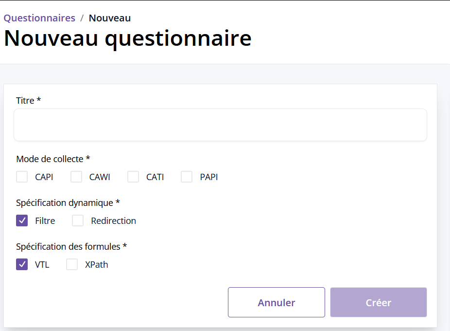
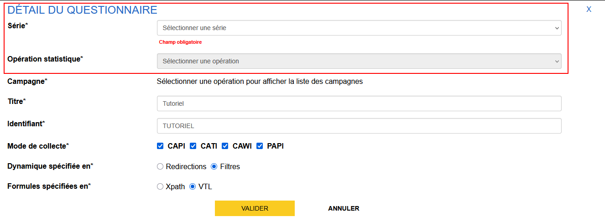

# Création d'un questionnaire

Sur la page d'accueil de Pogues, le bouton suivant est visible :

En cliquant sur le bouton, on ouvre la fenêtre de création du questionnaire. Celle-ci permet de renseigner ses paramètres.

## Identification

Il faut donner un "Titre" au questionnaire. Par défaut, un identifiant sera créé à partir de ce titre, vous pouvez par la suite le modifier en cliquant sur "Voir le détail" depuis la page "Questionnaire".

!!! tip
    Par convention, les identifiants des éléments du questionnaire (séquences, boucles, variables, etc.) seront écrits sous la forme `MON_IDENTIFIANT`

!!! example "Cas pratique"
    Dans le cadre de ce tutoriel, nous allons utiliser `Tutoriel` comme titre. Vous verrez que l'identifiant associez sera alors `TUTORIEL`

## Modes

Quatre modes de collecte sont disponibles, choisissez ceux qui vous concernent :

- CAPI, pour les enquêtes en face-à-face par l'intermédiaire d'un enquêteur
- CATI, pour les enquêtes par téléphone
- CAWI, pour les enquêtes via Internet
- PAPI, pour les enquêtes au format papier

!!! note
    Actuellement, l'impact sur les questionnaires mêmes est mince : seule les déclarations (aide à la saisie, consigne enquêteur) sont affichées ou non selon leur mode de collecte.

## Dynamisme

!!! warning

    Les options "Redirection" et "XPath" ne sont pas à utiliser pour les nouveaux questionnaires. Ils ne concernent que les questionnaires intégrés à la platforme de collecte Coltrane.

Les dernières options permettent de définir les aspects dynamiques du parcours du questionnaire :

- la gestion de l'affichage ou non des objets ("Redirection" ou "Filtre")
- le langage utilisé pour les contrôles, filtres, calculs de variables ("XPath" ou "VTL")

Pour ce tutoriel, nous choisissons "Filtre" et "VTL".

## Information sur le processus

Les champs "Série", "Opération statistique" et "Campagne" sont remplis en fonction de l'enquête correspondante. 
Par défaut ces champs sont vides et ne sont pas proposés lors de la création du questionnaire. Vous pouvez les spécifier après création du questionnaire via le bouton "Voir le détail" depuis la page "Questionnaire".

C'est un processus spécifique au contexte Insee, on ne le détaille pas ici.

!!! tip
    Si vous êtes en train de vous autoformer, vous pouvez choisir n'importe quelles valeurs, cela n'a pas d'impact sur le reste du questionnaire

## Suite
Nous allons maintenant créer une [première séquence](11-creation-premiere-sequence.md).