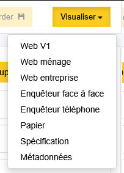
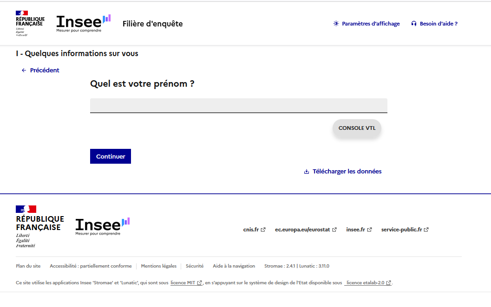
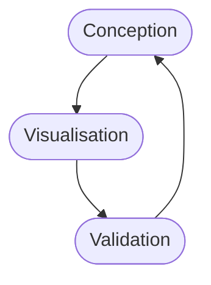

# Visualisation du questionnaire

La promesse de Pogues c'est de permettre la visualisation rapide du questionnaire, dans des modes différents.

Pour cela, en cliquant sur le bouton "Visualiser", on choisit le type de questionnaire que l'on veut générer.

Pour cette première fois, on choisit l'option "Web ménage".

!!! note

    Pour des raisons historiques, on a aujourd'hui trois cibles de génération pour un questionnaire web. Cependant, "Web V1" disparaîtra lorsque toutes les enquêtes sous Coltrane auront totalement basculé dans la Filière d'Enquête.

Après quelques secondes de création, le questionnaire _web_ est ouvert dans un nouvel onglet du navigateur.

!!! info

    La version du questionnaire ainsi générée est très proche du rendu final mais ne dispose pas de toutes les fonctionnalités d'un questionnaire complètement intégré à la plateforme de collecte.

    Par exemple, on ne dispose pas dans cette "visualisation simple" de la visualisation "personnalisée" avec l'injection de _variables externes_ ou _variables collectées pré-remplies_. Nous verrons ça plus tard dans le questionnaire.

Vous pouvez vérifier que le questionnaire produit est fidèle à la conception faite dans Pogues.

??? success "Solution"
    Vous devriez avoir une question qui s'affiche sous la forme suivante :
    

Nous venons de boucler un premier cycle dans la construction d'un questionnaire dans Pogues.

!!! abstract "Pour aller plus loin"
    - [Visualiser un questionnaire](../🚀_Guide/Questionnaire/42-sauvegarder-visualiser.md)
    - [Personnaliser un questionnaire](../🚀_Guide/Personnalisation/index.md)

## Suite
Nous allons maintenant poursuivre la création des questions de la séquence "Quelques informations sur vous".