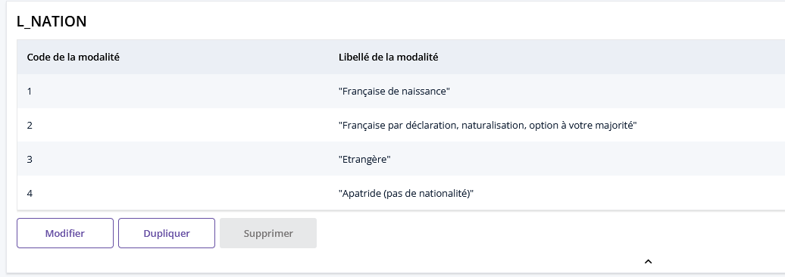
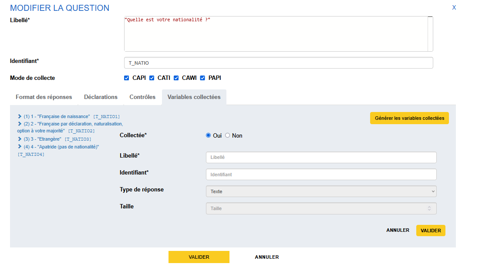
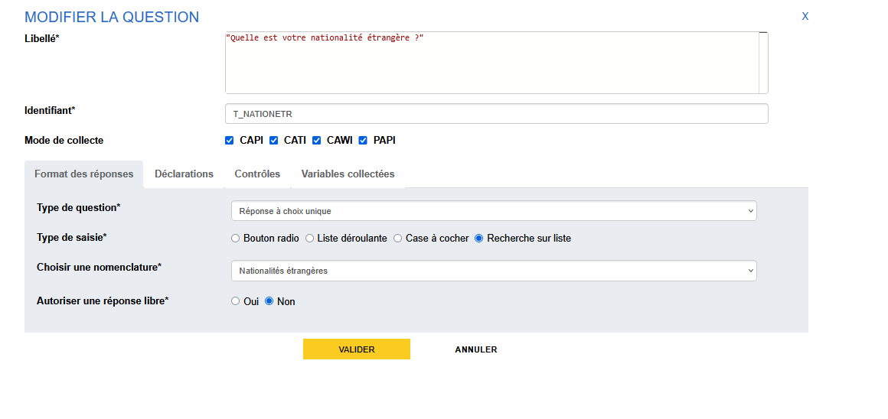
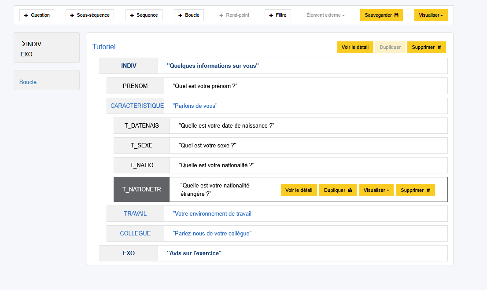

# Création d'une question à choix multiples et recherche sur liste

La prochaine question sera à une question à choix multiples (QCM) suivie d'une recherche sur liste. L'enchaînement des deux questions permettra d'interroger notre enquêté sur sa/ses nationalité(s). 

## Création d'une question à choix multiple

Pour cela, on va poser une première question afin de déterminer s'il dispose uniquement de la nationalité française, uniquement d'une nationalité étrangère ou s'il est français et étranger.

- On crée une liste de code avec les différentes modalités de notre question, on va prendre les 4 modalités qui sont habituellement proposées dans le cadre des enquêtes ménage. 

- on crée une question avec le libellé "Quelle est votre nationalité ?" et l'identifiant "T_NATIO"
- le _Type de question_ est "Réponse à choix multiple"
- dont la réponse est basée sur la liste de code L_NATIO qu'on vient de créer
- pour la _Représentation des réponse_ on garde le choix par défaut "Booléen".

!!! note

    La génération des variables ici va générer autant de variables _booléennes_ (vrai / faux) que d'éléments de la liste de codes.
    

## Création d'une question QCU recherche sur liste

Ensuite on va ajouter une question de type recherche sur liste (QCU recherche sur liste) afin d'inviter l'enquêté à choisir la nationalité qui lui correspond. Idéalement on voudrait ne poser cette question qu'aux personnes déclarant qu'elles ont une nationalité étrangère, c'est-à-dire qu'on voudrait filtrer cette question... patience, on verra prochainement comment mettre un place un filtre dans notre questionnaire.

Pogues propose un certain nombre de listes de nomenclatures mutualisées pour satisfaire le plus grand nombre d'enquêtes : nationalités, nationalités étrangères, départements, communes, professions par sexe, diplômes, les activités (NAF sur 2 positions) etc. Pour mobiliser les listes de nomenclatures ont utilise un composant recherche sur liste (suggester). 

!!! abstract "Pour aller plus loin"  
    -  [Le suggester](../🚀_Guide/Questions/15b-suggester.md)

- on crée une question avec le libellé "Quelle est votre nationalité étrangère ?" et l'identifiant "T_NATIONETR"
- le _Type de question_ est "Réponse à choix unique"
- le _Type de saisie_ est "Recherche sur liste"
- la _Nomenclature_ à sélectionner dans le menu déroulant est "Nationalités étrangères".
- on ne permet pas de réponse libre (cf le guide pour plus d'infos sur la réponse libre)

On génère les variables et on valide notre question : on vient de créer notre première question de type recherche sur liste !
Et on sera encore plus satisfait lorsqu'on aura vu comment filtrer la question pour ne la proposer qu'à ceux qui répondent avoir effectivement une nationalité autre ...

??? success "Solution"
    

