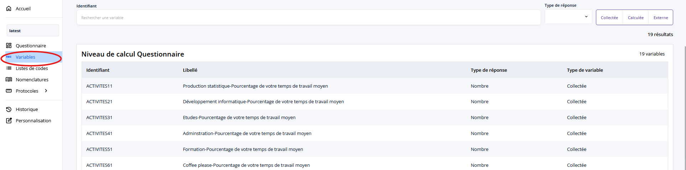
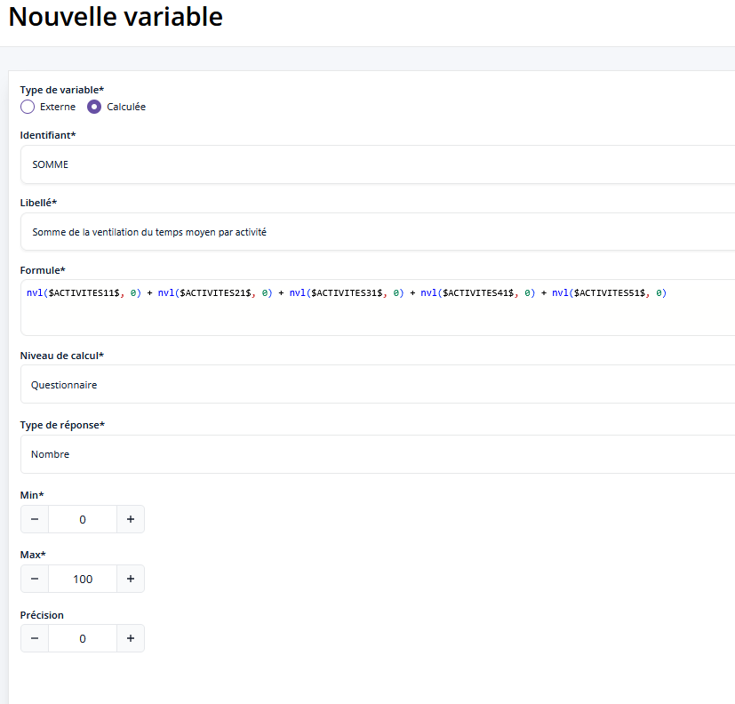
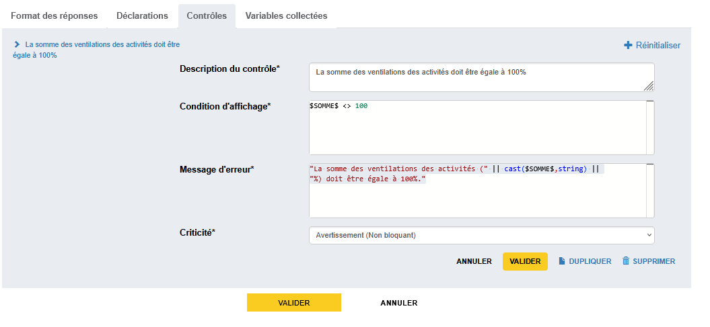
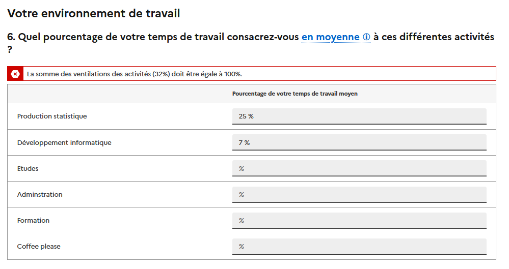

# Utilisation d'une variable calculée

Pogues permet la création de trois types de variables dans le questionnaire :

1. les _variables collectées_ : celles qui sont valorisées par les réponses aux questions,
2. les _variables calculées_ : elles sont produites à partir d'une expression VTL,
3. les _variables externes_ : elles sont valorisées par des données externes qui seront injectées dans le questionnaire.

!!! abstract "Pour aller plus loin"
    - [Les variables](../🚀_Guide/Variables/index.md)


Nous allons voir dans cette section comment mobiliser le deuxième type de variable pour mettre en place un contrôle sur la réponse à la question sur les activités professionnelles (`ACTIVITES`).

## Création de la variable

Pour créer une variable calculée, il faut aller dans le menu de gestion des variables, bouton dans le menu de gauche puis de cliquer sur le bouton _Créer une variable_.




Cette page liste l'ensemble des variables du questionnaire présentées par [Niveau de calcul](../🚀_Guide/Variables/portee.md).

Plusieurs champs sont à compléter :

- _Identifiant_ : un identifiant de la forme `MON_IDENTIFIANT`
- _Libellé_ : un texte court pour décrire la variable
- _Formule_ : l'expression VTL qui valorise la variable
- _Niveau de calcul_ : dans le cas général, la portée est _Questionnaire_, la variable est mobilisable dans l'ensemble du questionnaire. Pour des variables qui sont créées dans une occurence de boucle ou de tableau, il faut préciser que la portée se limite à cette boucle ou ce tableau.
- _Type de réponse_ : comme pour une variable collectée, on renseigne les caractéristiques de la variable
- Autres champs associés au type de réponse


Notre variable aura comme identifiant `SOMME`, et aura comme valeur l'addition des variables produites par le [tableau créé précédemment](16-creation-tableau.md) :

    ```vtl
    nvl($ACTIVITES11$, 0) +
    nvl($ACTIVITES21$, 0) +
    nvl($ACTIVITES31$, 0) +
    nvl($ACTIVITES41$, 0) +
    nvl($ACTIVITES51$, 0)
    ```




!!!note

    On utilise ici la fonction `nvl` qui permet de renvoyer une valeur par défaut si la variable est nulle. En effet, si on ne valorise pas une case du tableau, la variable correspondante aura comme valeur `null` ce qui ne permet pas de faire la somme.

    On lit `nvl($ACTIVITES11$, 0)` ainsi : si la variable `$ACTIVITES11$` est `null`, on renvoie `0` sinon on renvoie sa valeur.


Jusqu'ici nous n'avions que des variables collectées dans la liste des variables tandis que la variable nouvellement créée `SOMME` à pour type _Calculée_. Le survol du bouton permet d'afficher la formule de calcul.


## Utilisation de la variable

On peut maintenant ajouter un contrôle sur la question `ACTIVITES` pour s'assurer que la ventilation est égale à 100%. Vous pouvez pour cela vous appuyer sur ce que l'on a vu [précédemment](21-ajout-controle.md) et sur le [guide VTL](../💻_VTL/index.md)... 



??? success "Visualisation" 
    
   