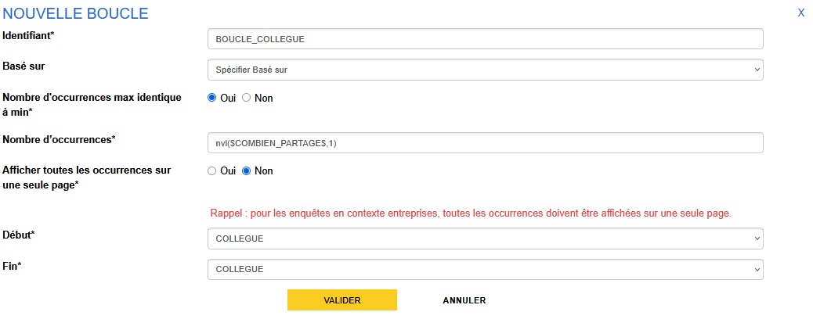

# Mise en place d'une boucle

Une boucle permet de répéter une partie du questionnaire (une séquence ou une sous-séquence), à partir de valeurs prédéterminées ou de variables du questionnaire.

Dans notre cas d'usage, on souhaite répéter la sous-séquence "Parlez-nous de votre collègue autant de fois que le nombre de collègue qui a été donné à la questions précédente "Combien de personnes partagent votre bureau ?".

On va donc mobiliser la variable `COMBIEN_PARTAGE` dans une boucle.

Pour créer la boucle, on clique sur le bouton "+ Boucle" dans la barre d'actions.

La fenêtre qui s'ouvre propose plusieurs champs que l'on peut mobiliser de deux manières différentes :

1. pour une boucle utilisant des valeurs fixes ou des variables du questionnaire (_boucle principale_);
2. pour une boucle s'appuyant sur une structure répétée comme une autre boucle ou un tableau dynamique (_boucle liée_).

Dans ce tutoriel, on va mettre en place le premier cas uniquement.

!!! abstract "Pour aller plus loin"
    - [Les boucles](../🚀_Guide/24-boucles.md)

## Création de la boucle

Nous allons remplir les champs suivants :

- _Identifiant_ avec comme toujours un identifiant de la forme `MON_IDENTIFIANT`
- _Basé sur_ à remplir uniquement pour les boucles liées (on les base sur un objet existant tel qu'une boucle principale ou sur un tableau dynamique)
- _Nombre d'occurrences max identique à min_ permet de ne remplir qu'une fois la taille de la boucle si le nombre d'occurrence est fixe (fixé par une formule ou un nombre donné) 
- _Nombre minimum d'occurrences_ le nombre minimum d'itérations, qui peut être une valeur fixe (par exemple `2`, ou une variable)
- _Nombre maximum d'occurrences_ le nombre maximum d'itération, là aussi une valeur fixe ou une variable
- _Afficher toutes les occurrences sur une seule page_ uniquement pour les boucles principales, lorsqu'il y a un nombre restreint de questions et qu'il est pertinent de proposer toutes les itérations d'un seul tenant en visualisation web ménage ou enquêteur (par exemple questions portant sur les membres d'un logement)
- _Libellé du bouton d'ajout_ à remplir quand le nombre minimum d'itérations est différent du nombre maximal
- _Début_ la séquence ou la sous-séquence à partir de laquelle commence la répétition
- _Fin_ la séquence ou la sous-séquence sur laquelle termine la boucle ; comme pour les filtres, cet élément de fin est inclus dans la boucle.

Dans notre cas, on spécifiera ces valeurs :

- _Identifiant_ `BOUCLE_COLLEGUE` (oui, on fait simple :smile:)
- _Nombre d'occurrences_ l'expression VTL `nvl($COMBIEN_PARTAGE$, 1)`, ce qui permet d'avoir `1` si la question précédente n'a pas été répondue ou la valeur de la réponse si on l'a obtenue
- _Début_ la sous-séquence `COLLEGUE`
- _Fin_ la sous-séquence `COLLEGUE`

!!!warning
    L'interface de création des boucles nous guide pour paramètrer la configuration de la boucle en fonction du contexte de visualisation (ménage / entreprise). Il convient de bien les respecter.

