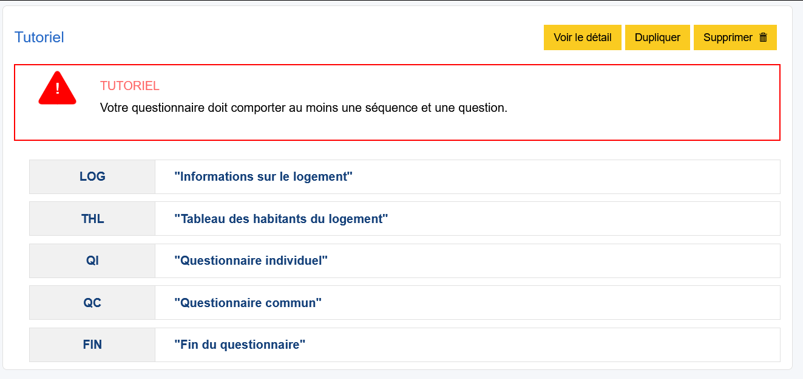
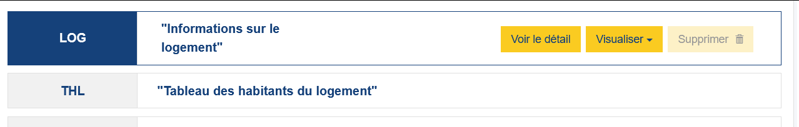
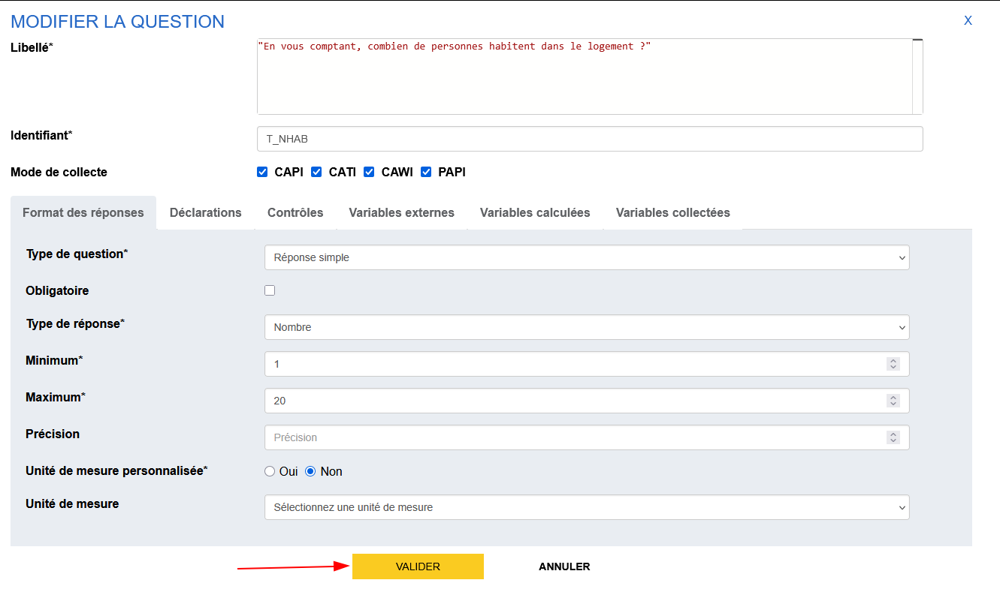
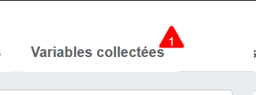
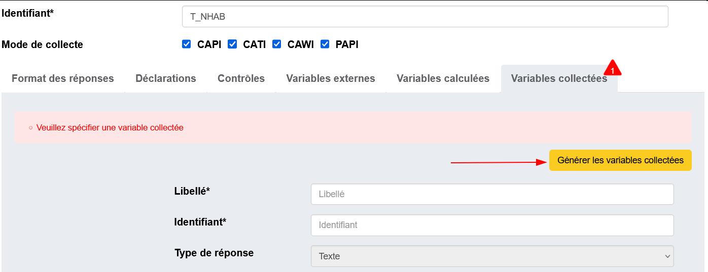
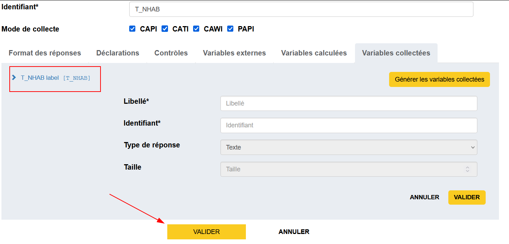
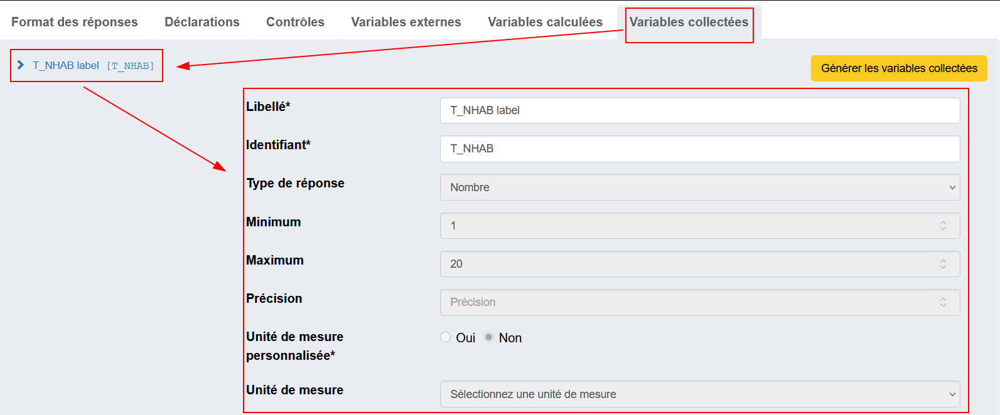
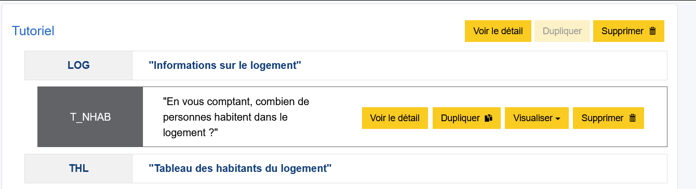

# Création d'une première séquence

Une fois le questionnaire créé, on arrive sur la vue d'ensemble (dite _vue structurelle_) du questionnaire.
Celui-ci est vide et nous demande d'ailleurs de créer une séquence et une question. 

Donnons-lui du contenu ! :smile:

!!! tip
    Un questionnaire est composé de séquences, sous-séquences et questions. Les possibilités d'articulation sont les suivantes :

    ```
    |- Séquence
    |--- Question
    |--- Sous-séquence
    |----- Question
    ```
    
    Un questionnaire doit contenir au moins une séquence et une question.
    Une séquence contient des questions et/ou des sous-séquences. Une sous-séquence peut contenir des questions.

## Création de la séquence

Pour créer la première séquence, il suffit de cliquer sur le bouton "+ Séquence" de la barre d'actions :


Une fenêtre modale s'ouvre avec deux champs à remplir :

- _Libellé_ : Titre de la séquence qui va apparaître dans le questionnaire
- _Identifiant_ : Identifiant métier de la séquence. par défaut l'application propose les premiers caractères du libellé de la séquence, il est modifiable.

Les modes de collecte restent les mêmes que ceux du questionnaire.

!!! example
    Saisissons la première séquence avec le *libellé* `"Informations sur le logement"`.
    
    Quand on sort du champ *libellé*, on voit que le champ *identifiant* est automatiquement remplit avec `INFORMATIO`. Ici Pogues prend les 10 premier caractères alphanumériques du libellé les concatène et les met en majuscule. Ce nom est arbitraire et peu parlant pour la suite du questionnaire. Donnons lui l'identifiant suivant `LGT`

Pour finaliser la création, on appuie sur le bouton "Valider" en bas de la fenêtre :


!!! example
    Vous allez créer les 4 séquences qui constituent notre questionnaire "Tutoriel"

    | Identifiant | Libellé |
    | - | - |
    | `LGT` | `"Informations sur le logement"` |  
    | `THL` | `"Tableau des habitants du logement"` | 
    | `QI` | `"Questionnaire individuel"` | 
    | `QC` | `"Questionnaire commun"` | 
    | `FIN` | `"Fin du questionnaire"` | 

??? success "Solution"
    

!!! abstract "Pour aller plus loin"
    - [Les Séquence](../🚀_Guide/10-sequences.md)

!!! Mais ce n'est pas fini... 
    On peut voir que le questionnaire est toujours mécontent et nous indique qu'il faut aussi créer au moins une question, ce que nous allons faire de ce pas ! 

## Création d'une question
Nous allons maintenant créer la première question de nôtre questionnaire et la placer dans la première séquence.

1. PLacez vous sur la première séquence `LOG` : cliquer sur le bloc associé à `LOG`.     
    _Vous devez voir qu'une fois sélectionné, le bloc grossit et est mis en évidence par l'encadré en bleu._
    
2. Dans la barre des actions, le bouton "+ Question" permet la création d'une question.
3. Suivez les prochaines indications afin de spécifier une question avec les informations suivantes : 
    - Un identifiant `T_NHAB` 
    - Une réponse simple 
    - Un type numérique 
    - Une variable collectée associée même identifiant `T_NHAB` et les mêmes paramètres

### Identification

Dans la fenêtre modale qui apparaît :

- _Libellé_ : `"En vous comptant, combien de personnes habitent dans le logement ?"`
- _Identifiant_ : `T_NHAB`

### Format de réponse

Pogues propose plusieurs formats de réponse qui peuvent être ensuite paramétrés.

Dans l'onglet "Format des réponses", on choisit comme _Type de question_ "Réponse simple" et _Type de réponse_ "Nombre", ce qui va permettre de créer un champ de réponse numérique.

Puis choisissez un minimum et un maximum (prenons par exemple 1 et 20).
Ici il n'y a pas de précision, et pas d'unité de mesure pour cette question.

On revient dans la section suivante sur le détail des options, mais terminons d'abord la création de cette première question.

cliquez sur "VALIDER"



Pogues averti qu'il manque des informations dans l'onglet "Variables collectées"



Pour cela, il reste une dernière étape, la création de la variable sous-jacente (appelé aussi "Variable collectée" associée).

### Création de la variable

Pogues distingue **la question** de **la réponse** et de **la donnée collectée - la variable**. Il faut donc explicitement créer cette dernière.

Pour cela, on se dirige vers l'onglet "Variables collectées" puis on clique sur le bouton "Générer variables collectées".


On peut enfin valider la question en cliquant sur le plus gros bouton "Valider" en bas de la fenêtre.


!!! Note
    Lorsque vous validez une question, une fenêtre peut apparaître avec le texte "Modifications non validées. Merci de valider toutes les actions sur l'élément.".
    

    Cela signifie tout simplement que certains champs à l'intérieur de la question n'ont pas été explicitement validés (à l'aide d'un bouton de validation dédié).

    Si vous êtes sûr du contenu de ces éléments, vous pouvez tout simplement cliquer sur _Valider en l'état_, l'ensemble de ce que vous avez saisi sera sauvegardé.

!!! tip
    Lorsqu'on est sur l'onglet des "Variables Collectée". On peut cliquer sur la variable afin de voir les informations associées
    

    Ici, seul les champs _Identifiant_ et _Libellé_ sont modifiables. Ces champs sont important pour la documentation de vos variables dans la suite du processus de l'enquête ! Il faut donc leur donner un nom et une description plus parlante que celle donnée par défaut.

    !!! warning "Mais pas si vite !"
        Dans le cadre de ce tutoriel, et en général lors de la construction d'un questionnaire, nous préconisions de **ne pas toucher à ces champs et laisser les valeurs par défaut**

        À chaque fois qu'on régénère les variables, Pogues va écraser tous les noms des libellés et identifiant et il faudra tout renommer à la main. Cela peut vite devenir fastidieux sur de gros tableaux ou QCM.

    Les autres champs ne sont pas modifiables car sont **directement associés aux paramètres de la question**. Si jamais ces informations sont incorrectes, c'est que votre question l'est aussi. Il faut alors retourner sur l'onglet "Format des réponses" et changer ces paramètres en conséquence.

!!! abstract "Pour aller plus loin"
    - [Les questions](../🚀_Guide/Questions/index.md)
    - [Variables Collectées](../🚀_Guide/Variables/variables-collectees.md)
    - [Nommage des variables](../🚀_Guide/Variables/nommage.md)

!!! success "Solution"
    Pogues est enfin content ! Il ne râle plus et on peut enfin **sauvegarder** nôtre questionnaire.
    

## Sauvegarde du questionnaire

Nous disposons maintenant d'un questionnaire simple, contenant une séquence et une question, il est temps de :material-content-save: __sauvegarder__ !

Un simple clic sur le bouton "Sauvegarder" de la barre d'action fait l'affaire.

!!! tip
    Vous pouvez facilement gérer la liste de vos sauvegardes avec le menu [**historique**](../🚀_Guide/29-historique.md) ✨
