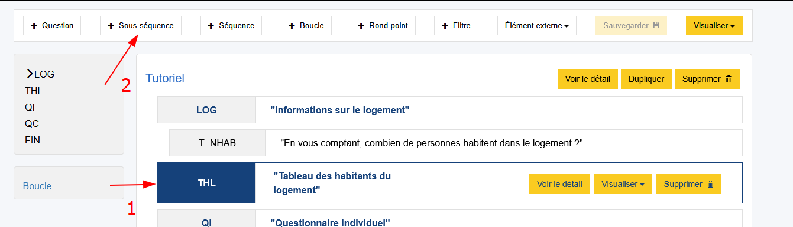
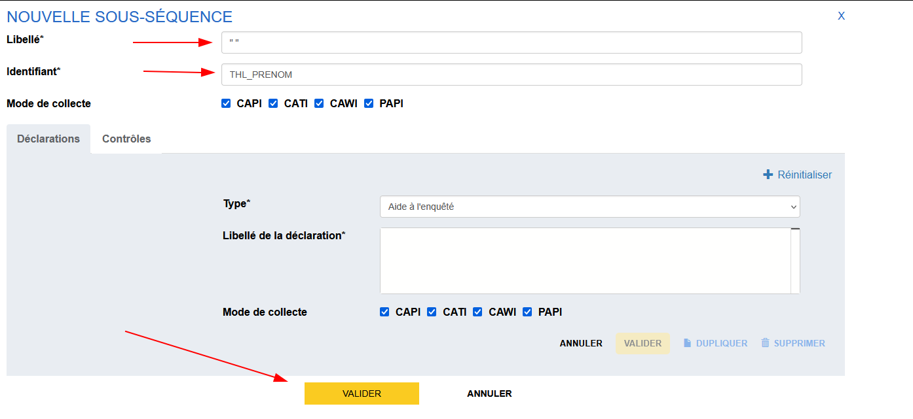
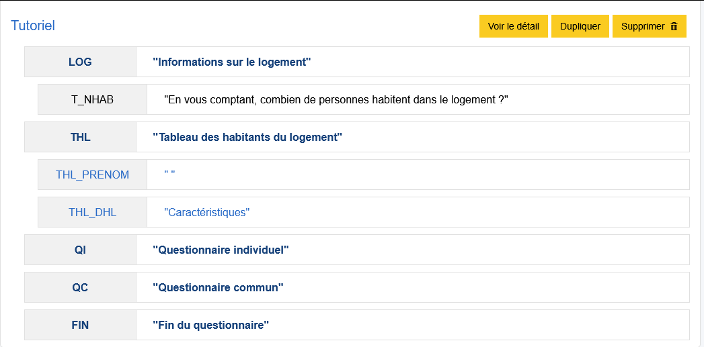
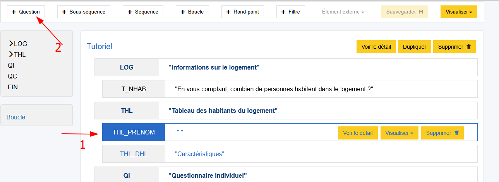
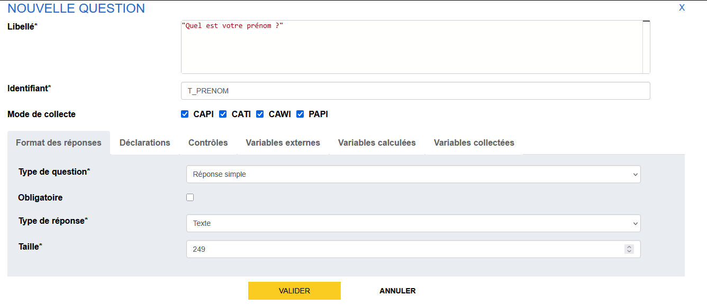
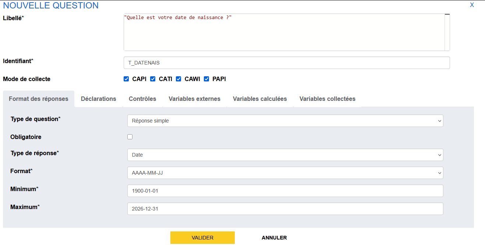
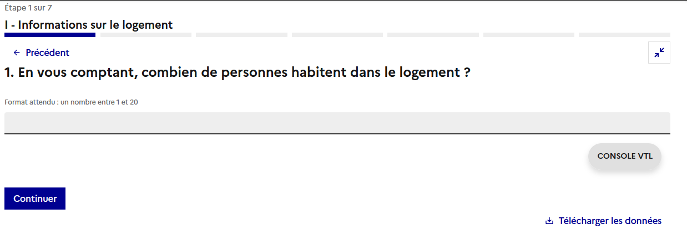
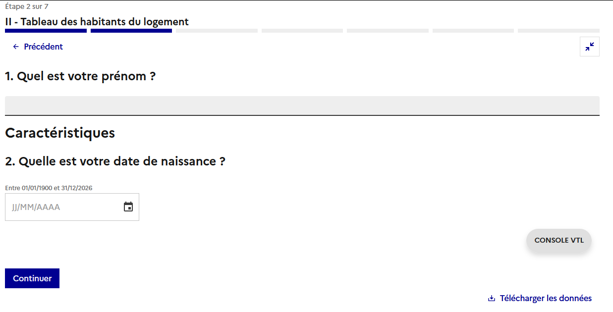

# Construction de la partie "Tableau des habitants du logement"


## Structure de la séquence
Nous poursuivons la construction du questionnaire en spécifiant les questions de la séquence sur le "Tableau des habitants du logement". Pour rappel, la composition de cette séquence ressemble à ça :

- Une séquence "Tableau des habitants du logement" :
- Des question d'identification des individus constituant le ménage
- Une boucle Principale `BOUCLE_PRENOMS` permettant d'identifier les individus du ménages
- Une boucle Liée `BOUCLE_INDIV` basé sur `BOUCLE_PRENOMS` permettant de poser une série de questions sur l'État civil de chaque individu du ménage.

Nous allons introduire deux _sous-séquences_, `THL_PRENOM` et `THL_DHL`, pour mieux délimiter le concept de la boucle principale et de la boucle liée. Nous visons ainsi la structure suivante

```
Questionnaire
|-- [Séquence] LGT
|   |-- [Question simple] T_NBHAB
|-- [Séquence] THL
|   |-- [Sous-séquence] THL_PRENOM
|   |   |-- [Question simple] T_PRENOM 
|   |-- [Sous-séquence] THL_DHL
|       |-- [QCU] T_SEXE
|       |-- [Question simple] T_DATENAIS
|-- [Séquence] QI
```

## Création des sous-séquences
D’abord, créons les deux sous séquences. Pour ce faire on se place sur la séquence qui nous intéresse (clic sur le bloc `THL`), puis on clique sur le bouton "Sous-séquence" dans le bandeau du haut


Il suffit ensuite de remplir la modale qui vient de s'ouvrir avec les informations suivantes et valider.

- _Identifiant_ : `THL_PRENOM`
- _Libellé_ : " "



Faire de même avec `THL_DHL` et le libellé "Caractéristiques"

??? success "Solution"
    

!!! abstract "Pour aller plus loin"
    - [Les sous-séquences](../🚀_Guide/11-sous-sequences.md)

### Question sur les Prénoms
Nous allons maintenant créer la première question concernant les prénoms. Placez vous sur la sous séquence concernée (clic sur `THL_PRENOM`), puis appuyez sur le bouton de création de question.


Remplissez les champs avec les infos suivantes : 

- _Libellé_ : "Quel est votre prénom ?"
- _Identifiant_ : `T_PRENOM`
- _Type de question_ : Réponse simple
- _Type de réponse_ : Texte (laissez la taille par défaut)

??? success "Solution"
    
    
Générez la variable puis validez.

!!! abstract "Pour aller plus loin"
    - [Les questions simples de type texte](../🚀_Guide/Questions/13-reponse-simple.md/#type-de-réponse-texte)

### Question sur l'âge
Nous allons créer maintenant une question simple, `T_DATENAIS`, mais avec un nouveau type de réponse, le type "Date".

On a besoin pour ce type de question de spécifier un format et des bornes minimum et maximum, à spécifier selon le format.

!!! example "Cas pratique"
    Placez vous sur la sous-séquence `THL_DHL` puis créez une nouvelle question simple avec les information suivantes :

    - _Libellé_ : "Quelle est votre date de naissance ?"
    - _Identifiant_ : `T_DATENAIS`
    - _Type de question_ : Réponse simple
    - _Type de réponse_ : Date
    - _Format_ : AAAA-MM-JJ
    - _Minimum_ : `1900-01-01`
    - _Maximum_ : `2026-12-31`

??? success "Solution"
    

Générez la variable puis validez.

!!! abstract "Pour aller plus loin"
    - [Les questions simples de type date](../🚀_Guide/Questions/13-reponse-simple.md/#type-de-réponse-date)

Ici on récupère bien une date au format année/mois/jour. Nous verrons plus tard comment réutiliser cette variable collectée en calculant l'âge via justement ce qu'on appelle une "variable calculée".


### Visualiser, c'est tester

!!! info "On n'oublie pas de Visualiser, Valider puis Sauvegarder !"
    Nous avons fait quelques changements dans le questionnaire. Une bonne pratique est de ne pas attendre d'avoir fait trop de changements avant de visualiser pour les valider. Il faut aller pas à pas pour bien maîtriser ce que l'on fait.

Cette fois utilisons la visualisation "Web entreprise". Cette visualisation a la particularité de mettre **toutes les questions d'une même séquence sur la même page**. 

On observe ainsi pour la première séquence la page suivante,

Et pour la deuxième page, nous avons les deux questions que l'on vient de créer, séparées par les deux sous séquences " " et "Caractéristiques"


Une fois que nos changements sont valides, **on sauvegarde !**

!!! tip "N'hésitez pas à varier les contexte de visualisation durant tout ce tutoriel"

!!! abstract "Pour aller plus loin"
    - [La visualisation web](../../5._Orchestrateurs/Stromae-DSFR/index.md)

## Suite
Nous allons maintenant voir comment créer une [question à choix unique (QCU)](14-creation-liste-qcu.md).