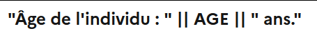
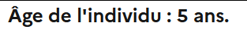

# Fonctions VTL et usages

## Liste de fonctions

### Les plus utilisés
| Method      | Description                          |
| ----------- | ------------------------------------ |
| [**`nvl()`**](#nvl)       | Gère la nullité    |
| [**`cast()`**](#cast)       | Change le type de la donnée    |
| [**`substr()`**](#substr)       | Extrait un sous ensemble de caractère d'un texte |
| [**`isnull()`**](#isnull)       | Teste la nullité d'une variable    |
| [**`in ...`**](#in)       | Teste l'appartenance d'une valeur à un ensemble    |
| [**`if ... then ... else ...`**](#if-then-else)  | Teste si un condition est vraie, _et retourne le contenu du then_ ou fausse, _et retourne le contenu du else_ |
| [**`current_date()`**](#current_date)  | Retourne la date du jour au format `date` |


### Numériques
| Method      | Description                          |
| ----------- | ------------------------------------ |
| [**`abs()`**](#abs)     | Retourne la valeur absolue d'un nombre  |
| [**`ceil()`**](#ceil)     | Retourne le plus petit entier supérieur ou égal au nombre donné  |
| [**`exp()`**](#exp)     | Retourne l'exponentielle d'un nombre  |
| [**`floor()`**](#floor)     | Retourne le plus grand entier qui est inférieur ou égal à un nombre donné |
| [**`mod()`**](#mod)     | Retourne le modulo = le reste d'une division entière  |
| [**`round()`**](#round)     | Retourne la valeur d'un nombre arrondi à l'entier le plus proche  |


## Détail des fonctions
##### nvl
!!! question "Utilité"
    Lorsque l’on manipule des variables en VTL, on veut dans la plupart des cas se prémunir de valeurs nulles. Par exemple, **un champ qui n’est pas encore rempli par le répondant est de valeur nulle** (`null`). <br>
    Il est donc nécessaire de gérer cette possible nullité. On utilise pour cela la fonction `nvl`

!!! abstract "Syntaxe"
    ```
    nvl(<var>, <valeur par défaut>)
    ```

    - `var` : variable sur laquelle on teste la nullité
    - `valeur par défaut` : valeur retournée dans le cas ou `var` vaut `null` 

=== "Texte"
    | Valeur de `MA_VARIABLE` | Fonction | Résultat |
    | --- | ---| --- |
    | `"mon texte"` | `nvl($MA_VARIABLE$, "valeur par défaut")` | `"mon texte"` |
    | `null` | `nvl($MA_VARIABLE$, "valeur par défaut")` | `"valeur par défaut"` |
    | `null` | `nvl($MA_VARIABLE$, "")` | `""` |
    | `""` | `nvl($MA_VARIABLE$, "")` | `""` |
    | `""` | `nvl($MA_VARIABLE$, "autre valeur par défaut")` | `""` |
=== "Nombre"
    | Valeur de `MA_VARIABLE` | Fonction | Résultat |
    | --- | ---| --- |
    | `18`      | `nvl($MA_VARIABLE$, 25)`   | `18` |
    | `null`      | `nvl($MA_VARIABLE$, 25)`   | `25` |
    | `null`      | `nvl($MA_VARIABLE$, 0)`   | `0` |
    | `0`      | `nvl($MA_VARIABLE$, 0)`   | `0` |
    | `0`      | `nvl($MA_VARIABLE$, 12)`   | `0` |

??? example "Exemple d'utilisation"
    === "Champ texte vide"
        Tester si un champ texte, `PRENOM` est vide ou non. _Voir [la note des réponses de type texte](../🚀_Guide/13-reponse-simple.md/#type-de-reponse-texte)_
        ```
        nvl($PRENOM$, "") = ""
        ```
    === "Comparaison de nombre"
        Comparer si une variable de type nombre est supérieure à une valeur.
        
        > Ici je veux me prémunir du fait que ma variable pourrait ne pas être renseignée. Si l'enquêté décide de ne pas saisir de valeur pour une question donnée dont la réponse est un nombre, exemple un chiffre d'affaire `CA`, on pourrait considérer que le `CA` équivaut à `0` afin de rester cohérent dans les traitements suivants. <br>
        
        Exemple, on veut un filtre pour afficher une question uniquement dans le cas où `CA` serait supérieur à `24 000`. on écrirait alors dans la condition d'affichage du filtre,
        
        === "Condition sans `nvl` :x:"
            ```
            $CA$ > 24 000
            ```
            Si l'enquêté ne répond rien à `CA`, alors la filtre va être évalué avec `null > 24 000` ce qui renvoie une erreur et donc on affiche la question dans tous les cas (voir [comportement filtre](../../6._🫂_Support/index.md/#affichage-a-tort-de-questions-filtrees) pour plus de détails). Or on aurait aimé que si l'enquêté ne réponde rien ce soit comme si il avait un `CA` de `0`.
        === "Condition implicite :white_check_mark:"
            ```
            nvl($CA$, 0) >  24 000
            ```
            Si l'enquêté ne répond rien à `CA`, alors la filtre va être évalué avec `0 > 24 000` ce qui renvoie `false` et la condition d'affichage n'étant pas remplie, alors la question concernée sera filtrée.
        === "Condition avec `=true` :white_check_mark:"
            ```
            (nvl($CA$, 0) >  24 000) = true
            ```
            Si l'enquêté ne répond rien à `CA`, alors la filtre va être évalué avec `0 > 24 000` ce qui renvoie `false` et la condition d'affichage n'étant pas remplie, alors la question concernée sera filtrée.

##### cast
!!! question "Utilité"
    En VTL, Le typage **définit la nature des valeurs que peuvent prendre les données que nous manipulons**. <br>
    Il est parfois nécessaire de passer d’un type de variable à un autre, on parle dans ce cas de transtypage.

!!! abstract "Syntaxe"
    ```
    cast(<var>, <type cible> [, <motif>])
    ```

    - `var` : variable sur laquelle on applique le transtypage
    - `type cible` : type dans lequel on veut formater la variable
    - `motif` (optionnel) :  selon les type de cast on a besoin d'un information supplémentaire. 
    Ex: pour les date on vaut le format cible. "YYYY" ; "YYYY-MM-DD" ; 

=== "Texte"
    | Valeur de `MA_VARIABLE` | Fonction | Résultat |
    | --- | ---| --- |
    | `18`      | `cast($MA_VARIABLE$, string)`   | `"18"` |
    | `"18"`      | `cast($MA_VARIABLE$, string)`   | `"18"` |
    | `1995-01-17`  (`date`) | `cast($MA_VARIABLE$, string, "YYYY-MM-DD")`   | `"1995-01-17"` |
    | `1995-01-17`  (`date`) | `cast($MA_VARIABLE$, string, "YYYY")`   | `"1995-01-17"` :warning: |
    | `1995`  (`date`) | `cast($MA_VARIABLE$, string, "YYYY")`   | `"1995"` |
=== "Nombre"
    | Valeur de `MA_VARIABLE` | Fonction | Résultat |
    | --- | ---| --- |
    | `"25"`      | `cast($MA_VARIABLE$, integer)`   | `25` |
    | `25`      | `cast($MA_VARIABLE$, integer)`   | `25` |
=== "Booléen"
    | Valeur de `MA_VARIABLE` | Fonction | Résultat |
    | --- | ---| --- |
    | `0`      | `cast($MA_VARIABLE$, boolean)`   | `false` |
    | `1`      | `cast($MA_VARIABLE$, boolean)`   | `true` |
    | `"true"`      | `cast($MA_VARIABLE$, boolean)`   | `true` |
    | `true`      | `cast($MA_VARIABLE$, boolean)`   | `true` |
=== "Date"
    | Valeur de `MA_VARIABLE` | Fonction | Résultat |
    | --- | ---| --- |
    | `"1995-01-17"`      | `cast($MA_VARIABLE$, date, "YYYY-MM-DD")`   | `1995-01-17` (`date`) |
    | `"1995-01-17"`      | `cast($MA_VARIABLE$, date, "YYYY-MM")`   | `1995-01` (`date`) |
    | `"1995-01-17"`      | `cast($MA_VARIABLE$, date, "YYYY")`   | `1995` (`date`) |
    | `"1995-01-17"`      | `cast($MA_VARIABLE$, date, "MM")`   | `01` (`date`) |
    | `"1995-01-17"`      | `cast($MA_VARIABLE$, date, "DD")`   | `17` (`date`) |
    | `"1995"`      | `cast($MA_VARIABLE$, date, "YYYY")`   | `1995` (`date`) |
    | `"1995"`      | `cast($MA_VARIABLE$, date, "YYYY-MM")`   | `1995-01` (`date`) |
    | `"1995"`      | `cast($MA_VARIABLE$, date, "YYYY-MM-DD")`   | `1995-01-01` (`date`) |

??? example "Exemple d'utilisation"
    === "Personnalisation une libellé"
        Par exemple on veut afficher dans un libellé l'âge d'une personne. Un libellé de question ne peut interpréter que
        
        - **des textes en dur** : tout texte positionné entre des doubles quotes `"mon texte"`, 
        - **une variable de type texte** : variable définie avec un "Type de réponse" égale à `Texte`
        > Voir [personnalisation de libellé](../📝_Cas_pratiques/personnaliser-libelles.md) pour plus de détails et d'exemples

        **Or** un âge est souvent enregistré dans une variable de type `Nombre`
        > afin de pouvoir faire des comparaisons, ex savoir si la personne est majeur ou non, `$AGE$ < 18`.

        === "VTL :x:"
            Si on essaye d'injecter directement la variable `AGE` dans le libellé,
            ```
            "Âge de l'individu : " || $AGE$ || " ans."
            ```
            le VTL n'est pas bien interprété et la formule est affichée tel quel dans la visualisation.
            
        === "VTL :white_check_mark:"
            Il faut donc **changer le type** de la variable `AGE` en un type texte. En VTL cela correspond au type `string`
            ```
            "Âge de l'individu : " || cast($AGE$,string) || " ans."
            ```
            Et le libellé s'affiche maintenant correctement

            
    === "Comparaison de Nombre"
        Dans le cas où on a une variable externe, comme elles sont de base tout importées comme des textes (cf [import de données externes](../../2._Public_Enemy/guide/1-guide-pe-echantillon.md/#point-dattention)), il faut les transtyper en nombre (`integer`)
        ```
        cast($VARIABLE_EXTERNE$, integer) < 25
        ```
        Renvoie `true` si la variable externe est inférieur à `25` et `false` sinon.
    === "Comparaison de date"
        Quand on définit une variable de type date, on collecte en réalité un texte sous un format précis (`AAAA`, `AAAA-MM`, `AAAA-MM-JJ`). Voir [Type de réponse Date](../🚀_Guide/13-reponse-simple.md/#type-de-reponse-date). <br>
        Or on ne peut comparer deux textes en terme de supériorité ou infériorité numérique. 

        > Si on fait `"1986-01" > "1987-02"`, la moteur VTL ne saura pas comment les interpréter pour la comparaison.

        Il faut donc d'abord caster nos variables en `date` puis faire la comparaison :
        ```
        cast($ARRIVEE$, date, "YYYY-MM-DD") > cast($DEPART$, date, "YYYY-MM-DD")
        ```
        Renvoie `true` si la date d'arrivée est postérieure à la date de départ et `false` sinon.

##### substr

!!! question "Utilité"
    Retourne la partie d'une chaîne de caractères comprise entre l'indice de départ et un certain nombre de caractères après celui-ci. <br>
    Par exemple pour une Date qui est une chaîne de caractère au format `"AAAA-MM-JJ"`, on veut récupérer uniquement l'année. On va donc récupérer uniquement les 4 premiers caractères de cette chaîne : `substr("AAAA-MM-JJ", 1, 4)` renvoie la chaîne `"AAAA"`
    
!!! abstract "Syntaxe"
    ```
    substr(<var>, <index>, <longueur>)
    ```

    - `var` : variable de type `string` (texte/chaîne de caractère) sur laquelle on veut extraire un sous ensemble caractères
    - `index` : position, dans la chaîne de caractères `var`, du départ du sous ensemble à extraire  
    - `longueur` : taille du sous ensemble à extraire

=== "Texte"
    | Valeur de `MA_VARIABLE` | Fonction | Résultat |
    | --- | ---| --- |
    | `"mon texte complet !"` | `substr($MA_VARIABLE$, 1, 5)` | `"mon t"` |
    | `"mon texte complet !"` | `substr($MA_VARIABLE$, 3, 5)` | `"on te"` |
    | `"mon texte complet !"` | `substr($MA_VARIABLE$, 3, 11)` | `"on texte co"` |


??? example "Exemple d'utilisation"
    === "Date"
        On a créé une question dont la réponse est au format Date `"AAAA-MM-JJ"` dans Pogues, la variable collectée est `DATE_NAISSANCE` avec la valeur `"1995-02-15"`. 
        On peut extraire les éléments suivant :
        === "l’année"
            ```
            substr($DATE_NAISSANCE$, 1, 4) -> "1995"
            ```
        === "le mois"
            ```
            substr($DATE_NAISSANCE$, 6, 2) -> "02"
            ```
        === "le jour"
            ```
            substr($DATE_NAISSANCE$, 9, 2) -> "15"
            ```

    === "Formater l'affichage d'une date"
        Comme vu plus haut, le format des variables Date n'est pas forcément idéal pour l'affichage, on veut pouvoir présenter l'information avec le motif `"JJ/MM/AAAA"` (jour, mois, année).

        Le code suivant permet cette transformation :
        ```
        substr(cast($DATE$, string, "YYYY-MM-DD"), 9, 2) ||
        "/" ||
        substr(cast($DATE$, string, "YYYY-MM-DD"), 6, 2) ||
        "/" ||
        substr(cast($DATE$, string, "YYYY-MM-DD"), 1, 4)
        ```

        Si `DATE` vaut `"1995-02-15"`, alors la function ci dessus renvoie `"15/02/1995"`

    === "Gestion des majuscules"
        Imaginons que l'on collecte un prénom à travers la bien nommée variable `PRENOM`. On souhaite que quelque soit la casse de la réponse, on affiche le prénom sous la forme `Prénom`. <br>
        Voici une formule pour le cas d'un prénom simple:
        ```
        upper(substr(PRENOM, 1, 1)) || lower(substr(PRENOM, 2, length(PRENOM)))
        ```

        !!! warning ""
            :warning: cela ne fonctionnera pas pour les prénoms composés pour lesquels il sera nécessaire de rendre compte d'un séparateur (un espace, un tiret).


##### isnull

:construction: Coming soon ...

##### in

!!! question "Utilité"
    Il peut être intéressant de savoir si un élément est présent dans un vecteur ou non.
    Ex, on veut savoir si parmi les prénoms récoltés, il y a quelqu'un qui s'appelle "Bob"
    
!!! abstract "Syntaxe"
    ```
    <var> in <ensemble>
    ```

    - `var` : variable dont on veut savoir la présence dans une liste d'éléments
    - `ensemble` : liste d'éléments sur lequel on teste la présence de `var`

=== "Texte"
    | Valeur de `MA_VARIABLE` | Valeur de `ENSEMBLE` | Fonction | Résultat |
    | --- | ---| --- | --- |
    | `"a"` | `{"a", "b", "c"}` | `$MA_VARIABLE$ in $ENSEMBLE$`   | `true` |
    | `"d"` | `{"a", "b", "c"}` | `$MA_VARIABLE$ in $ENSEMBLE$`   | `false` |
=== "Nombre"
    | Valeur de `MA_VARIABLE` | Valeur de `ENSEMBLE` | Fonction | Résultat |
    | --- | ---| --- | --- |
    | `18` | `{18, 25, 3}` | `$MA_VARIABLE$ in $ENSEMBLE$`   | `true` |
    | `6` | `{18, 25, 3}` | `$MA_VARIABLE$ in $ENSEMBLE$`   | `false` |

??? example "Exemple d'utilisation"
    === "avec des variables"
        ```
        $PRENOM$ not_in $PRENOMS_FAMILLE$
        # ou
        $PRENOM$ not_in {"Alice", "Bob", "Charlie"}
        ```

##### if ... then ... else ...

:construction: Coming soon ...

##### current_date

!!! question "Utilité"
    Quand on veut récupérer le date du jour pour pouvoir avoir des contrôles dynamiques selon les années de l'enquête, et ainsi ne pas avoir à mettre à jour tous les contrôles tous les ans.

!!! abstract "Syntaxe"
    ```
    current_date()
    ```

=== "Type `Date`"
    | Date actuelle | Fonction | Résultat |
    | --- | ---| --- |
    | 12 mars 2025 | `current_date()` | `Wed Mar 12 2025 01:00:00 GMT+0100` |
=== "Type `Texte`"
    On peut directement récupérer la date complète ou une partie (mois, jour) en format texte.<br>
    Pour se faire on utilise le transtypage en texte avec la fonction [**`cast(<date>,string,<format>)`**](#cast).

    | Date actuelle | Fonction | Résultat |
    | --- | ---| --- |
    | 12 mars 2025 | `cast(current_date(),string,"YYYY-MM-DD")` | `"2025-03-12"` |
    | 12 mars 2025 | `cast(current_date(),string,"YYYY-MM")` | `"2025-03"` |
    | 12 mars 2025 | `cast(current_date(),string,"YYYY")` | `"2025"` |
    | 12 mars 2025 | `cast(current_date(),string,"MM-DD")` | `"03-12"` |
    | 12 mars 2025 | `cast(current_date(),string,"MM")` | `"03"` |
    | 12 mars 2025 | `cast(current_date(),string,"DD")` | `"12"` |
=== "Type `Numérique`"
    On est obligé de d'abord passer par un transtypage en texte (voir [*En Texte*](#__tabbed_17_2)), puis de transtyper en nombre avec [**`cast(<date au format texte>,integer)`**](#cast).
    !!! info ""
        Pratique si on veut faire des comparaisons de dates : `DATE_1 < DATE_2`

    | Date actuelle | Fonction | Résultat |
    | --- | ---| --- |
    | 12 mars 2025 | `cast(cast(current_date(),string,"YYYY"),integer)` | `2025` |
    | 12 mars 2025 | `cast(cast(current_date(),string,"MM"),integer)` | `3` |
    | 12 mars 2025 | `cast(cast(current_date(),string,"DD"),integer)` | `12` |

##### abs

:construction: Coming soon ...

##### ceil
!!! question "Utilité"
    Retourne le plus petit entier supérieur ou égal au nombre donné.

!!! abstract "Syntaxe"
    ```
    ceil(<var>)
    ```

    - `var` : nombre à arrondir

=== "Positif"
    | Valeur de `MA_VARIABLE` | Fonction | Résultat |
    | --- | ---| --- |
    | `0.95` | `ceil($MA_VARIABLE$)` | `1` |
    | `4` | `ceil($MA_VARIABLE$)` | `4` |
    | `7.004` | `ceil($MA_VARIABLE$)` | `8` |
=== "Négatif"
    | Valeur de `MA_VARIABLE` | Fonction | Résultat |
    | --- | ---| --- |
    | `-0.95` | `ceil($MA_VARIABLE$)` | `0` |
    | `-4` | `ceil($MA_VARIABLE$)` | `-4` |
    | `-7.004` | `ceil($MA_VARIABLE$)` | `-7` |

##### exp

:construction: Coming soon ...

##### floor
!!! question "Utilité"
    Renvoie le plus grand entier qui est inférieur ou égal à un nombre donné.

!!! abstract "Syntaxe"
    ```
    floor(<var>)
    ```

    - `var` : nombre à arrondir

=== "Positif"
    | Valeur de `MA_VARIABLE` | Fonction | Résultat |
    | --- | ---| --- |
    | `5.95` | `floor($MA_VARIABLE$)` | `5` |
    | `5.05` | `floor($MA_VARIABLE$)` | `5` |
    | `5` | `floor($MA_VARIABLE$)` | `5` |
=== "Négatif"
    | Valeur de `MA_VARIABLE` | Fonction | Résultat |
    | --- | ---| --- |
    | `-5.95` | `floor($MA_VARIABLE$)` | `-6` |
    | `-5.05` | `floor($MA_VARIABLE$)` | `-6` |
    | `-5` | `floor($MA_VARIABLE$)` | `-5` |

##### mod

!!! question "Utilité"
    Pratique dans les contrôles quand on veut récupérer le reste d'une division.
    
!!! abstract "Syntaxe"
    ```
    mod(<var>, <diviseur>)
    ```

    - `var` : nombre à diviser
    - `diviseur` : valeur par laquelle on veut diviser `var`

=== "Nombre"
    | Valeur de `MA_VARIABLE` | Fonction | Résultat |
    | --- | ---| --- |
    | `18` | `mod($MA_VARIABLE$,5)`   | `3` |
    | `18` | `mod($MA_VARIABLE$,18)`   | `0` |
    | `18` | `mod($MA_VARIABLE$,1)`   | `0` |

??? example "Exemple d'utilisation"
    === "Précision d'un nombre"
        Si on veut vérifier qu'une variable `JOUR` est renseignée avec une précision à là demi-journée près, on peut écrire un contrôle avec la condition d'affichage suivante :   
        ```
        mod($JOUR$, 0.5)<>0    
        // ou   
        mod($JOUR$*10, 5)<>0 
        ```

##### round

!!! question "Utilité"
    Quand on veut récupérer le résultat d'une division sans les décimales ou avec une précision moindre.

!!! abstract "Syntaxe"
    ```
    round(<var>, <precision>)
    ```

    - `var` : nombre à arrondir
    - `precision` : nombre de chiffre après la virgule `var`

=== "Precision 0"
    | Valeur de `MA_VARIABLE` | Fonction | Résultat |
    | --- | ---| --- |
    | `5` | `round($MA_VARIABLE$, 0)` | `5` |
    | `-5` | `round($MA_VARIABLE$, 0)` | `-5` |
    | `5.05` | `round($MA_VARIABLE$, 0)` | `5` |
    | `-5.05` | `round($MA_VARIABLE$, 0)` | `-6` |
    | `5.952` | `round($MA_VARIABLE$, 0)` | `6` |
    | `5.052` | `round($MA_VARIABLE$, 0)` | `5` |
    | `-5.058` | `round($MA_VARIABLE$, 0)` | `-5` |
    | `-5.952` | `round($MA_VARIABLE$, 0)` | `-6` |
=== "Precision 1"
    | Valeur de `MA_VARIABLE` | Fonction | Résultat |
    | --- | ---| --- |
    | `5` | `round($MA_VARIABLE$, 1)` | `5` |
    | `-5` | `round($MA_VARIABLE$, 1)` | `-5` |
    | `5.05` | `round($MA_VARIABLE$, 1)` | `5.1` |
    | `-5.05` | `round($MA_VARIABLE$, 1)` | `-5` |
    | `5.952` | `round($MA_VARIABLE$, 1)` | `6` |
    | `5.052` | `round($MA_VARIABLE$, 1)` | `5.1` |
    | `-5.058` | `round($MA_VARIABLE$, 1)` | `-5.1` |
    | `-5.952` | `round($MA_VARIABLE$, 1)` | `-6` |
=== "Precision 2"
    | Valeur de `MA_VARIABLE` | Fonction | Résultat |
    | --- | ---| --- |
    | `5` | `round($MA_VARIABLE$, 2)` | `5` |
    | `-5` | `round($MA_VARIABLE$, 2)` | `-5` |
    | `5.05` | `round($MA_VARIABLE$, 2)` | `5.05` |
    | `-5.05` | `round($MA_VARIABLE$, 2)` | `-5.05` |
    | `5.952` | `round($MA_VARIABLE$, 2)` | `5.95` |
    | `5.052` | `round($MA_VARIABLE$, 2)` | `5.05` |
    | `-5.058` | `round($MA_VARIABLE$, 2)` | `-5.06` |
    | `-5.952` | `round($MA_VARIABLE$, 2)` | `-5.95` |
    