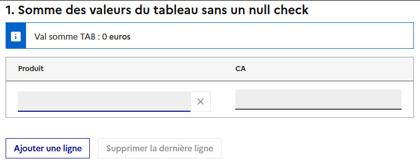
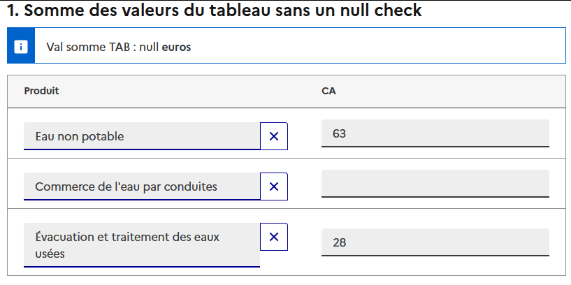
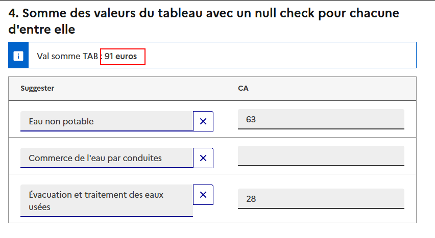

# Sommer un vecteur avec des valeurs null

## Problème
Imaginons une question sous forme de tableau dynamique, `TAB`, collectant le chiffre d'affaire dans la variable collectée `CA` <br>

- On créer une variable calculée faisant la somme de cette colonne `CA` : 
```
SUM_TAB = sum($CA$)
```
- On affiche dans une déclaration cette somme via la formule : 
```
"Val somme TAB : " || cast($SUM_TAB$,string) || " **euros**"
```
- On visualise et on va sur la page de notre tableau
    

    !!! tip "info"
        Quand on arrive au début du questionnaire sans rien avoir remplie, `CA` est un vecteur vide, `[]` <br>
        Donc `SUM_TAB = sum([]) = 0`.

- On décide de remplir uniquement la première et la troisième ligne, on obtient le résultat suivant : 

**La somme des CA vaut `null`** :exploding_head: 

## Cause

Ici, le vecteur `CA` est composé des valeurs suivant : `[63, null, 28]`. Or VTL ne sait pas faire `63 + null + 28`. Il faut donc transformer ce null en 0.

!!! warning "Attention"
    Contrairement à un champ texte ou un booléen, quand on efface la valeur (décocher ou supprimer la valeur du champ) d'un champ de type nombre, alors cette variable est remise à null. <br>
    Voir [le type nombre](../🚀_Guide/Questions/13-reponse-simple.md/#type-de-reponse-nombre) pour plus de détail.


## Solution
On va passer par une variable calculée qui va transformer les `null` en `0` pour le vecteur `CA`

1. Créer une variable calculée `NULL_CHECK_TAB_COL` avec un niveau de calcul = `TAB`
```
NULL_CHECK_TAB_COL = nvl($CA$,0)
```

2. Utiliser cette variable dans le calcul de la somme 
```
SUM_TAB = sum($NULL_CHECK_TAB_COL$)
```

**Et on obtient le résultat voulu** :tada:



!!! tips "Info"
    Voir **[portée des variables](../🚀_Guide/24-boucles.md/#portee-des-variables-champ-niveau-de-calcul)** pour plus de détails sur comment utilisé le niveau de calcul

## Questionnaire exemple

Pour référence, un [questionnaire implémentant cette solution](https://conception-questionnaires.demo.insee.io/questionnaire/m2iwuqca) est disponible dans l'environnement de demo, sous le timbre DOCUMENTATION