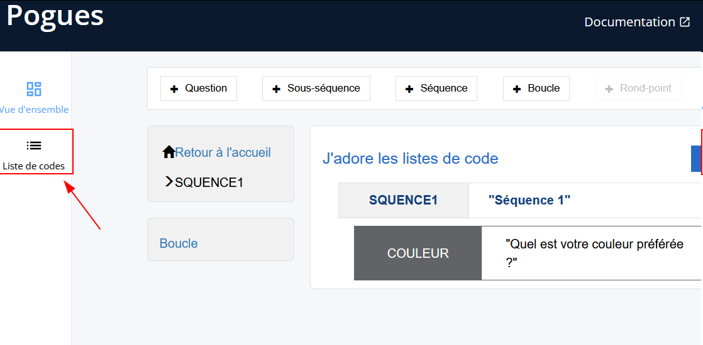
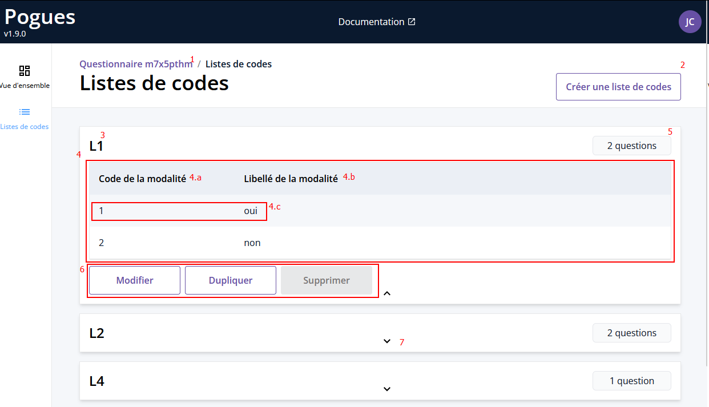
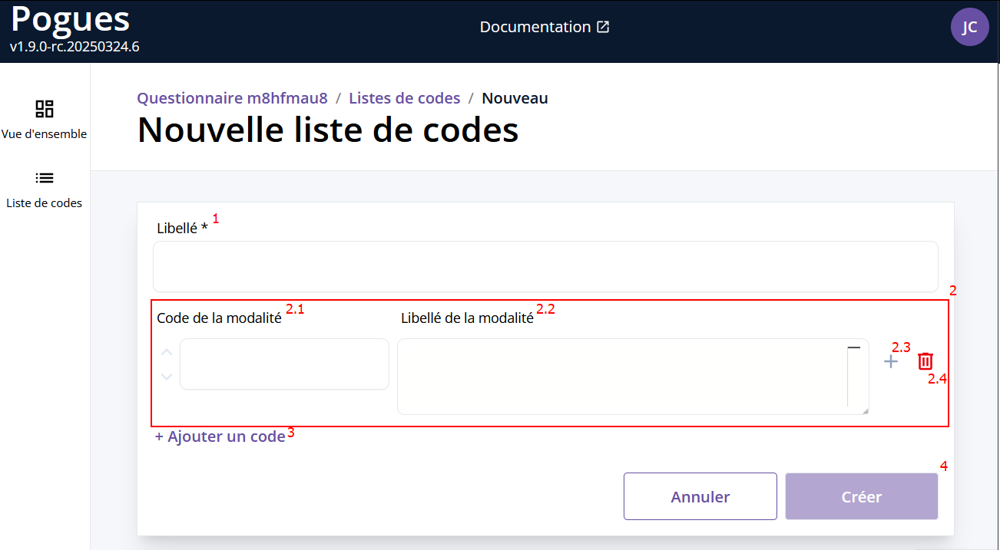
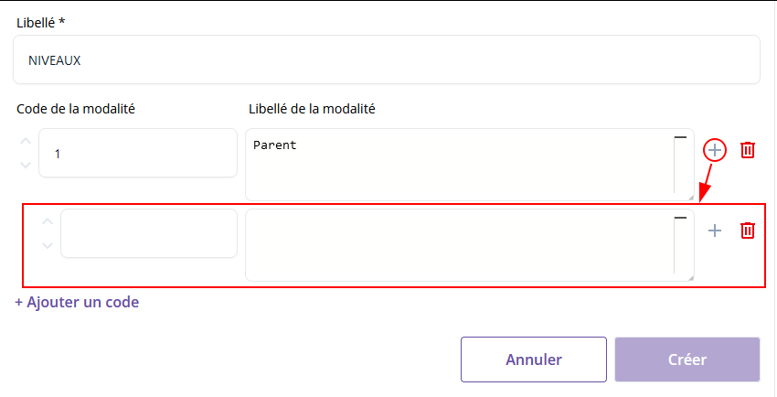
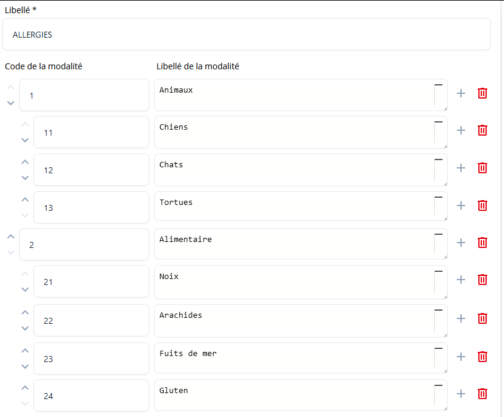
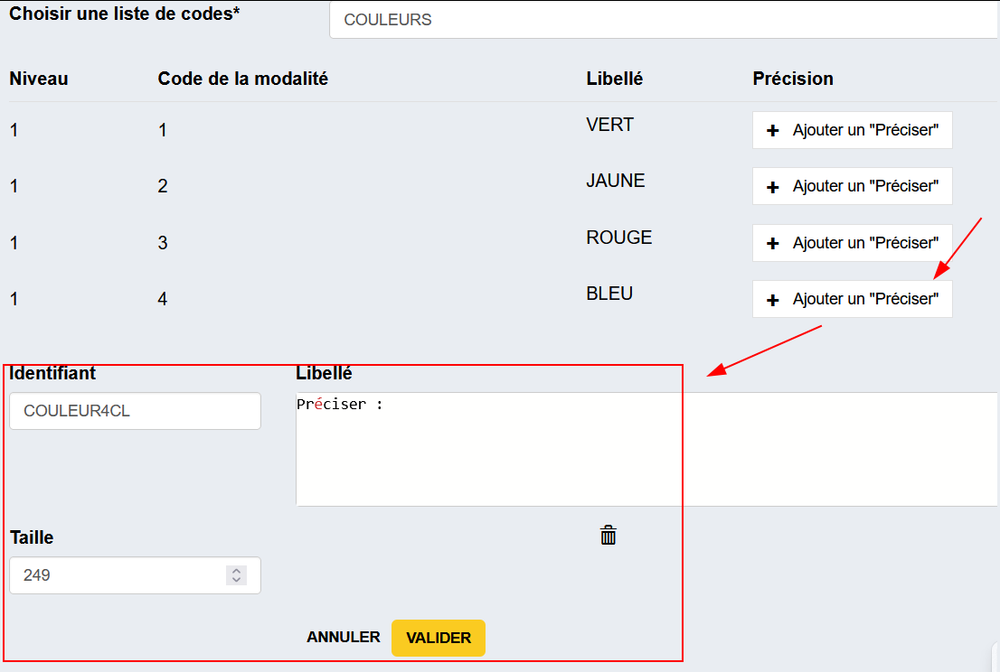
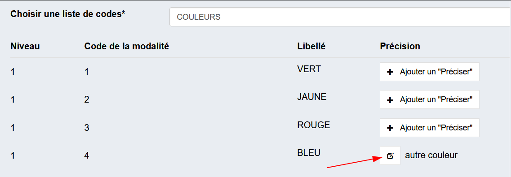

# Spécifier une liste de codes (New ✨)

## Accès aux listes de codes
On accède aux différentes listes de codes via le bouton sur la gauche

On arrive ensuite sur la page de gestion des listes de codes du questionnaire

!!! abstract "Légende"
    1. `Identifiant` du questionnaire
    1. `Bouton de création` d'une nouvelle liste de codes
    1. `Nom` d'une liste de codes
    1. `Liste de codes`
        1. Colonne associée au `Code` des différentes modalités
        1. Colonne associée au `Libellé` des différentes modalités
        1. Une `Modalité` avec ses valeurs associées (`Code` et `Libellé`)
    1. `Nombre de question` utilisant cette liste de codes
        
        !!! tip "Un clique ou un survol permet d'afficher la liste des questions."
    1. Bouton pour `Modifier`, `Dupliquer` ou `Supprimer` une liste de codes.
        
        !!! warning "La suppression est grisée car on na peut supprimer une liste de codes utilisée par des questions."
    1. Flèche permettant de visualiser le `détail` d'une liste de codes en ouvrant la fenêtre (possibilité à l'inverse de la fermée quand cette dernière est déjà ouverte).

## Gérer les listes de codes

!!! warning "Toute modification/création/suppression d'une liste de codes va automatiquement créer une nouvelle version du questionnaire"

### Créer une nouvelle liste de codes

Après avoir appuyé sur le bouton de création d'une nouvelle liste de codes, la page suivante s'affiche

!!! abstract "Légende"
    1. `Nom` de la liste de codes
    1. Une `Modalité`
        - `Code` de la modalité avec un champ texte
        - `Libellé` de la modalité avec un éditeur `VTL`
        - `Ajouter` une `Modalité` **enfant** (voir [gestion des niveaux](#gestion-des-niveaux))
        - `Supprimer` une `Modalité`
    1. `Ajouter` une nouvelle `Modalité`
    1. `Créer` (ou `Annuler`) la liste de codes 

!!! warning "Champs requis"
    Pour créer une liste de codes, il faut au moins
    
    - Un nom
    - Une modalité avec un code et un libellé (la formule VTL associée doit être valide)  

#### Gestion des niveaux

Il est possible d'avoir plusieurs niveaux de modalités dans une même liste de codes

!!! danger "Les niveaux ne sont supportés que pour les tableaux et les QCM avec une liste de codes pour réponse (pas booléen)"

!!! tip "Ajouter des modalité "enfant""
    === "Liste initiale" 
        Quand on clique sur le :octicons-plus-24: à droite de la modalité, cela ajoute une nouvelle modalité enfant.
        
    === "Ajouter un enfant"
        
    === "Ajouter un 2ème enfant"
        Si on clique encore sur ce même :octicons-plus-24: cela rajoute une deuxième modalité enfant
        
    === "Ajouter un petit-enfant"
        En cliquant sur le :octicons-plus-24: de l'enfant on peut aller plus loin dans les niveau et avoir un enfant de l'enfant
        

!!! tip "Changer l'ordre des modalités"
    === "Ordre initial"
        On peut facilement changer l'ordre des modalités ou en supprimer
        
    === "Changer l'ordre"
        

!!! tip "Supprimer une modalité avec des enfants"
    === "Liste initiale"
        Quand on clique sur l'icone :octicons-trash-24: à droite de la modalité, cela la modalité parent avec tous ses enfants.
        
    === "Parent 1 supprimé"
        

??? exemple "Exemple complet"
    

### Éditer une nouvelle liste de codes

Une fois la liste de codes créée, on revient sur la page principale des listes de codes.  
On peut ensuite, sur une liste de codes déjà existante, exécuter les actions suivantes 

- `Modifier` : Accède à la page de modification de liste de codes
- `Dupliquer` : Crée une copie de la liste de codes et l'ajoute en bas de la liste
- `Supprimer` : Supprime la liste de codes.

    !!! warning "Supprimer une liste de codes utilisée dans une question"
        On ne peut pas supprimer une liste de codes utilisée par des questions. On peut voir quelles sont les questions concernées et il faut les modifier pour qu'elles n'utilisent plus cette liste de codes.  
        Un liste de codes associée à aucune question peut être supprimée.

### Utiliser une liste de codes dans un questionnaire 
Lors de la création d'une question avec réponse à choix unique ou multiple, on peut sélectionner la liste de codes à associer avec le champ `Choisir une liste de codes*`
=== "Choisir une liste de codes"
    
=== "Liste de codes sélectionnée"
    

#### "Autre préciser"

!!! warning "Un seul `Préciser` par liste de codes associé à une question"

=== "Ajouter un `Préciser`"
    Pour ajouter un Complément textuel "Autre", il suffit de cliquer sur le bouton `Ajouter un "Préciser"` puis d'indiquer son contenu dans le champ VTL `Libellé` qui est apparu.
    
    > Le champ `Identifiant` est généré automatiquement et peut être édité. La valeur saisie par l'enquêté est enregistrée dans cette variable.
=== "Éditer un `Préciser`" 
    Pour éditer un `Préciser` il suffit de cliquer sur le bouton d'édition
    

!!! note 
    La demande de précision n'est pas associée à la liste de codes en elle-même mais bien à la **question qui utilise cette liste de codes**.
    Ainsi pour une même liste de codes on peut avoir différents `Préciser` définis dans différentes questions.

