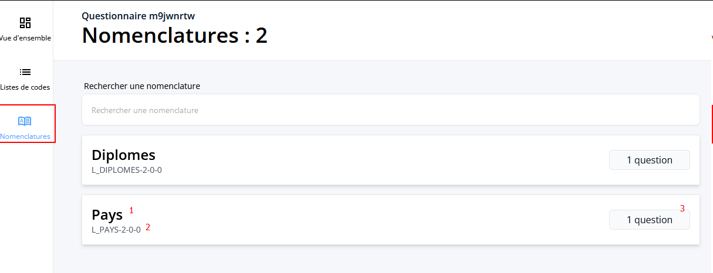
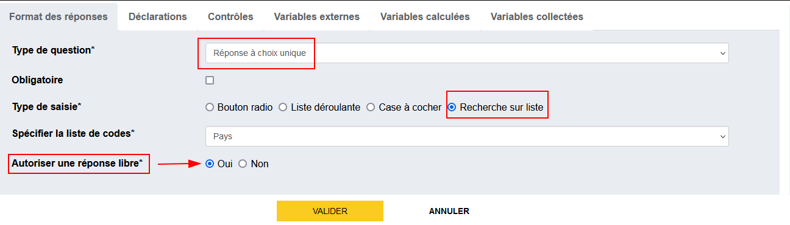
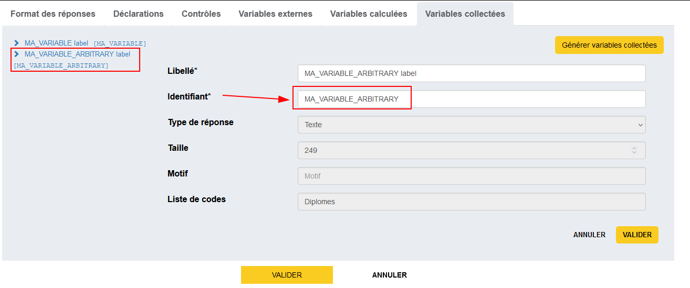
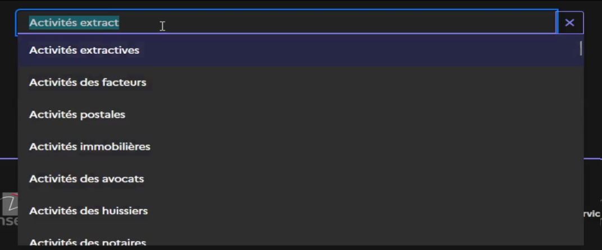
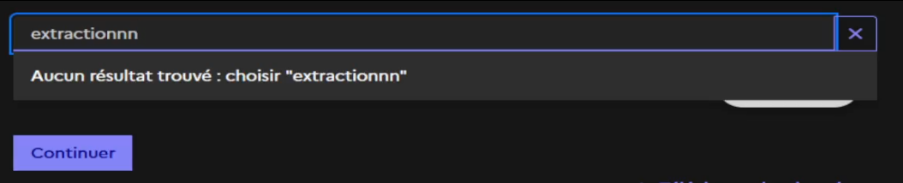
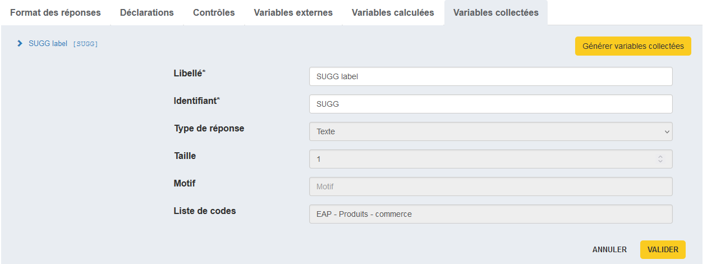
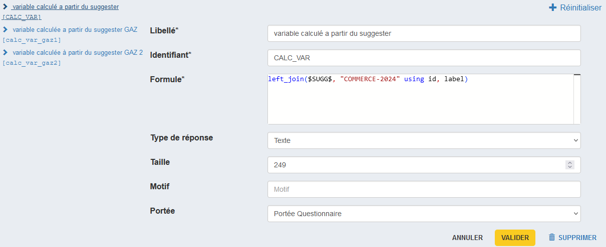
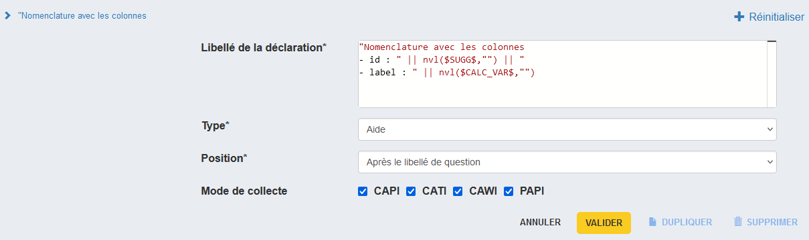
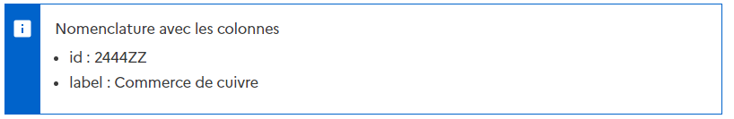
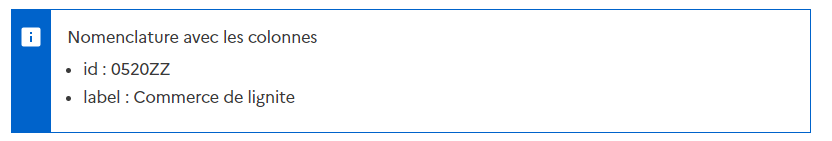

# Suggester : philosophie et nomenclatures

Les nomenclatures doivent contenir au moins les attributs/colonnes `id` et `label`.

On effectue la recherche sur les libellés et/ou les identifiants suivant le paramétrage qui a été choisi pour chacune de ces nomenclatures.

Le paramétrage peut concerner les éléments suivants :

- recherche sur des libellés voire sur les identifiants
- recherche au 3ème caractère saisi par défaut mais peut être 1er ou 2ème selon les cas
- mise en place de stopwords ou synonymes

Entre 2 enquêtes, la recherche (paramétrage) est identique pour une même nomenclature.

## ✨ Page de Nomenclatures
On peut maintenant accéder à la page des nomenclatures via un bouton sur le menu à gauche. Cette page est en lecture seule, on ne peut donc pas éditer une nomenclature.

!!! abstract "Légende"
    Pour chaque nomenclature, on dispose :

    1. du nom métier de la nomenclature : Nom dans le menu déroulant dans Pogues
    2. de sa version : Nom du fichier chargé dans Pogues
    
!!! example "Exemple"
    Pour la nomenclature Pays on aura les infos :
    
    - Pays
    - L_PAYS-1-2-0
    
    

## Recherche sur liste avec réponse libre

On peut définir un QCU avec recherche sur liste **et réponse libre** :  l'enquêté peut conserver le texte saisi si la recherche avec ce texte ne renvoie pas d'occurrence dans la nomenclature spécifiée par le concepteur.

??? example "Exemple d'utilisation"
    1. Pour activer cette fonctionnalité, il suffit de sélectionner `Oui` pour le champ **"Autoriser une réponse libre"**. (Par défaut ce champ vaut `Non`).
    
    2. En générant les variables collectées, on remarque que l'on a **2 variables** :

        - Variable collectée `MA_VARIABLE` : *correspond aux recherches ayant abouti dans la liste.*
        - Variable collectée `MA_VARIABLE_ARBITRARY` : *correspondant aux recherches infructueuses pour lesquelles l'enquêté / l'enquêteur n'a aucun résultat et choisit de conserver sa saisie.*

            ??? note "Nommage de `MA_VARIABLE_ARBITRARY`"
                :warning: Le nom de la seconde variable est automatiquement générée mais est modifiable depuis l'onglet de gestion des variables collectées.
                
        
        !!! danger "Attention"
            On ne peut avoir une valeur renseigné pour ces deux variables en même temps : c'est l'une ou l'autre. **Ce point est à prendre en compte si on fait du pré-remplissage**
        
    3. Prenons par exemple la nomenclature sur les activités. Si on saisit 'Activités extract' on obtient les echos suivants
        
        En sélectionnant l'un des echos puis en appuyant sur 'Continuer', alors `MA_VARIABLE` prend la valeur de cet echo et `MA_VARIABLE_ARBITRARY` est `null`.

        Si on saisit 'extractionnn' aucun echo n'est trouvé dans la liste. On a alors la possibilité de sélectionner 'extractionnn' comme réponse.
        
        Si on clique sur 'choisir "extractionnn"' puis qu'on clique sur 'Continuer', alors `MA_VARIABLE_ARBITRARY` prend la valeur 'extractionnn' et `MA_VARIABLE` vaut `null`.

    L'option `Non` désactive cette fonctionnalité : l'utilisateur ne peut pas saisir de "réponse libre" = comportement "classique" du suggester.

!!! warning "Exception"
    **La fonctionnalité de recherche sur liste avec réponse libre ne marche dans les tableaux**

!!! tip "Ancien fonctionnement dans le TCM"
    Dans les variables TCM, les listes contiennent une modalité "je n'ai pas trouvé dans la liste" et on on crée une autre variable avec une question filtrée

## Suggester à choix multi-variables (une réponse valorise plusieurs variables)

### Besoin
Lorsqu'on utilise une question à choix unique avec recherche sur liste ("Suggester"), on peut avoir dans la nomenclature des colonnes autres que l'identifiant et le label. <br>
On souhaite pouvoir récupérer les valeurs en même temps la variable contenant l'identifiant et les valeurs incluses dans d'autres colonnes.

### Scenario
!!! info 
    Dans l'exemple suivant, on souhaite récupérer dans la variable `CALC_VAR` la valeur correspondant à la colonne "label" de la nomenclature d'identifiant technique "COMMERCE-2024" lorsqu'on collecte comme identifiant la variable `SUGG`

#### Nomenclartue _Commerce-2024_
| id     | label               |
| ------ | ------------------- |
| 2444ZZ | Commerce de cuivre  |
| 0520ZZ | Commerce de lignite |

#### Étapes
1. Créer une variable collectée basée sur une question à choix unique avec recherche sur liste et avec l'id `SUGG`.

!!! abstract "Règle de nommage"
    C'est toujours mieux de nommer les variables en MAJUSCULE séparé par des '_'
2. Créer une variable calculée `CALC_VAR` avec la formule suivante : <br>
`left_join($SUGG$, "COMMERCE-2024" using id, label)`



#### Résultats 
Je peux ensuite afficher cette valeur, par exemple dans une déclaration, en appelant la variable calculée `CALC_VAR`

???+ example "Exemple de déclaration en VTL"
    ```js
    "Nomenclature avec les colonnes
    - id : " || nvl($SUGG$,"") || "
    - label : " || nvl($CALC_VAR$,"")
    ```




##### En sélectionnant "Commerce de cuivre"


##### En sélectionnant "Commerce de lignite"


!!! warning "Détail technique"
    Le comportement actuel est temporaire du point de vue du parcours utilisateur dans Pogues. <br>
    En effet, la variable `CALC_VAR` est définie dans Pogues comme une variable calculée mais d'un point de vue métier, c'est une variable **collectée**.
    Elle est bien considérée comme une variable collectée dans Lunatic. On peut la récupérer en téléchargeant les données depuis la visualisation DSFR. <br>
    
    A terme, on aura un parcours utilisateur dans Pogues qui sera plus cohérent avec ce concept. <br>
    Ex : Un bouton qui permet d'ajouter une paire clé/valeur qui indique le nom de la nouvelle variable collectée et le nom de la colonne dans la nomenclature 

### Questionnaire exemple

Pour référence, un [questionnaire implémentant cette solution](https://conception-questionnaires.demo.insee.io/questionnaire/m1holrzlDOC) est disponible dans l'environnement de demo, sous le timbre DOCUMENTATION
