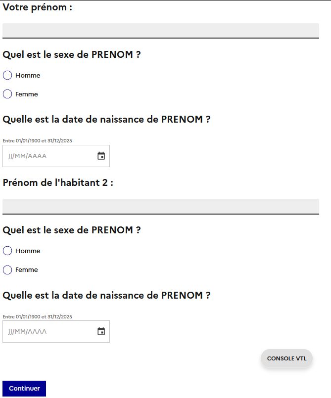
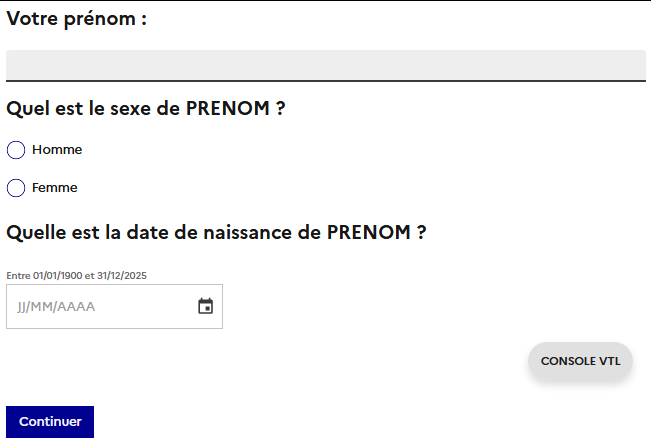
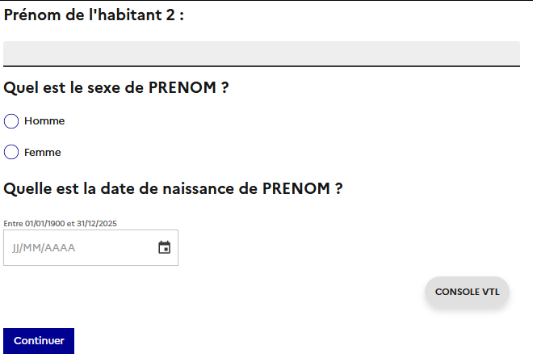

# Les boucles

Une boucle est une répétition d'un ensemble de séquences ou de sous-séquences du questionnaire. On va appeler cet ensemble **occurrence**. <br>
Ex : ensemble des questions pour identifier une personnes, `PRENOM`, `AGE`, `SEXE`, etc.

On peut concevoir dans Pogues deux types de boucles :

- des boucles qui s'appuient sur des valeurs (des nombres fixes ou issus de variables) : **Boucle Principale**,
- des boucles qui s'appuient sur une autre boucle ou sur un tableau : **Boucle Liée**.

Quel que soit son type, une boucle sera créée en cliquant dans la barre d'actions sur le bouton `+ Boucle`.

## Boucle Principale

Pour créer une telle boucle, il faut remplir les champs suivants :

!!! abstract "Description"
    === "Nombre d'occurrences max = min"
        - `Identifiant`, par exemple `B_LE_NOM_DE_MA_BOUCLE`
        - `Nombre d'occurrences max identique à min`, ici vaut **OUI**
        - `Nombre d’occurrences`, le nombre de répétitions
        - `Afficher toutes les occurrences sur une seule page`, définit l'affichage des questions avec **toutes les occurrences** sur une même page ou avec **une occurrence** par page.
        - `Début`, l'élément par lequel commence la boucle (une séquence ou une sous-séquence donc)
        - `Fin`, l'élément avec lequel termine la boucle - une séquence si on a commencé par une séquence, une sous-séquence dans l'autre cas.
    === "Nombre d'occurrences max <> min"
        - `Identifiant`, par exemple `B_LE_NOM_DE_MA_BOUCLE`
        - `Nombre d'occurrences max identique à min` : **NON**
        - `Nombre d'occurrences minimum`, la valeur minimum de répétitions
        - `Nombre d'occurrences maximum`, la valeur maximum de répétitions
        - `Début`, l'élément par lequel commence la boucle (une séquence ou une sous-séquence donc)
        - `Fin`, l'élément avec lequel termine la boucle - une séquence si on a commencé par une séquence, une sous-séquence dans l'autre cas.

### Affichage des occurrences (New ✨)

Par défaut, **toutes les occurrences** d'une boucle sont affichées sur la même page. Dans le cas où le nombre d'occurrences max est identique au min, on peut décider de changer cet affichage via le paramètre `Afficher toutes les occurrences sur une seule page` en mettant `NON`

!!! Warning "La fonctionnalité _Afficher une occurrence par page_ est réservée aux questionnaires web en contexte ménage."

!!! example "Exemple d'utilisation"
    - Regrouper les questions sur l'identité d'une personne (Prénom, Age, Sexe, etc) sur la même page pour **chaque** individu.
    - Ici **une occurrence** = question `PRENOM` + question `SEXE` + question `AGE`
    === "Affichage des occurrences sur la même page"
        
    === "Affichage d'une occurrence par page"
        === "Page 1"
            
        === "Page 2"
            

## Boucle Liée

Pour créer une boucle liée, je remplis :

!!! abstract "Description"
    - `Identifiant`, par exemple `B_LE_NOM_DE_MA_BOUCLE`
    - `Basé sur`, en allant chercher une structure répétée, c'est-à-dire une boucle ou un tableau
    - `Sauf`, permet d'exclure certaines répétitions de la boucle
    - `Début`, l'élément par lequel commence la boucle (une séquence ou une sous-séquence donc)
    - `Fin`, l'élément avec lequel termine la boucle - une séquence si on a commencé par une séquence, une sous-séquence dans l'autre cas.

!!! tip
    Un élément **important** des boucles liées : si je crée une boucle `B2` liée à une boucle `B1`, toutes les variables collectées dans les occurrences de `B1` seront disponibles lors des répétitions de `B2`.

## Portée des variables (Champ "Niveau de calcul")

Se référer à la section [Portée des variables](Variables/portee.md)

## Exclusion

Le champ `Sauf` permet d'exclure dans une boucle liée certaines des répétitions.

En reprenant l'exemple du paragraphe précédent, on pourrait par exemple exclure les mineurs avec la formule VTL :

```
AGE < 18
```

Ou mieux, exclure les individus hors champs en nous appuyant sur l'indicatrice calculée ! :smiley:
