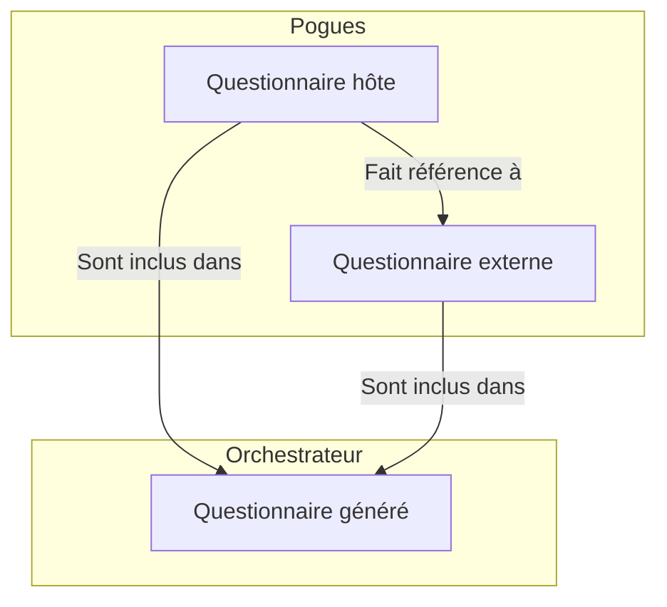
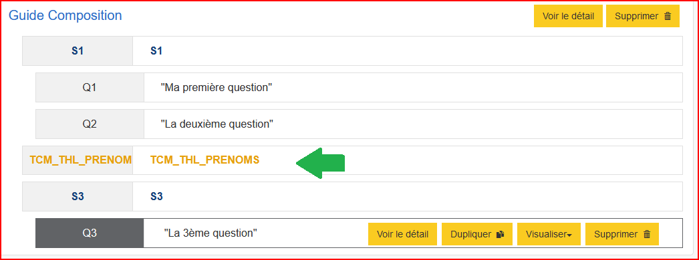
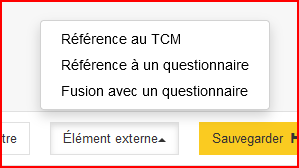
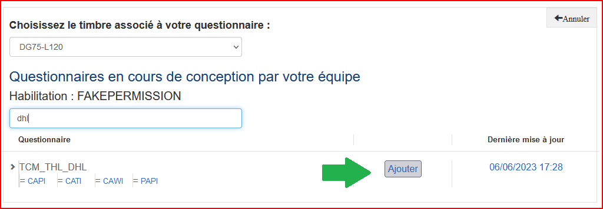
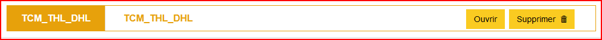
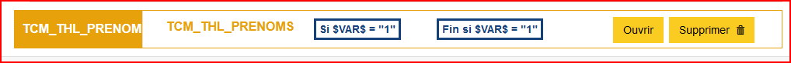

# La composition

Pour rendre la conception d'un questionnaire plus flexible, il est possible d'y importer d'autres questionnaires. On _compose_ ainsi un questionnaire à partir de multiples sources.

## Les principes

La fonctionnalité de _composition_ permet d'ajouter des références dynamiques à un ou plusieurs questionnaires externes, références qui sont matérialisées lors de la visualisation du questionnaire hôte.

!!! note

    Référence dynamique signifie ici que tout changement dans le questionnaire cible sera disponible dans le questionnaire qui l'importe, ce qui est différent de la fonctionnalité de Fusion qui copie le questionnaire cible une fois puis ne le met plus à jour.

Le questionnaire Pogues s'enrichit d'un nouvel élément qui marque cette ou ces références à d'autres questionnaires. :point_down:

## Ajouter une référence

Pour ajouter une référence, il faut cliquer sur le bouton "Élément externe" de la barre d'actions, qui va vous proposer :

- _Référence au TCM_ : permet d'ajouter une référence à un module du TCM
- _Référence à un questionnaire_ : permet d'ajouter une référence à tous types de questionnaire
- _Fusion avec un questionnaire_ : permet d'accéder à la fonctionnalité de fusion de questionnaire

Nous nous concentrons ici sur les deux premières options. Le fonctionnement qui suit est le même pour les deux options, la première opère simplement un filtre pour ne proposer que des modules du TCM.

Dans la page qui s'ouvre, il suffit de rechercher le questionnaire que l'on veut référencer dans notre questionnaire puis de cliquer sur _Ajouter_.

La référence est ajoutée dans le questionnaire comme un nouvel élément qui est déplaçable comme une séquence.

On peut également ouvrir le questionnaire référencé ou supprimer la référence.

## Utiliser la référence

Une fois la référence ajoutée, le questionnaire hôte peut mobiliser :

- les __variables__ du questionnaire référencé (les variables collectées, calculées ou externes)
- les __boucles__ du questionnaire référencé (pour la création d'une boucle liée)

Il est également possible de filtrer une référence. :point_down:

## Précautions et "bonnes pratiques" 👍

### Boucles 

On appelle boucle, le questionnement répétitif d’un ensemble de questions. Cet ensemble de questions pour une répétition donnée est appelée une **occurrence** de boucle.
Dans Pogues, une boucle ne peut être construite qu'a partir de séquences (ou sous-séquences) entières.
L'atelier de conception propose deux types de boucles : 

- une boucle dite simple pour laquelle on définit un nombre minimum et un nombre maximum d’occurrences affichables, en absolu (numérique) ou avec une variable collectée ou calculée ;
- une boucle dite liée qui se base sur les occurrences d'une boucle précédente. Dans ce cas, la première est la boucle principale
Exemple dans le TCM : la boucle principale est la liste des prénoms, une boucle liée peut être une boucle sur l'état de santé de chaque individu

Pour créer une "boucle liée", il est nécessaire d'avoir déjà créé la boucle principale, qui peut avoir été décrite dans un questionnaire précédent. Donc il ne sera pas possible de créer une boucle liée sur un questionnaire "isolé"

!!!note

    Il est également possible de créer une boucle liée à partir d'un tableau dynamique. 
    Chacune des lignes du tableau est équivalent à une occurrence de la boucle principale. 
    ⚠️ Pour avoir un comportement similaire à ce qui est décrit au dessus, le tableau dynamique ne doit pas être peuplé par une variable externe mais par une variable collecté.  
    Ce fonctionnelle avec un vecteur injecté sous forme de variable externe n'est pas encore supporté.

### 🐞 Gestion des doublons d'identifiant

#### Listes de codes et référence au questionnaire d'origine

A la création d'une liste de codes, est créé un identifiant technique non affiché dans Pogues. 
Lorsqu'on duplique un questionnaire, cet identifiant est conservé. 
Lorsqu'on compose un questionnaire qui utilise le questionnaire d'origine et le questionnaire dupliqué, on a alors un souci de doublons.

??? success "Solution"
    **=> Utiliser le bouton de duplication de liste de code** dans la page des listes de code  
    - Changer juste après le nom pour distinguer de l'ancienne
    - On peut ensuite régénérer les variables calculées et valider les modifications. :tada: Plus de problèmes de doublons

#### Séquences et Sous-Séquences

Comme pour les listes de codes, les identifiants des séquences et sous séquences des questionnaires dupliqués restent les mêmes.

Il n'existe pas de moyen pratique pour y remédier autre que supprimer le séquence/sous-séquence et la recréer.

!!! tip "Astuce"
    1. Se placer sur la séquence/sous-séquence en question
    2. Créer une séquence/sous-séquence. Cette dernière va apparaître juste au dessus de celle sélectionnée.
    3. Changer les noms en conséquence.
    4. Supprimer l'ancienne séquence/sous-séquence

### Duplication pour sauvegarde

Attention à la duplication également lorsqu'on veut "sécuriser" son questionnaire. La composition se fait par référence.

??? example "Exemple"
    si C est la composition de A et B, alors C fait référence aux ids de A et de B (`id_A` et `id_B` par ex). 
    Si je duplique A en AA, B en BB, je crée 2 nouveaux id, `id_AA` et `id_BB` et que je modifie AA et BB, C faisant toujours référence par composition à `id_A` et `id_B`, donc à A et B, il n'aura pas les modifications contenus dans AA et BB.

### Variables créées dans un questionnaire et utilisées dans un autre

Un questionnaire qui sera utilisé dans un questionnaire hôte peut avoir des parties filtrées ou des variables calculées, utilisant les variables d'une autre partie de questionnaire : 
- on peut, dès le début de la description du questionnaire dans Pogues, faire appel à ces variables provenant d'un autre questionnaire mais  elles ne seront pas valorisées lors de la visualisation Pogues du questionnaire "de base".

- pour les valoriser et donc aller plus loin dans les tests : 
    - soit on les décrit comme variables externes - penser ensuite à les supprimer quand la composition commence
    - soit on crée des variables collectées "temporaires" en début de questionnaire

### Travail collectif avec composition

- s'accorder sur le nommage des variables, des listes : 
    - ne pas créer de variables T_ car réservées aux variables TCM
    - ne pas utiliser de -, de minuscules
    - nommer les listes au format L_ 
- savoir qui travaille sur quel questionnaire 