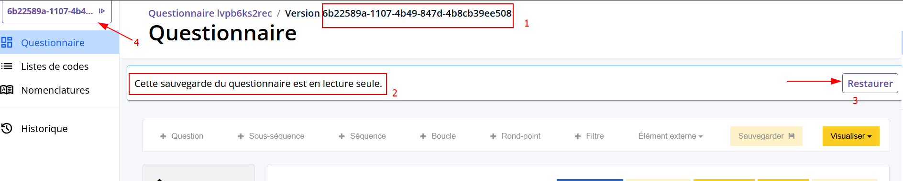

# Historique de sauvegardes

## Accéder à l'historique

!!! abstract "Historique des sauvegardes"
    

    1. Liste des sauvegardes  du jour
    2. Bouton pour consulter un sauvegarde
    3. Sauvegardes des jours précédents
    4. Supprimer toutes les sauvegardes

!!! info "Règle de conservation des sauvegardes"
    Tous les soirs, toutes les sauvegardes du jour, puis les 10 précédentes sont conservées. Au-delà, la dernière de chaque jour est conservée."

??? question "Précisions sur la dernière journée sauvegardée"
    Le "nettoyage" des sauvegardes pour les jours précédents est déclenché tous les soirs sauf le samedi et dimanche soir.
    
    **Exemple :** On est le 17/02/2025 à 15:00
    
    1. On va sur un questionnaire qui a été dernièrement modifié le 01/02/2025.
    2. On clique sur le bouton `Historique`, on arrive sur la page de sauvegardes.
    3. On observe une liste de 5 sauvegardes : 
        - 3 sauvegardes du 01/02/2025 à 09:30, 11:00 et 11:35
        - 1 sauvegarde du 28/01/2025 à 14:00
        - 1 sauvegarde du 04/01/2025 à 09:00
    4. On retourne sur le questionnaire, on l'édite, on sauvegarde. Un nouvelle sauvegarde du questionnaire est donc créée.
    5. On clique sur le bouton `sauvegardes`, la modale s'ouvre.
    6. On observe une liste de 6 sauvegarde :
        - 1 sauvegarde du 17/02/2025 à 15:02
        - 3 sauvegardes du 01/02/2025 à 09:30, 11:00 et 11:35
        - 1 sauvegarde du 28/01/2025 à 14:00
        - 1 sauvegarde du 04/01/2025 à 09:00

    - Si jamais on enregistre 16 sauvegarde pour le 17/02, le lendemain il n'y aura plus que 10 sauvegarde pour le 17/02 et autant que l'on veut pour le 18/02
    - Si jamais on enregistre 8 sauvegarde pour le 17/02, le lendemain il y aura toujours les 8 sauvegarde pour le 17/02, autant que l'on veut pour le 18/02 mais plus que 2 pour le 01/02 (11:00 et 11:35)

## Consulter une sauvegarde d'un questionnaire

!!! abstract "Consultation d'un sauvegarde"
    

    1. Id de la sauvegarde
    2. Bandeau indiquant que le questionnaire est en lecture seule
    3. Bouton pour restaurer cette sauvegarde = créer une nouvelle sauvegarde avec le même contenu
    4. Bouton permettant de revenir rapidement à la dernière sauvegarde du questionnaire 

!!! tip "Navigation pendant la consultation d'une sauvegarde"

    - Lorsqu'on est en mode "consultation de sauvegarde", le questionnaire est en mode **lecture seule** : aucune modification du questionnaire n'est possible car on est juste en train de **consulter** le contenu d'une sauvegarde d'un questionnaire.

    - Il est possible de visiter les autres menus (`Nomenclatures`, `Listes de codes`, etc) en **restant sur le contenu de la sauvegarde actuellement consulté**. Donc on peut facilement accéder aux listes de codes de chaque sauvegarde de mon questionnaire. 