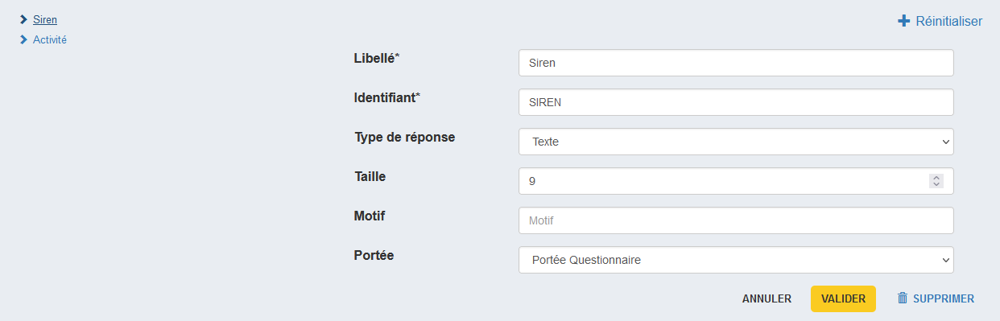
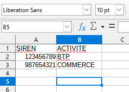
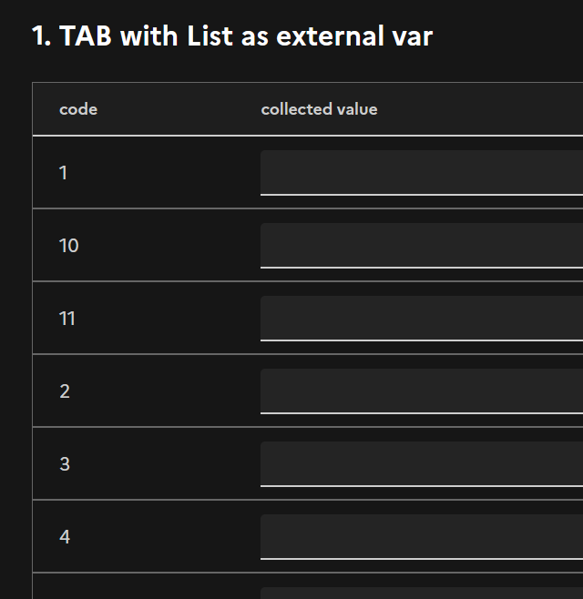
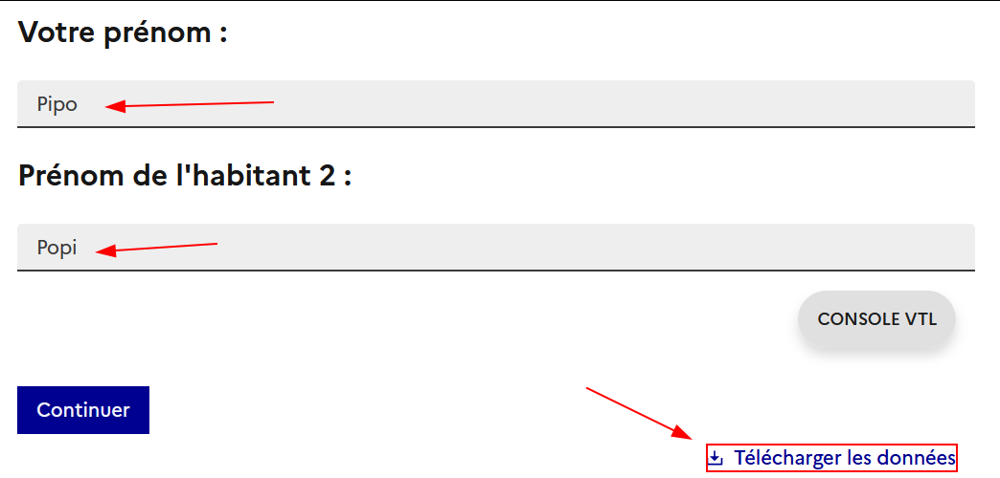
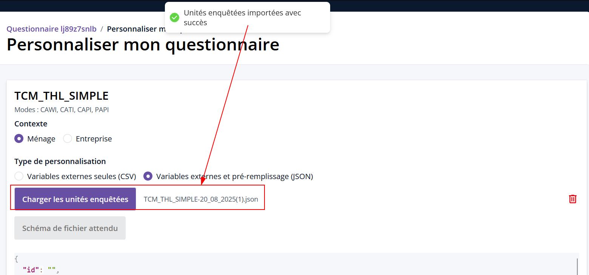
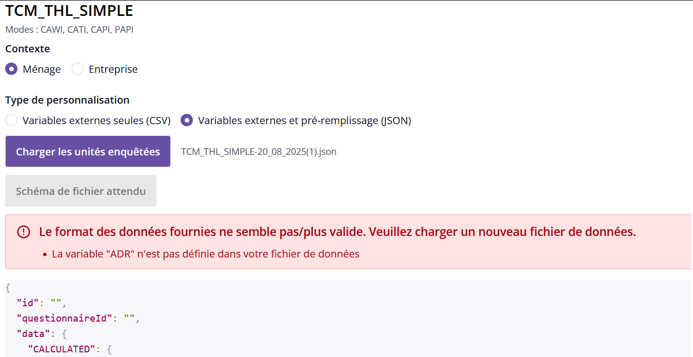
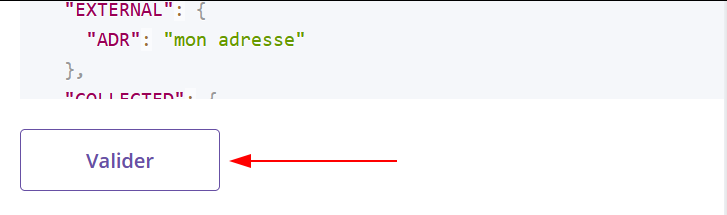

# Création des unités enquêtées

## Processus

Il faut fournir les unités enquêtées de test afin de créer les questionnaires correspondant dans les différents orchestrateurs.

Pour cela, il faut transmettre un fichier, au format CSV ou json, donnant les valeurs associées aux variables externes décrites dans Pogues.

!!! tip "Pré-remplissage de variables collectées" 

    Il est également possible de définir des valeurs pour des variables collectées. C'est ce qu'on appelle le pré-remplissage de données de collecte.<br>
    **Possible uniquement via le format json**

## Variables externes seules - CSV

Le bouton "Schéma du fichier attendu" permet de télécharger un fichier CSV contenant l'entête des variables, à compléter avec les valeurs associées aux unités enquêtées.

Si mon questionnaire Pogues contient deux variables externes, `SIREN` et `ACTIVITE`, je les retrouve dans le fichier ainsi téléchargé.

Dans Pogues :



Dans le fichier CSV de schéma :


On peut remplir les données à partir de ce fichier schéma :

...

## Point d'attention

!!!danger "Encadrer les données avec `""`"

    - Les valeurs d'en-tête et de lignes doivent être encadrées de `""`. Le fichier schéma téléchargé depuis Public Enemy contient bien ces double quotes pour les en-têtes.
    - Si on utilise Libre Office Calc pour éditer ce fichier, on peut utiliser [**cette astuce**](https://help.libreoffice.org/latest/fr/text/scalc/guide/csv_files.html) pour s'assurer que les `""` sont bien toujours présentes après enregistrement
    - Pour bien s'assurer que cette contrainte est respectée, on peut ouvrir le fichier de données que l'on constitue avec un éditeur de texte comme Notepad++.

    ???example "Exemple de fichier csv valide"
        ```
        "SIREN","ACTIVITE","SALARIE_PRENOM_1","SALARIE_PRENOM_2","SALARIE_PRENOM_3",
        "120027016","BTP","Pierre","Géraldine",""
        "987654321","COMMERCE","Solange","Ludovic","Camille"
        ```

!!! warning "Type des variables externes"
    - Toutes les variables externes sont importées avec en tant que texte (= type `string`). **il faut donc bien penser à utiliser la fonction de [cast()](../../💻_VTL/fonctions-vtl.md/#cast) au besoin**  

!!!warning "Maximum 10 UE"

    - Un fichier de données ne pourra contenir qu'un maximum de 10 unités enquêtées.

!!!warning "Ordre des listes de plus de 10 éléments dans un tableau dynamique"

    - Si pour une UE on a une variable sous forme de vecteur et qu'on injecte plus de 10 élément, alors ces derniers ne seront pas affichés dans le bon ordre
    
    
    Ex: J'ai une variable externe LISTE
    ```
    LISTE = [LISTE_1,LISTE_2,...,LISTE_9,LISTE_10,LISTE_11]
    ```
    si j'injecte cette variable dans l'une des colonne d'un tableau et que je visualise, je vais avoir l'ordre suivant
    ```
    LISTE_1, LISTE_10, LISTE_11, LISTE_2, LISTE_3, ...
    ```
    
    ??? example "exemple"
        ```title="Exemple de csv à importer dans Public Enemy"
        "LISTE_1","LISTE_2","LISTE_3","LISTE_4","LISTE_5","LISTE_6","LISTE_7","LISTE_8","LISTE_9","LISTE_10","LISTE_11"
        "code 1","code 2","code 3","","","","","","","","11"
        "1","2","3","4","5","","","","","",""
        "1","2","3","4","5","6","7","8","9","10","11"
        ```
        

!!!note "Variables de portée Boucle ou lignes de tableaux dynamiques"

    Pour les variables de portée "Boucle" ou les lignes de tableaux dynamiques, il faudra créer autant de variables suffixées par un index que l'on veut d'occurrences ou de lignes. 
    Par exemple, pour une variable externe `PRENOM`, on fournira un fichier contenant `PRENOM_1`, `PRENOM_2`, ..., `PRENOM_N`.

Puis charger avec le bouton "Charger les unités enquêtées", puis valider la création avec le bouton "Créer le questionnaire dans les orchestrateurs".

!!!note

    Selon la taille du questionnaire cette création peut durer plusieurs minutes.

## Variables externes et pré-remplissage - JSON (New ✨)

Pour récupérer le fichier json attendu du questionnaire, il suffit de faire

1. une visualisation simple depuis Pogues (ex visualisation Web ménage)
1. remplir les question que l'on souhaite pré-saisir et télécharger le fichier de données
    Ici on saisie des valeurs pour la variable PRENOM qui est dans une boucle
    
    un récupère un json de la forme suivante
    ```json
    {
        "data": {
            "CALCULATED": {},
            "EXTERNAL": {},
            "COLLECTED": {
                "T_NHAB": {
                    "COLLECTED": 2
                },
                "T_PRENOM": {
                    "COLLECTED": [
                        "Pipo",
                        "Popi"
                    ]
                }
            }
        },
        "stateData": {
            "state": "INIT",
            "date": 1755698985271,
            "currentPage": "3"
        }
    }
    ```
1. On charge ensuite le fichier

    

    ??? warning "Variables externes manquantes"
        Dans une visualisation simple depuis Pogues, il n'y a pas de variables externes, donc il n'y en a pas dans le json de données téléchargé non plus. Il faut les ajouter si besoin dans l'attribut `"EXTERNAL"`

        Ex : dans mon cas il me manque la variable externe `ADR` car elle est définie dans mon questionnaire mais pas dans mon fichier json. Un message d'erreur apparait alors au moment de charger le fichier
        

        Il suffit de modifier le fichier ane ajoutant un attribut `"ADR"` dans `"EXTERNAL"` pour que cela fonctionne.
    
        ```json
        {
            "data": {
                "CALCULATED": {},
                "EXTERNAL": {
                    "ADR": "mon adresse"
                },
                "COLLECTED": {
                    "T_NHAB": {
                        "COLLECTED": 2
                    },
                    "T_PRENOM": {
                        "COLLECTED": [
                            "Pipo",
                            "Popi"
                        ]
                    }
                }
            },
            "stateData": {
                "state": "INIT",
                "date": 1755698985271,
                "currentPage": "3"
            }
        }
        ```

1. Enfin on valide
    

    On clique sur valider dans la pop-up de confirmation pour finaliser la création de la personnalisation 

