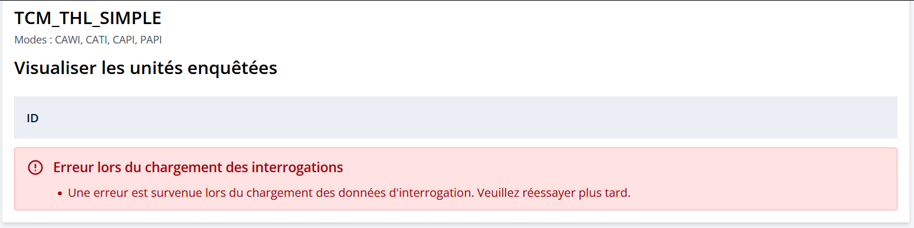
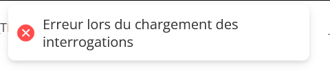

# Gestion des erreurs de personnalisation

## Erreur de synchronisation

Lorsqu'on modifie un questionnaire qui a déjà une personnalisation de chargée, et que c'est changement sont structurants pour le questionnaire (potentiellement le questionnaire est **cassé** entre temps), il se peut qu'apparaisse ce bandeau

De même, si on essaye de créer une personnalisation pour un questionnaire cassé, on la pop-up suivante qui apparaît

!!! tip "Solution"
    - Supprimer la personnalisation et voyez pour corriger le questionnaire avant d'en recréer une.
