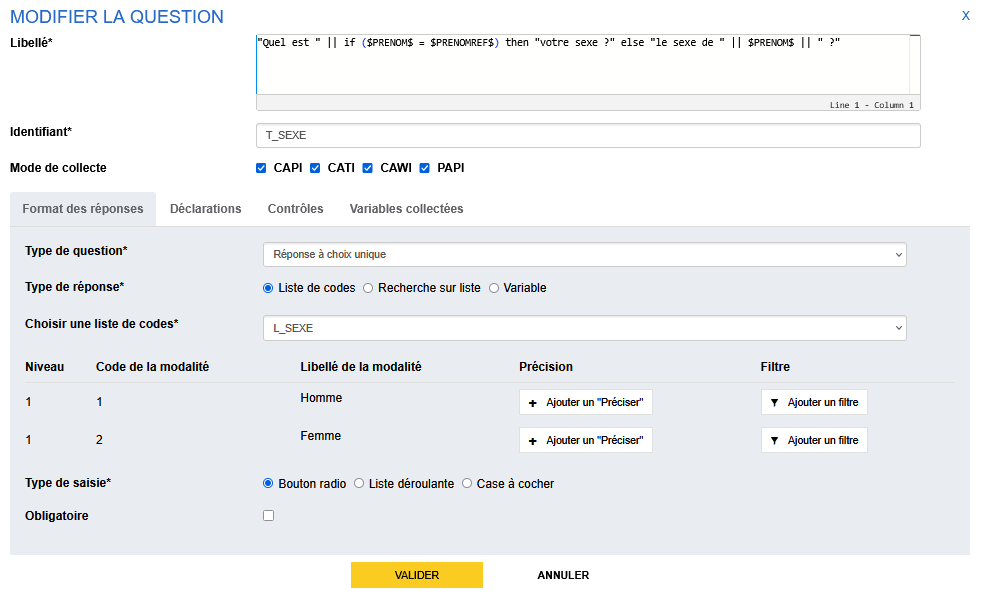
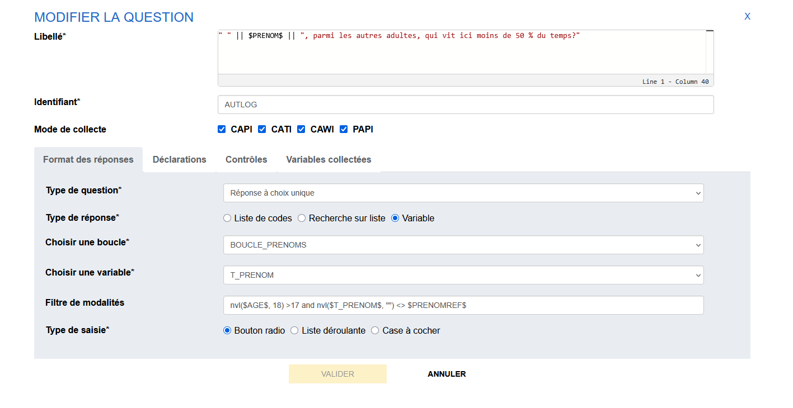

# Les questions de type Réponse à choix unique

Pour créer une question de type **Réponse à choix unique**, on renseigne :

- le _type de réponse_ (liste de codes, recherche sur liste, variable)
- le _type de saisie_ (Bouton-radio, Liste déroulante, Recherche sur liste)

## Types de réponses

Il existe 3 types de réponse pour les questions QCU (question à choix unique). Les types de réponses correspondent à la façon dont on va décrire les modalités de réponses proposées à l'enquêté.

### Liste de codes

Avant de spécifier la question QCU avec une réponse de type sélection dans une liste de codes, il faut avoir créer la liste de codes.

Plus de détails dans la page [Les listes de codes](../14-liste-codes.md).

La démarche pas-à-pas pour créer une question QCU basée sur une liste de codes est détaillée dans le tutoriel, [Création d'une réponse basée sur une liste](../../💡_Tutoriel_/14-creation-liste-qcu.md).

#### Filtrer les modalités

Il est possible de filtrer la liste de modalités associée à la QCU selon des formules VTL. Pour plus d'info, voir la doc [Filtrer une liste de codes](../14-liste-codes.md/#filtrer-une-liste-de-codes).

#### Ajouter une demande de précision

On peut laisser la possibilité à l'enquêté d'apporter un complément textuel à la réponse QCU basée sur une liste de codes lorqu'on a dans la liste une modalité "Autre".

Plus de détails dans la page [Les listes de codes](../14-liste-codes.md#ajouter-un-préciser).

#### Caractère obligatoire

Parmi les questions de type QCU, seules les questions QCU de type liste de codes permettent d'ajouter un caractère obligatoire à la question.

### Recherche sur liste (Suggester)

Le Suggester est le composant de recherche sur liste. Il permet d'offrir une recherche dynamique sur des listes volumineuses avec la présentation d'échos de réponse au fur et à mesure de la saisie.

Le type de réponse est imposé : c'est une liste déroulante dans laquelle l'enquêté sélectionne la modalité correspondant à sa situation.

Plus de détails dans la page [Suggester](15b-suggester.md).

### Variable du questionnaire

Il est possible de créer une question de type QCU basée sur une **variable de portée une boucle ou un tableau dynamique** (ie, la variable est un vecteur, elle contient plusieurs valeurs) : les valeurs de la variable seront utilisées comme modalité du QCU.

!!! example "Cas pratique"
    Pour spécifier la question, on remplit les champs suivants dans Pogues :

    - _Type de question_ : Réponse à choix unique
    - _Type de réponse_ : Variable
    - _Choisir une boucle_ : Sélectionner la portée de la variable que vous voulez utiliser comme base du QCU --> la boucle ou le tableau dynamique
    - _Choisir une variable_ : Sélectionner la variable souhaitée
    - _Type de saisie_ : Bouton radio ou liste déroulante

Les modalités de la question sont contituées des valeurs du vecteur (par exemple les valeurs du vecteur PRENOM collectées dans une boucle, un vecteur de produits préremplis pour un tableau dynamique etc).

#### Filtrer les modalités

!!! danger "Fonctionnalité non supportée pour les [:octicons-link-16:Réponses QCU dans un tableau](./Tableaux/index.md), uniquement dans une question simple !"

Il est possible de filtrer les modalités d'un QCU basé sur une variable du questionnaire (collectée, externe ou calculée) en remplissant le champ `Filtre de modalités` avec une formule VTL. 

La question QCU peut être positionnée au sein d'une boucle ou en dehors.

La formule VTL s'applique en exploitant des variables de portée questionnaire ou de même portée que la variable décrivant les modalités du QCU.

Par exemple, je peux filtrer la variable `PRENOM` issue d'une boucle `BOUCLE_PRENOM` utilisant dans ma formule VTL toute variable de portée `BOUCLE_PRENOM` qu'elle soit collectée, externe ou calculée.

La même logique d'affichage que pour le filtre d'une question est mise en oeuvre :

| Validité de la Formule VTL | Condition d'affichage | Résultat |
| ----------------- | --------------------- | --------- |
| Pas de formule | / | la modalité est affichée |
| ❌ | `ERROR` | la modalité est affichée |
| ✅ | `TRUE`  | la modalité est affichée |
| ✅ | `FALSE` | la modalité n'est pas affichée |

Cette fonctionnalité s'applique également aux variables de portée un tableau dynamique : je peux créé une question simple de type réponse à choix unique avec des modalités basées sur une variable de portée un tableau dynamique (variable collectée, calculée ou externe) et filtrer les modalités pour ne proposer que celle ayant certaines caractéristiques que je peux décrire avec des variables de portée questionnaire ou le même tableau dynamique que la variable de base ou des valeurs fixes.

## Types de saisie

### Bouton-radio 
Ergonomie web standard pour ce type de réponse, on ne peut pas décocher la réponse à la question (on peut changer la réponse, mais on ne peut pas supprimer une réponse)). Exemple classique : Oui/Non, tranche de taille
Il faut "Spécifier la liste de codes" (c'est-à-dire décrire les modalités de réponse et les libellés associés)

### Liste déroulante 
Il faut "Spécifier la liste de codes" (c'est-à-dire décrire les modalités de réponse et les libellés associés)
### Case à cocher ( = Bouton-radio)
Le choix de cette option donne le même résultat que l'option "Bouton radio", les cases à cocher n'ayant de sens que s'il y a plusieurs réponses possibles (QCM).

