# Les questions liens deux à deux

Ce type de question est aujourd'hui exclusivement réservée au **tronc commun des ménages** : elle permet de **collecter les liens familiaux** entre les différents habitants du logement. Elle se compose d'un ensemble de "listes déroulantes" demandant les liens entre tous les habitants du logement.

Renseigner :

- la _variable source du prénom_, 
- la _variable source du sexe_,
- la _liste de codes_ permettant de décrire les différents liens possibles.

La variable source du sexe n'est pas un attribut à renseigner obligatoirement pour faire fonctionner la question de type liens deux à deux. Toutefois, elle est indispensable pour accéder aux [variables globales décrivant les parents, enfants et conjoints](../Variables/variables-globales.md#variables-globales-issues-des-liens-deux-a-deux). 

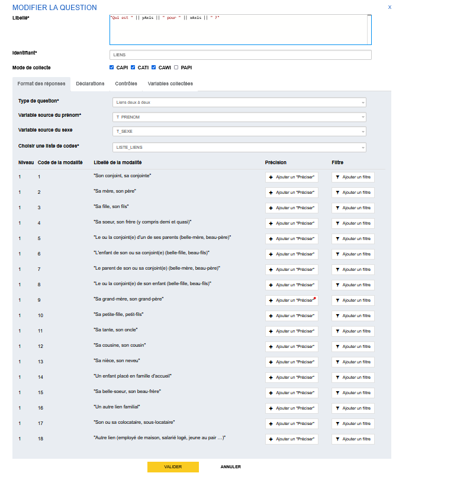

!!!tips La liste de codes pour les liens entre les habitants du logement au T1-2026
    La liste de codes à utiliser pour les liens entre les habitants du logement est maintenue par la division RTI et en partie internalisée dans les outils de l'atelier pour la fourniture des liens réciproques.
    Il est impératif de l'utiliser sans modifications.

    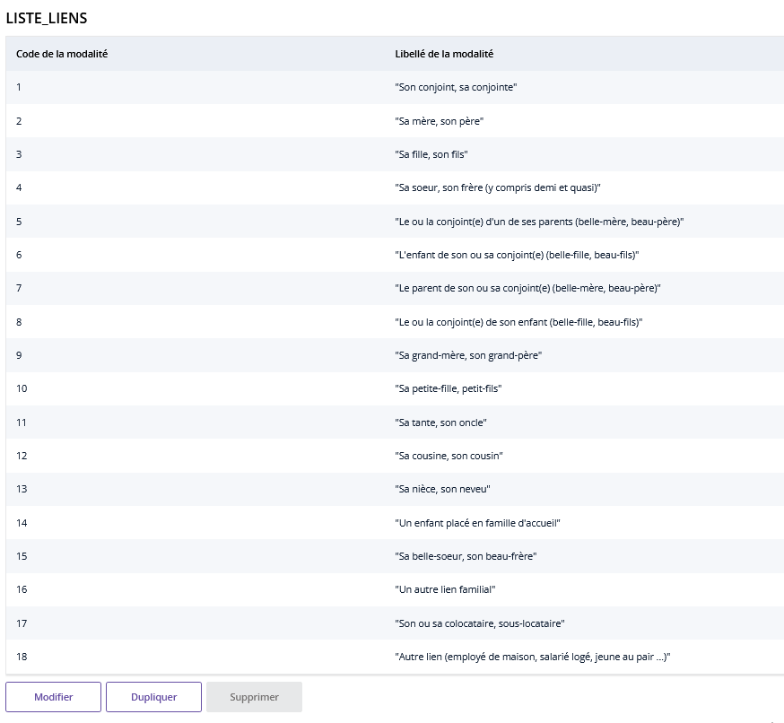

## Deux présentations possibles

Lors du remplissage du questionnaire on déclare les liens entre les habitants du logement en choisissant la nature du lien dans une liste déroulante. 

Deux présentations sont possibles : avoir toutes les questions sur la même page ou une page par habitants. La première solution a la simplicité de présenter l'ensemble des questions sur la même page mais le remplissage peut devenir fastidieux dès qu'il y a plus de 3 habitants dans le logement.

On vous explique comment implémenter les deux façons de présenter la question.

### Sans boucle : tous les habitants sur la même page

Dans une sous-séquence (ou une séquence), on créé la question de lien deux à deux en renseignant les attributs cités précédemment : variable source pour les prénoms et sexe et liste de codes.

On peut ajouter une déclaration sur la page de la sous-séquence si on le souhaite.

### Avec une boucle : une page par habitant du logement ✨

Pour disposer d'une page par habitants, il suffit de poser une boucle sur la sous-séquence (ou une séquence) qui contient la question de lien deux à deux. Cette boucle est liée à la boucle principale qui permet de collecter les prénoms.

!!! tip "Astuce"
    Pour éviter d'avoir une page de sous-séquence (titre de la sous-séquence, déclarations) entre chaque itération de la boucle (habitant), il suffit de **ne pas mettre de déclarations** lorsqu'on spécifie la sous-séquence.

## Un exemple

Prenons un exemple avec une famille de 5 personnes : 

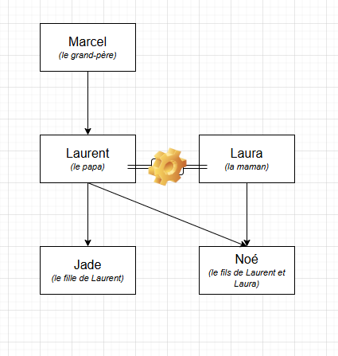

C'est Laura qui répond au questionnaire, elle déclare d'abord son conjoint, puis les enfants et termine par le grand-père. Elle déclare les liens sans se tromper :nerd: 

### Le remplissage du questionnaire

#### Cas sans boucle (tous les habitants sur la même page)

!!! example "Remplissage du questionnaire en visualisation web ménage"
    === "1. page de présentation de la sous-séquence" 
        En présence d'une déclaration sur la sous-séquence, on affiche une page de présentation des liens.
        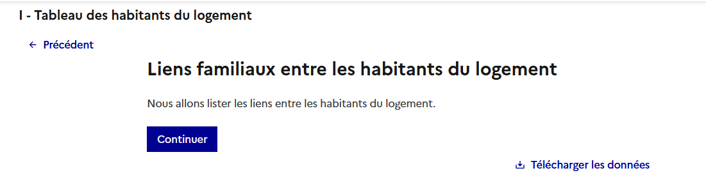
    === "2. les liens à renseigner et les liens symétriques" 
        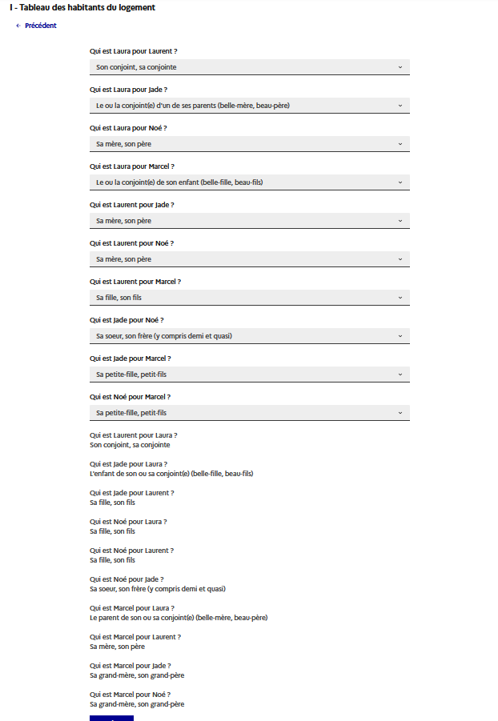
        

Pour ce logement de 5 personnes, on voit que la liste des liens à remplir et des liens symétriques est difficile à faire tenir sur une page... c'est pourquoi on préconise la présentation avec boucle ci-dessous, en particulier pour les enquêtes ménage avec enquêteur (usage d'une tablette).

#### Cas avec boucle (une page par habitant)

!!! example "Remplissage du questionnaire en visualisation enquêteur"
    === "1. Laura" 
        Ici on fait le choix de ne pas spécifier de déclaration sur la sous-séquence afin de ne pas afficher la page de présentation de la sous-séquence. On collecte les 4 liens qui lient Laura et les autres habitants du logement.
        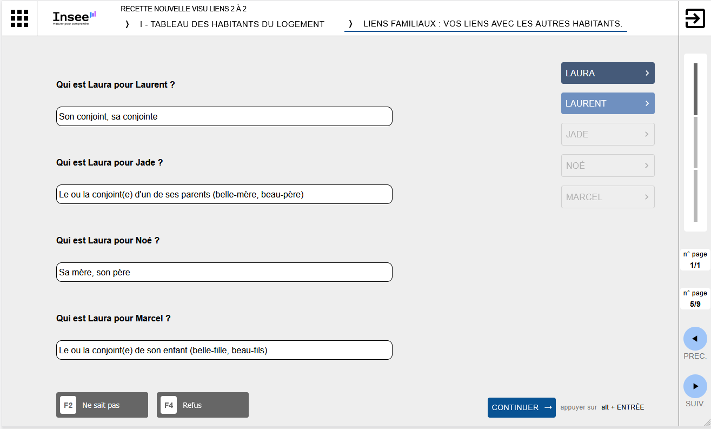
    === "2. Laurent"
        On collecte 3 liens et on rappelle le lien symétrique de celui déjà collecté auprès de Laura.
        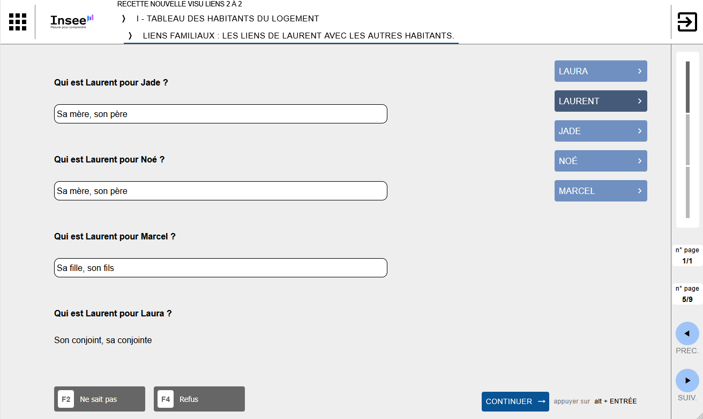
    === "3. Jade"
        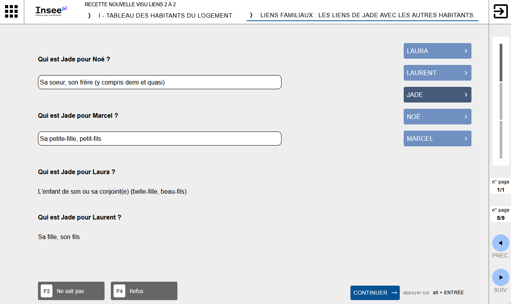
    === "4. Noé"
        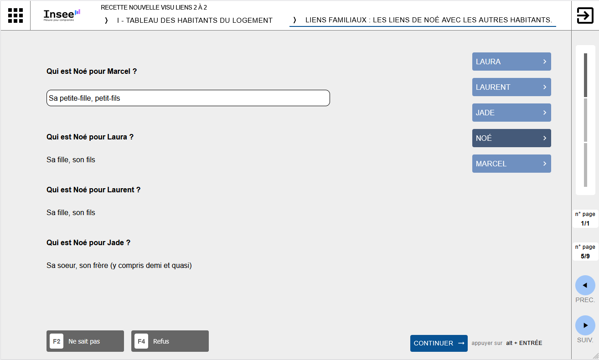
    === "5. Marcel"
        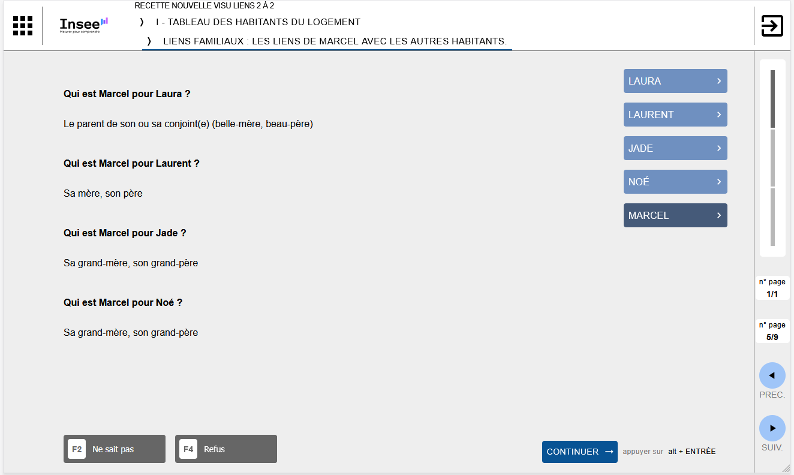
 

### Les données collectées
Voici les données telles qu'elles sont collectées :

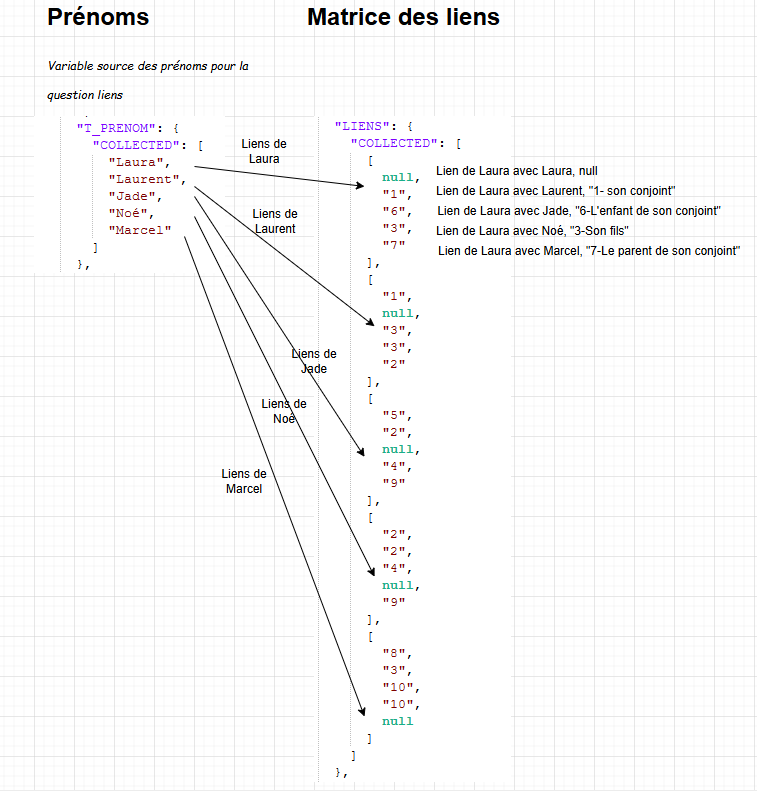

Le format des données collectées lors d'une question de type lien deux à deux ne permet pas à ce jour de mobiliser simplement, en cours de collecte chaque lien, c'est pourquoi on met à votre disposition des variables globales permettant de mobiliser les principales informations utiles au questionnement (prénom et sexe des parents, prénom du conjoint, liste des prénoms des enfants).

!!!abstract "Pour aller plus loin"
    [Les variables globales issues des liens deux à deux](../Variables/variables-globales.md#variables-globales-issues-des-liens-deux-a-deux)