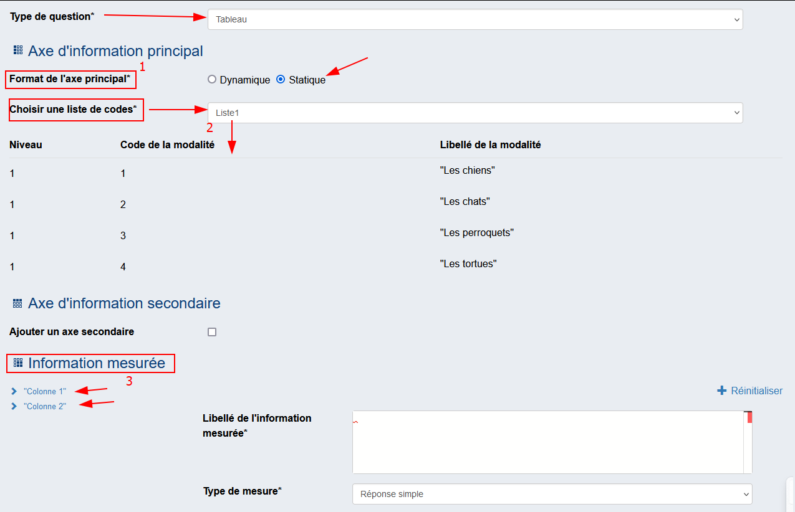

# Les tableaux statique

Si on veut créer une question de type Tableau Statique (avec en-tête de lignes en première colonne), renseigner :

!!! abstract "Description"
    - l'Axe d'information principal : 
        - [`1`] Format de l'axe principal* : Choisir `Statique`
        - [`2`] Spécifier la liste de codes. S'il n'y en a pas, veuillez [spécifier une nouvelle liste de codes](../14-liste-codes.md). cette dernière sera utilisée pour l'entête de lignes en première colonne.
    - [`3`] l'Information mesurée : renseigner la ou les informations de type Réponse simple ou Réponse à choix unique qu'on souhaite collecter. Le résultat sera donc un tableau comprenant une colonne d'en têtes et n colonnes de collecte d'informations

    

**Cas particulier** : on peut souhaiter ajouter un axe d'information secondaire, qui permettra de croiser les informations figurant en première colonne avec un autre critère. Il faut avoir conscience que ce type de représentation est complexe pour l'enquêté. Pour l'utiliser, cocher la case "axe secondaire" et spécifier la liste de codes via les fonctionnalités habituelles

**Attention** : si un Axe d'information secondaire est décrit, une seule "variable" sera collectée. 
