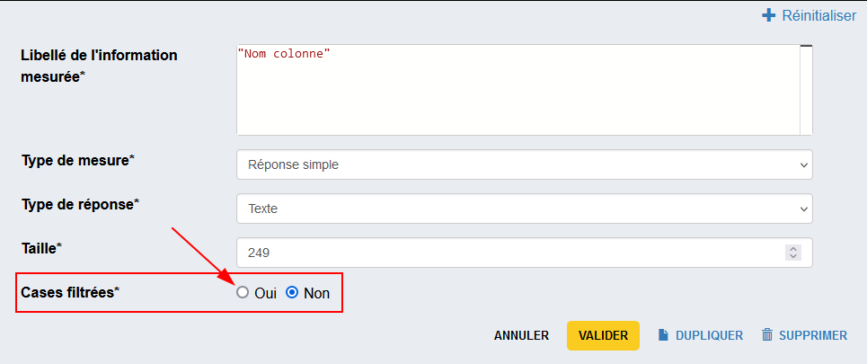
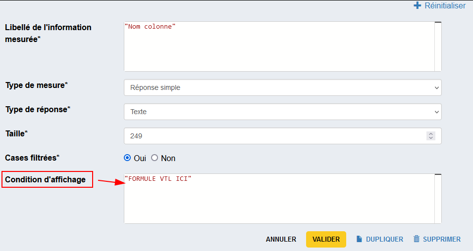
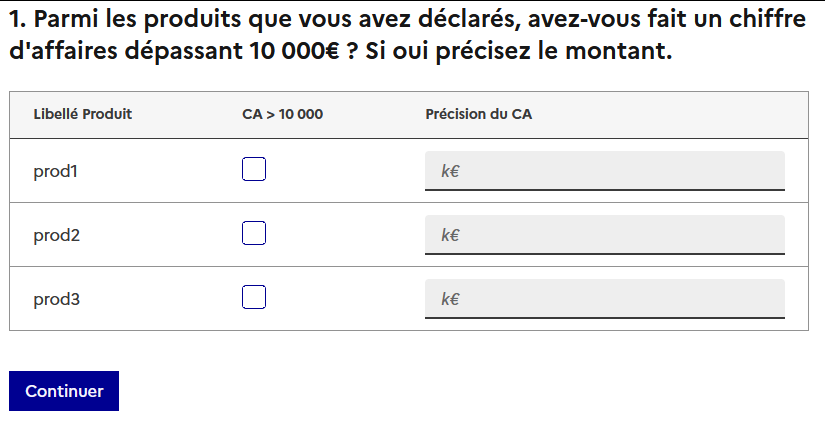
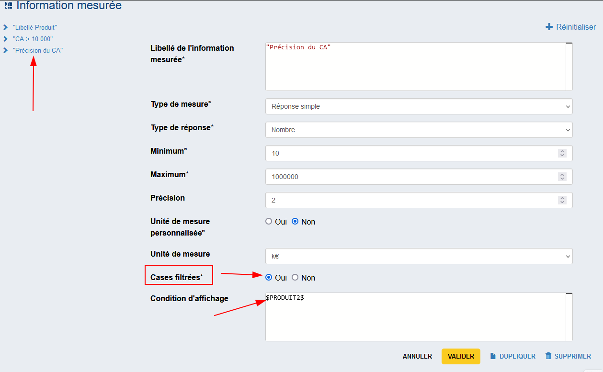
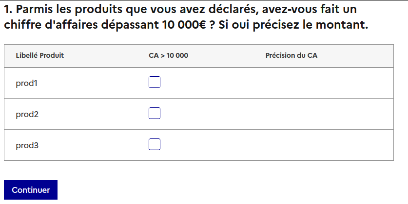
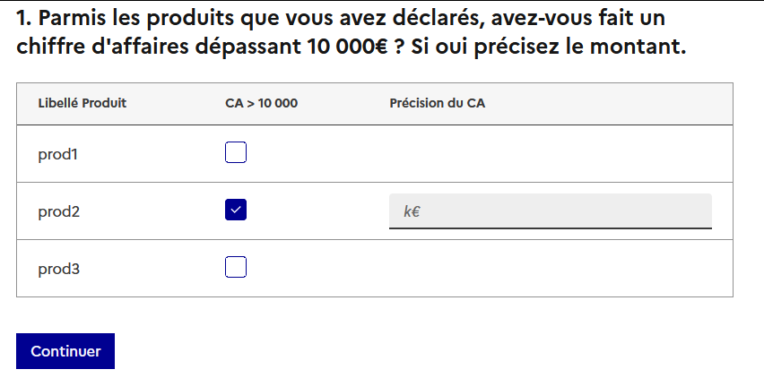
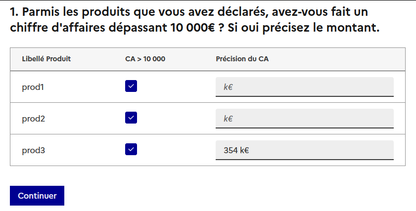
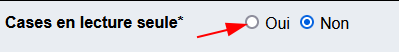
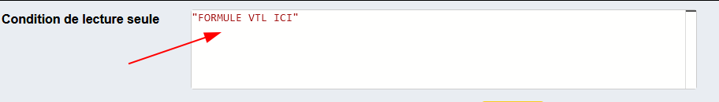

# Les tableaux dynamiques

On peut vouloir créer des tableaux dont on ne connait pas à l'avance le nombre de lignes (Tableau dynamique). Ces tableaux se présenteront : 

- sans en-tête de lignes en première colonne
- avec un bouton _Ajouter une ligne_ (sous le tableau)
- et un bouton _Supprimer une ligne_ (la dernière).

Pour ce faire, on créera une question de type Tableau avec pour axe principal une liste.

### Choix de l'axe d'information principal :  

Pour avoir un tableau dynamique, choisir `Liste`.  
On a ensuite 2 choix pour le calcul du nombre de lignes : `Min/Max` ou `Formule`

#### Nombre de lignes déterminés par `Min/Max`

- Indiquer le nombre de lignes minimum (aujourd'hui un nombre mais une évolution permettra à terme de saisir un champ VTL)
- Indiquer le nombre de lignes maximum (aujourd'hui un nombre borné à 300 mais une évolution permettra à terme de saisir un champ VTL)).

#### Nombre de lignes déterminés par `Formule`

- Indiquer une formule VTL qui doit retourner **un nombre**, imaginons `n`.
- Le tableau généré aura exactement `n` lignes 

??? danger "VTL non valide"

    Si le résultat du VTL n'est pas interprété avec le type 'Nombre', ex `Formule = "Du texte"`, on a l'erreur suivante
    

???+ example "Exemple de tableau dynamique avec formule VTL"
    
    - Si on a un questionnaire avec une question `NB_PERSONNE` de type _Nombre_
    
    - On peut alors créer ensuite un tableau dynamique avec pour formule de nombre de lignes `$NB_PERSONNE$`.
    Dans le cas où l'utilisateur réponds 5 à la question `NB_PERSONNE`, alors le tableau aura exactement 5 lignes    
    

### Information(s) mesurée(s) : 
renseigner une information de type _Réponse simple_ ou _Réponse à choix unique_
Si on souhaite qu'une de ces informations mesurées ne soit pas "collectée", voir l'item [données non-collectées](3-cases-non-collectees.md)

## Calculer des totaux de lignes ou de colonnes

Ces totaux peuvent être ensuite utilisées dans deslibellés, des filtres ou des contrôles

- cf. [Total en ligne](./3-cases-non-collectees.md/#total-en-ligne)
- cf. [Total en colonne](./3-cases-non-collectees.md/#total-en-colonne)

## Contrôles

Dans l'onglet Contrôles, décrire classiquement le contrôle en VTL mais préciser son niveau : si le contrôle concerne les informations relatives à une ligne du tableau, préciser "Niveau : ligne"

## Préremplir un tableau avec des données non collectées

Pogues permet de préremplir certaines __colonnes__ des tableaux dynamiques, que ce soit par de la donnée externe ou par des variables calculées. Ces __colonnes__ ne sont alors pas modifiables en collecte.

[Spécifier des données non-collectées](./3-cases-non-collectees.md)

## ✨ Filtrer des cases

!!! abstract "Objectif"
    Il est possible de filtrer des cases dans un tableau dynamique selon une formule VTL.

=== "Ajouter une `Condition d'affichage` sur une colonne du tableau"
    
=== "Éditer la formule VTL"
    

La même logique que pour filtrer une question est appliquée : on propose un éditeur VTL conditionnant l'affichage de la case avec les règles suivantes :

| Validité de la Formule VTL | Condition d'affichage | Résultat |
| ----------------- | --------------------- | --------- |
| Pas de formule | / | la case est affichée, l'enquêté peut la renseigner |
| ❌ | `ERROR` | la case est affichée, l'enquêté peut la renseigner  |
| ✅ | `TRUE`  | la case est affichée, l'enquêté peut la renseigner  |
| ✅ | `FALSE` | la case n'est pas affichée, l'enquêté ne peut pas la renseigner  |

Le choix "Non" est sélectionné par défaut : aucune case de la colonne n'est filtrée = toutes les cases sont affichées.

??? example "Exemple"
    Imaginons le tableau suivant avec l'identifiant `PRODUIT`
    
    
    !!! abstract "Variables générées du tableau."
        1. La première variable est non collectée. On y injecte une variable externe.
        2. `PRODUIT2` est un booléen : case à cocher qui vaut `true` ou `false`.
        3. `PRODUIT3` est le `CA` que l'on veut collecter.
    Pour une liste de produits, on veut savoir quels sont les produits pour lesquels une entreprise à un CA de plus de 10 000€, et avoir la valeur précise de ce CA **uniquement dans ce cas**.  
    On veut donc éviter que l'enquêté puisse saisir une valeur dans la colonne `Précision du CA` si son CA est inférieur à 10 000€ pour un produit. Pour ce faire on va rajouter une `Condition d'affichage` sur cette colonne pour afficher ou non les case selon la formule VTL $PRODUIT2$.
    
    !!! tip "En VTL, `$PRODUIT2$` est équivalent à `$PRODUIT2$ = true`"
    Si `PRODUIT2` vaut `true`, l'enquêté a coché la case, alors on affiche le champ pour collecter la variable $PRODUIT3$ (colonne "Précision du CA")

    Ce qui donne le tableau suivant
    === "0 case coché"
        
    === "1 case coché"
        
    === "3 case cochés avec 1 case remplie"
        

## ✨ Cases en lecture seule
!!! abstract "Objectif"
    Le concepteur peut spécifier des règles qui mettent en lecture seule certaines cases d'un tableau dynamique. Cette fonctionnalité est utile par exemple lorsqu'on pré-remplit les données d'un tableau et qu'on ne souhaite pas laisser la possibilité à l'enquêté de modifier les valeurs.

!!! danger "Limitations"
    Les types `Date` et `Durée` ne sont pour l'instant pas supportés

=== "Ajouter une `Condition de lecture seule` sur une colonne du tableau"
    
=== "Éditer la formule VTL"
    

On propose un éditeur VTL conditionnant la possibilité de mettre en lecture seule (de ne pas pouvoir éditer) la case avec les règles suivantes :

| Validité de la Formule VTL | Condition de lecture seule | Résultat |
| ----------------- | --------------------- | --------- |
| Pas de formule | / | la case est accessible en modification pour l'enquêté |
| ❌ | `ERROR` | la case est en lecture seule, l'enquêté ne peut pas l'éditer  |
| ✅ | `TRUE`  | la case est en lecture seule, l'enquêté ne peut pas l'éditer  |
| ✅ | `FALSE` | la case est accessible en modification pour l'enquêté  |

Le choix "Non" est sélectionné par défaut : aucune case de la colonne n'est en lecture seule = toutes les cases de la colonne sont modifiables.