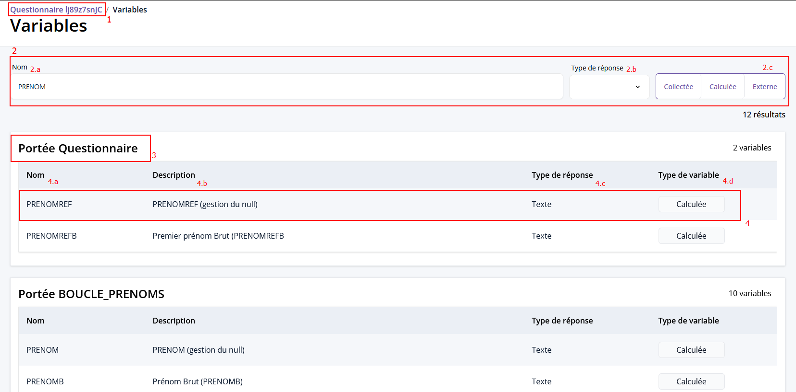

# Les Variables dans Pogues

## Types de variables 

- [**Collectée**](variables-collectees.md) : Donnée principale d'une enquête = information que l'on veut récupérer pour ensuite l’analyser.
- [**Calculée**](variables-calculees.md) : Variable calculée des variables à partir d'autres variables du questionnaire
- [**Externe**](variables-externes.md) : Variable permettant de personnaliser un questionnaire. Ex : Année de l'enquête
- [**Globale**](variables-globales.md) : Variables fournies directement par le moteur de contrôle des questionnaires

## Liste de Variables (New ✨)

Un page listant toutes les variables du questionnaire est disponible via le menu "Variables".
Elles sont accessible en lecture seule (pas d'édition pour l'instant) avec un classement par portée (niveau de calcul pour les boucles et les tableaux).

!!! abstract "Variables d'un questionnaire"
    

    1. `id` : identifiant du questionnaire
    2. `filtres` : permet de filtrer selon certains critères la liste des variables affichées
        1. `Nom` : pour filtrer sur les noms (anciennement `identifiant`)
        2. `Type de réponse` : pour filtrer sur le type de réponse d'une variable
        3. `Type de variable` : pour filtrer selon les [types](#types-de-variables) 
    3. `Portée` : [niveau de calcul](portee.md) d'une variable selon si elle est définie dans un tableau, une boucle ou pas.
    4. `Variable` : une variable du questionnaire avec les informations suivantes :
        1. `Nom` (anciennement `identifiant`)
        1. `Description` (anciennement `libellé`)
        1. `Type de réponse`
        1. `Type de variable`
        > Si la variable est de type **Calculée**, alors on a la possibilité de voir la formule VTL associée au survol ou en cliquant sur le bouton.
