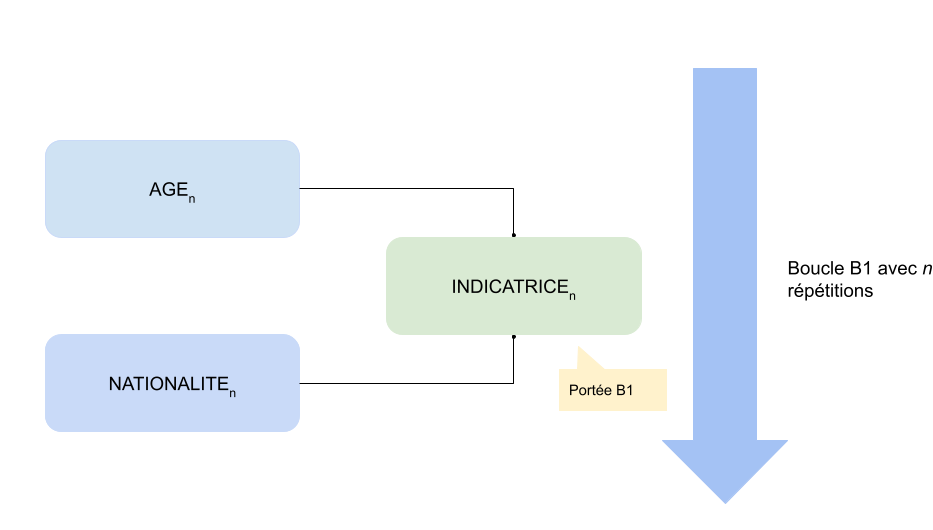
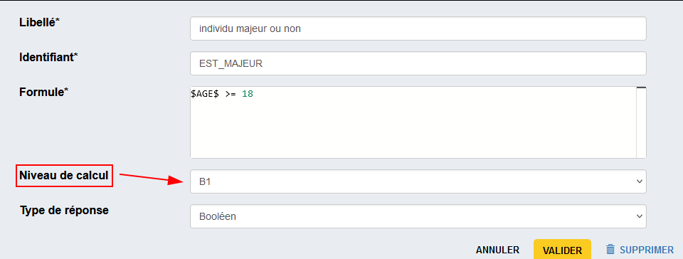

# Portée des variables

!!! question "Champ *Niveau de calcul*"
    Les variables calculées ou externes possèdent une portée indiquée par le paramètre **_Niveau de calcul_**. A quoi cela correspond-il ?

    Il s'agit de préciser si une variable est calculée ou injectée (dans le cas d'une variable externe) au sein d'une boucle ou dans le contexte du questionnaire dans son ensemble.

### Type de portée

- **Portée `Questionnaire` :** alors toutes les variables vecteurs seront bien considérées comme des vecteurs (liste d’élément). Il est donc possible d’effectuer des opération d’agrégation dessus (sum, count, ect)
- **Portée `Boucle/Tableau` (ou `<Vecteur>`) :** alors la variable calculée sera elle aussi un vecteur et la formule VTL associée portera sur toutes les occurrences du vecteur.
    Ex : la var calculée `CALC_VAR` ayant pour formule VTL `$CA_ENTREPRISE$ + 100` sera donc un vecteur auquel on aura ajouté `100` à chaque valeur de `$CA_ENTREPRISE$`.
    `<Vecteur>` prend la valeur du nom d’une boucle ou d’un tableau dynamique.

## Exemple pour les boucles
Imaginons une boucle `B1` sur un ensemble de questions relatives à des individus. Je veux pouvoir pour chacun d'eux créer une indicatrice permettant de savoir si l'individu est dans le champs en vérifiant son âge (variable collectée `AGE`) et sa nationalité (`NATIONALITE`).

Pour cela, je crée une variable calculée de portée `B1` dont la formule s'appuie pour chaque occurrence de la boucle (chaque individu) sur les variables `AGE` et `NATIONALITE` (de chaque individu).

**Cas pratique :**  

On veut contrôler si un individu est majeur ou non pour savoir quels questions lui poser. On va créer une variable calculée `EST_MAJEUR` de portée `B1` portant sur chaque valeur de `AGE` et vérifiant si `$AGE$ >= 18`

Si on imagine 5 individu aves les âges suivants : 5 ; 40 ; 24 ; 35 ; 12

Alors on aura les valeurs suivantes pour les variables,

- `AGE` = `[5,40,24,35,12]`
- `EST_MAJEUR` = `[false,true,true,true,false]`

Si on fait ensuite une boucle liée `B2` sur une suite de 3 questions et que cette boucle est basée sur `B1`, lorsque l'on place le filtre avec la formule VTL suivante, `$EST_MAJEUR$` (ce qui équivaut à `$EST_MAJEUR$=true`), alors dans notre cas, on ne posera ses questions que pour le 2eme, 3eme et 4eme individu.

## Exemple pour les tableaux

🚧TODO🚧