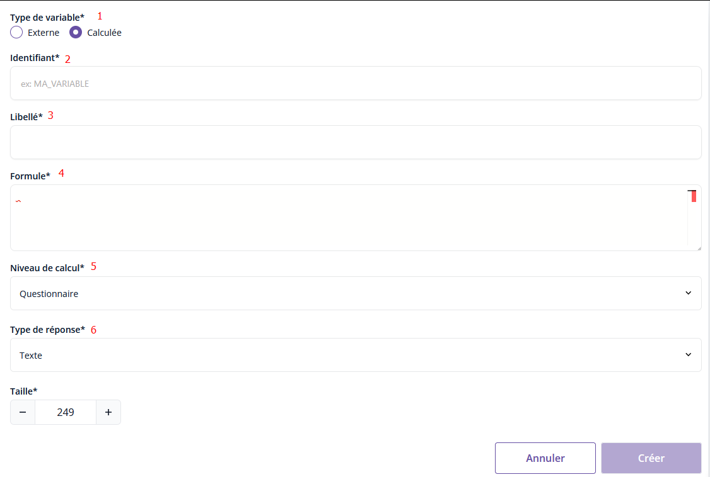

# Les variables calculées ✨
!!! question "Définition"
    Il peut être nécessaire de calculer des variables à partir d'autres variables du questionnaire pour certains contrôles notamment.

## Création d'une variable calculée

✨ Une variable calculée se définit via le menu "Variables" puis en cliquant sur le bouton en haut à droite "Créer une variable". 

!!! abstract "Nouvelle variable calculée"
    

    1. `Type de variable*` : permets de changer entre la création d'une variable calculée et une variable externe
    1. `Identifiant*` : correspond au nom de la variable
    1. `Libellé*` : description de la variable
    1. `Formule*` : Éditeur VTL permettant de définir la formule VTL qui calcul la variable
		- Exemples : Nombre total de personne dans le ménage interrogé ; somme des pourcentages du chiffre d'affaires dédiés à certaines activités ou nombre de majeurs d'un ménage
    1. `Niveau de calcul*` : défini la portée de la variable. Plus de détails [ici](https://user-juliencarmona-654711-0.user.lab.sspcloud.fr/proxy/8000/Bowie/1._Pogues/%F0%9F%9A%80_Guide/Variables/portee/)
		
		!!! note "Note"
			Par défaut la valeur est `Questionnaire` si la variable vaut la même valeur sur l’ensemble du questionnaire. Si la variable est occurrentielle (cad, sa valeur dépend de la ligne sur laquelle on se trouve au sein d’un tableau dynamique ou de l’occurrence sur laquelle on se trouve au sein d’une boucle), renseigner ici l'élément itérable (identifiant du tableau dynamique ou boucle du questionnaire) auquel se réfère la variable.

    1. `Type de réponse*` : parmi Texte, Date, Nombre, Booléen (cf. Création d'une question de type réponse simple)
      > Suivant la valeur sélectionnée, d'autres champs associés au type apparaissent.
      > Plus de détails sur les différents types [ici](../../🚀_Guide/Questions/13-reponse-simple.md)
