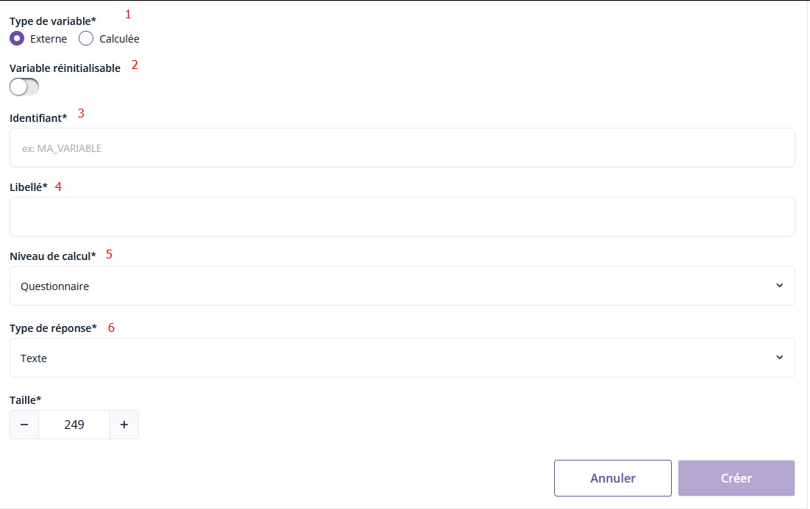

# Les variables externes ✨


Pogues permet de référencer dans le questionnaire des variables externes, c'est à dire des variables qui sont fournies au chargement du questionnaire lors de la collecte, en provenance d'un fichier de données produit à partir de données connues et attachées à l'unité enquêtée.

!!! danger 
Le _typage_ disponible dans Pogues pour ces variables est celui disponible par ailleurs pour les variables collectées et calculées, mais l'outil impose un format texte afin d'être facilement lu tout au long de la chaîne de traitement : l'ensemble des variables externes injectées dans le questionnaire sont du __texte__.

    Impact : si ces variables doivent être utilisées comme numériques, il faut alors les transformer avec la fonction [cast()](../../💻_VTL/fonctions-vtl.md/#cast):

    ```vtl
    cast($VAR_EXT$, integer)
    ```

## Création d'une variable externe

✨ On crée les variables externes via le menu "Variables" en cliquant sur le bouton en haut à droite "Créer une variable".

!!! abstract "Nouvelle variable externe"
    

    1. `Type de variable*` : permet de sélectionner le type de variable souhaité : calculée ou externe
    1. `Variable réinitialisable` : attribut réservé aux enquêtes ayant un protocole complexe de collecte concurrentielle enquêteur / web : il peut arriver que l'enquêteur reprenne la main sur un questionnaire web et ait besoin de "supprimer" les réponses web : on offrira donc à l'enquêteur, dans Sabiane, la possibilité de remettre les données du questionnaire à vide. L'attribut `Variable réinitialisable` permet de tagger les variables qu'on permet de vider.
    1. `Identifiant*` : correspond au nom de la variable
    1. `Libellé*` : description de la variable
    1. `Niveau de calcul*` : correspond à la portée de la variable. Plus de détails [ici](https://inseefr.github.io/Bowie/1._Pogues/%F0%9F%9A%80_Guide/Variables/portee/)
		
		!!! note "Note"
			Par défaut il faut laisser `Questionnaire` comme niveau de calcul si la variable vaut la même valeur sur l’ensemble du questionnaire. Si la variable est occurrentielle (cad, sa valeur dépend de la ligne sur laquelle on se trouve au sein d’un tableau dynamique ou de l’occurrence sur laquelle on se trouve au sein d’une boucle), on renseigne ici l'élément itérable (identifiant du tableau dynamique ou boucle du questionnaire) auquel se réfère la variable.

    1. `Type de réponse*` : parmi Texte, Date, Nombre, Booléen (cf. Création d'une question de type réponse simple)
      > Suivant la valeur sélectionnée, d'autres champs associés au type apparaissent.
      > Plus de détails sur les différents types [ici](../../🚀_Guide/Questions/13-reponse-simple.md)

## Ajouter des variables externes de portée Boucle

Dans certains protocoles complexes, on peut vouloir intégrer des variables externes correspondant à des variables collectées précédemement dans un autre questionnaire à l'intérieur d'une boucle.

Imaginons par exemple que dans le premier questionnaire, on ait demandé le nombre d'habitants du logement (variable `NBHAB`), puis, à l'intérieur d'une boucle répétée pour chaque habitant on ait collecté les prénoms et ages (respectivement les variables `PRENOM` et `AGE`).

Afin de récupérer ces variables dans le second questionnaire :

- je crée dans celui-ci la boucle `BOUCLE_PRINCIPALE`, avec un min et max dont la valeur est la variable `NBHAB` (à créer, voir ci-dessous),
- je crée  les variables externes `NBHAB` (Portée Questionnaire), `PRENOM` et `AGE` (portée `BOUCLE_PRINCIPALE`).

Il faudra ensuite fournir à l'intégration un fichier CSV contenant les variables et valeurs ad hoc (voir [ici](../Personnalisation/2-guide-perso-echantillon.md#variables-externes-de-portee-boucle-ou-tableau-dynamique), section "Variables de portée Boucle")

!!! danger
    Éviter de finir le nom d'une variable externe par une valeur numérique.
    Une variable externe peut contenir un vecteur (par exemple : liste d'habitant issue de la base de sondages ou de la précédente enquête) et sera personnalisée en collecte avec un suffixe séquentiel.
    Par exemple : pour un vecteur de produits appelé PRODUITS, dans le fichier de personnalisation on pourra avoir PRODUITS_01, PRODUITS_02, etc
