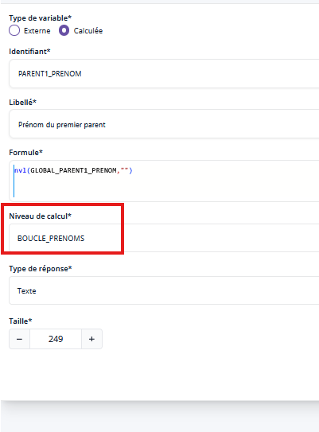
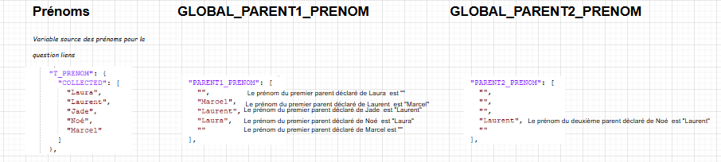
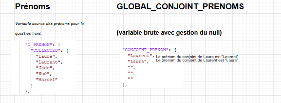
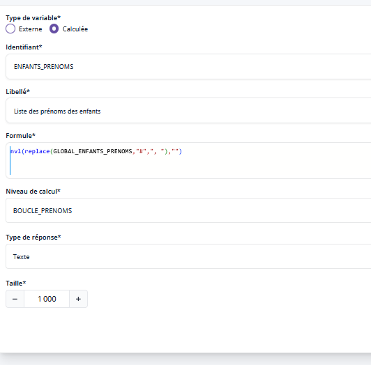
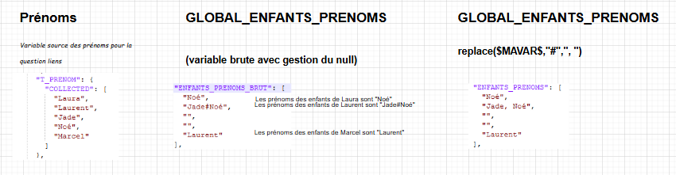

# Les variables globales ✨

!!! question "Définition"
    Les variables globales sont des variables fournies directement par le moteur de contrôle des questionnaires.

!!! warning

    Leur statut particulier implique un usage particulier : il ne faut pas les appeler en les encadrant par des `$`. On écrira donc par exemple `GLOBAL_ITERATION_INDEX` et pas `$GLOBAL_ITERATION_INDEX$`. 
    De plus, en mai 2024, il est nécessaire de faire suivre la variable d'une chaine de caractères éventuellement vides pour qu'elle se valorise

## Index de la position dans une boucle

Pour connaître l'index de la position dans une boucle, il est possible de mobiliser la variable `GLOBAL_ITERATION_INDEX`. Celle-ci vaudra `1` pour la première position, puis `2`, `3`, etc.

### Syntaxe

Dans la première boucle, on pourra par exemple afficher :
```
"Prénom de l'individu " || cast(GLOBAL_ITERATION_INDEX,string) || ""
```
Dans les boucles liées (cf. Les Boucles) on pourra également utiliser cette variable, qui sera l'index dans la première boucle.
On ne peut en revanche pas les utiliser hors boucle.

!!! warning "Il faut toujours mettre un texte après le cast, `|| ""` !!"
    L'exemple ci dessous ne fonctionne pas par exemple
    ```
    "Prénom de l'individu " || cast(GLOBAL_ITERATION_INDEX,string)
    ```

## Variables globales issues des liens deux à deux ✨

Le format des données collectées lors d'une question de type [lien deux à deux](../Questions/16-liens-2a2.md) ne permet pas à ce jour de mobiliser simplement, en cours de collecte chaque lien. Aussi, on vous fournit des variables système sous forme de vecteurs, faciles à manipuler avec des formules VTL dans le questionnaire.

### Présentation des variables

Il y a 4 jeux de variables : 

- `GLOBAL_PARENT1_PRENOM` et `GLOBAL_PARENT1_SEXE` : un vecteur avec le prénom (resp. sexe) du premier parent déclaré pour chaque personne de la boucle prénom 
- `GLOBAL_PARENT2_PRENOM` et `GLOBAL_PARENT2_SEXE` : un vecteur avec le prénom (resp. sexe) du deuxième parent déclaré pour chaque personne de la boucle prénom  
- `GLOBAL_CONJOINT` : un vecteur avec le prénom du (premier) conjoint déclaré pour chaque personne de la boucle prénom 
- `GLOBAL_ENFANTS_PRENOMS` : un vecteur avec la liste des prénoms des enfants pour chaque personne de la boucle prénom, s'il y a au moins 2 enfants les prénoms sont séparés par des `#`

### Exemple

Prenons un exemple avec une famille de 5 personnes :


Les variables globales issues des liens deux à deux sont disponibles et correctement calculées dès que la question sur les liens est renseignée dans le questionnaire. **Elles sont utilisables directement dans le questionnaire Pogues au sein d'une boucle basée sur le prénom sans calculer de variable intermédiaire**.


Dans un **but pédagogique**, nous allons créer des variables calculées qui permettent de voir commet se présentent les variables et comment les utiliser.


Pour voir ce qu'il y a dans la variable globale donnant le prénom du premier parent, on va par exemple on va créer 
````
`PARENT1_PRENOM` = nvl(`GLOBAL_PARENT1_PRENOM`,"") 
````
qui correspond à la variable brute avec gestion du null. Les variables sont de niveau de calcul la boucle dans laquelle on collecte la variable source du prénom. Vous remarquez ici qu'on utilise les variables globales sans les entourer de `$` comme pour `GLOBAL_ITERATION_INDEX`.



On fait pareil avec le prénom du deuxième parent 
````
`PARENT2_PRENOM` = nvl(`GLOBAL_PARENT2_PRENOM`,"").
````



!!!Note
    Il est possible de faire la même chose avec le sexe des parents afin de personnaliser le questionnaire en utilisant les termes mère/père au lieu de parent.

Pour savoir si un individu de la boucle a déclaré au moins un parent dans le logement, il suffit de tester la nullité de `GLOBAL_PARENT1_PRENOM` **dans une boucle**. On peut également utiliser le prénom et le sexe de ce premier parent pour poser d'autres questions.

De la même manière, on peut obtenir les prénoms du conjoint pour chaque individu de la boucle en utilisant `GLOBAL_CONJOINT_PRENOM` (un seul conjoint possible, le premier déclaré) tel que 
````
`CONJOINT_PRENOM` = nvl(`GLOBAL_CONJOINT_PRENOM`,"")
````



!!!tips "Astuce"
    Pour afficher la phrase "Untel est le conjoint de untel", on peut par exemple faire une déclaration de la forme suivante : 
    ````
    "" || `$T_PRENOM$` || " " || 
    if isnull(`GLOBAL_CONJOINT_PRENOM`) then "n'a pas de conjoint dans le logement."
    else "est le conjoint de : " || cast(`GLOBAL_CONJOINT_PRENOM`, string) || "." 
    ````
    Dans le cas de Laura, on aura le résultat "Laura est le conjoint de : Laurent", dans le cas de Marcel, on aura "Marcel n'a pas de conjoint dans le logement".


On peut également fournir la listes des enfants pour chaque personne du logement. Dans la variable `GLOBAL_ENFANTS_PRENOMS`, on récupère la liste des prénoms des enfants, chaque prénom étant séparé par le caractère spécial `#`. On n'a pas souhaité utliser les caractères usuels tels que la virgule ou le point-virgule pour ne pas créer de confusion lors des exports csv. 

Pour avoir une liste de prénoms utilisable dans une déclaration, on mobilise la fonction VTL `replace` pour substituer le `#` par un caractère de notre choix avec la formule 
````
nvl(replace(`GLOBAL_ENFANTS_PRENOMS`,"#",", "),"") 
````



Voici un aperçu des variables donnant la liste des enfants :




