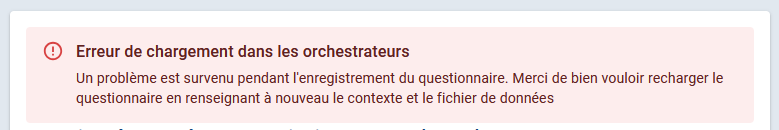
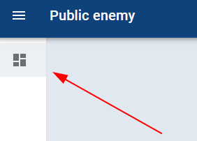
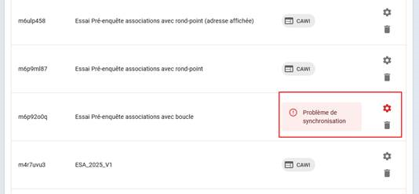

# Gestion des erreurs dans Public Enemy

## Erreur de synchronisation

Lorsqu'on modifie un questionnaire qui a déjà été chargé dans Public Enemy, et que c'est changement sont structurants pour le questionnaire, il se peut qu'apparaisse un bandeau au dessus 

!!! tip "Solution"
    - Aller sur la [page d’accueil de Public Enemy](https://personnalisation-conception-questionnaires.insee.fr/questionnaires) ou cliquer sur le bouton dans le bandeau de gauche
        

    - Retrouver son questionnaire parmi la liste des questionnaires chargés dans Public Enemy
        

        Contrairement aux autres questionnaire bien chargés, on peut voir qu’il y a bien un avertissement en rouge. 

    - Cliquer sur la poubelle puis de repartir de son questionnaire dans Pogues pour le personnaliser à nouveau.