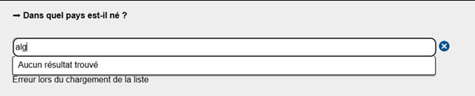
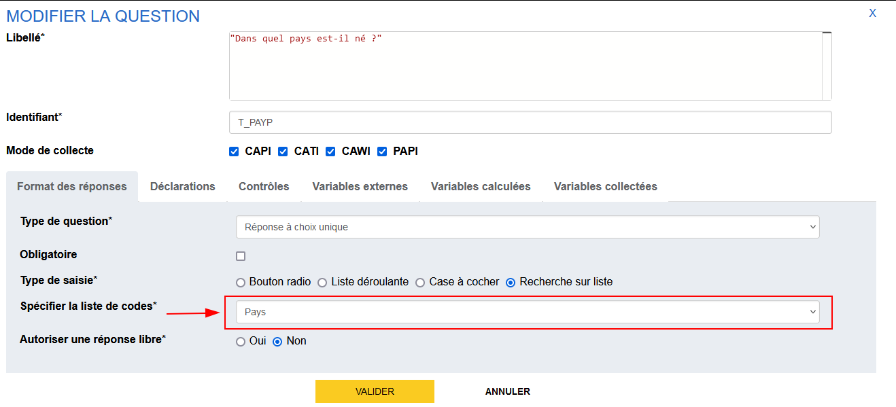
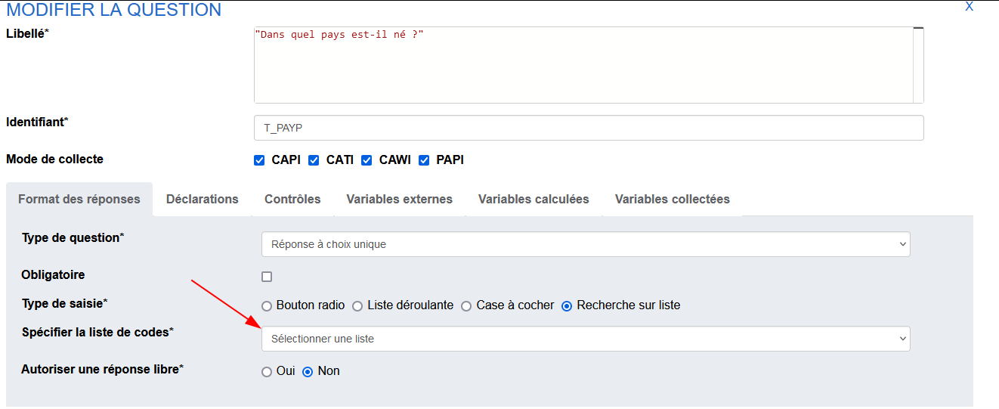

# :people_hugging: Problèmes les plus fréquents

## **Génération KO pour la visualisation depuis Pogues**

Lors d'une visualisation, un message "Une erreur a été rencontrée" apparaît. 

!!! tip "Astuce"
    Tenter de générer le questionnaire séquence par séquence

    - si une séquence pose souci, descendre  sous-séquence par sous-séquence, voire question par question et identifier la question qui pose souci. 
    - si toutes les séquences se génèrent, il y a probablement un problème de boucles ou de doublons. En effet, des listes (dans les QCM ou QCU) peuvent avoir le même nom, notamment pour les questionnaires qui font appel à la composition. 

        
## **Affichage à tort de questions filtrées**
Principe général : si un filtre ne se valorise pas ou pas bien, la question est affichée donc si la question s'affiche "à tort", le filtre est probablement faux.

!!! tip "Contrôler le filtre"
    - vérifier que les autres variables dans le même filtre sont également affichées  
    - ajouter des déclarations contenant les variables impliquées dans le filtre afin de contrôler leurs valeurs

## **Filtre qui englobe la fin du questionnaire**
Lorsqu'un filtre englobe toute la fin du questionnaire, un bug peut être constaté car Pogues ne peut pas rediriger l'utilisateur vers la prochaine question, car il n'y en a pas.

!!! tip "Ajouter une séquence de fin"
    Pour éviter ce désagrément, on vous conseille d'ajouter une séquence de fin, sur laquelle on ne pose aucun filtre (faire au plus simple, juste une séquence avec une déclaration "Fin").

## **(Non)Affichage des déclarations**
Les déclarations s'affichent en fonction des modes décrits dans Pogues : pas de mode, pas d'affichage et réciproquement si pas d'affichage, il manque probablement le mode

## **Génération KO pour Spécification et Papier**
Dans le cas où **uniquement** la génération Papier ou Spécification ne fonctionnent pas, il se peut que ce soit à cause d'un caractère `*` présent dans un libellé ou une déclaration.

!!! danger
    Il faut éviter d’utiliser ce caractère si ce n’est pas pour l’utiliser comme une balise markdown. Exemples :

    -	`*mon texte*` pour faire de l’italique : *mon texte*
    -	`**mon texte**` pour avoir un texte en gras : **mon texte**

!!! tip "Solution"
    Remplacer le caractère `*` par un caractère qui fait du sens :   
    `Nombre de services*jours ...` -> `Nombre de servicesxjours...` = "Nombre de servicesxjours ...".   
    Ou encore avec plus de clarté `Nombre de services ***x*** jours ...` = "Nombre de services ***x*** jours ..." 

## **VTL avec opérations d’agrégation**
Dans le cas où l'on veut définir une expression VTL **faisant des opérations sur les éléments d'une variable vecteur**, hors d'un tableau ou d'une boucle (à un niveau questionnaire), il faut passer par une variable calculée, sinon **le VTL est en erreur** 

??? example "Exemple avec un contrôle"
    Prenons une variable `SALAIRE` qui est collecté dans une boucle de 4 occurrences.  
    À la fin de la boucle, on a : `SALAIRE=[2500, 1300, 2000, 4000]`. 
    Si on veut faire un contrôle sur la somme des salaires, il faut d'abord **créer une variable calculée** `SUM_SALAIRE=sum($SALAIRE$)` de niveau questionnaire, puis définir un contrôle avec cette dernière.
    
    Expression VTL du contrôle | Affichage du contrôle
    -- | --
    `sum($SALAIRE$) > 5000` | :x:
     `$SUM_SALAIRE$ > 5000`  | :white_check_mark:

## **Recherche sur liste KO en visualisation**

La recherche sur liste (suggester) peut mal être chargé lors d'une visualisation. On a alors le message suivant `Erreur lors du chargement de la liste`

Dans ce cas, il s'agit d'un conflit entre plusieurs questions qui ont chargés des versions différentes de la nomenclature (Ex: Pays du millésime de 2023 et celle du millésime de 2024)

???+ example "Cas concret"
    1. On définit, dans un questionnaire `X`, une question `T_PAYP` sur le pays d'origine du père dans Pogues, fin décembre 2023 en utilisant la nomenclature `PAYS` disponible dans l'application.
    
    > Ici "Pays" va être associé à la nomenclature `PAYS` du millésime 2023. `PAYS_2023`
    1. En début d'année 2024, la nomenclature `PAYS` pour le millésime 2024, `PAYS_2024` est publiée et est intégrée dans Pogues.
    1. Après cela, on rédige une nouvelle question `T_PAYM` sur le pays d'origine de la mère. Quand on va sélectionner "Pays" dans Pogues, ce dernier sera lié à **la nomenclature la plus récente disponible**, c'est à dire, `PAYS_2024`.
    
    :warning: Quand on va vouloir visualiser, on va avoir un conflit dans les nomenclatures chargées et Pogues va prendre l'une des deux (imaginons pour l'exemple que c'est `PAYS_2024`). De ce fait quand on arrivera sur la question `T_PAYP`, la recherche sur liste semblera être indisponible car il ne trouvera pas `PAYS_2023` mais pour `T_PAYM` elle sera bien chargée.

!!! tip "Solution"
    Recharger depuis Pogues les suggesters concernées pour qu'ils aient tous la dernière version de la nomenclature. 

    Si on reprend notre exemple décrit dans le "Cas concret", il suffit d'aller sur `T_PAYP` et de resélectionner "Pays".
    
    !!! note "Remarque"
        On peut remarquer que la question semble être *désélectionnée* alors que la variable est bien générée. C'est le signe qu'on est bien dans le cas décrit ci-dessus !