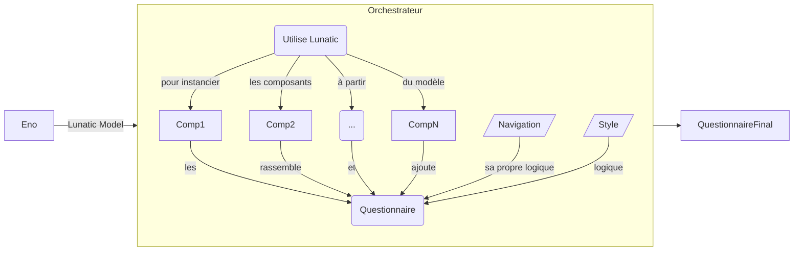

## A quoi sert un orchestrateur ?  
Les orchestrateurs permettent d'interfacer le LunaticModel, format en sortie d’Eno, pour "représenter"/"visualiser" les questionnaires : la bibliothèque de composants JS (javascript) permet d'instancier des composants et l'orchestrateur qui ajoute des couches à un fonctionnement natif. 
 
→ [Schéma](https://mermaid.ink/img/pako:eNqNk0tuwjAQhq9ieUUlDCrLLLopdEXTB-oKdzHEA3Hl2KkfrRDiLl32HlysJoSSRI1UL6J5fPlnPBrvaGYE0oSulfnMcrCezJ-5nmnDtQurjYUyJw82y9F5Cx6D5ZrEMw8avMwGL14q6fDsX52yt6Yory_m5GJOjR-MRqMGl57MpxArSKM1SIuDllfDc7OR7wEfrSktLscpfMgNHKHx6x_AZDle-K3Cc7L5rZtlrDTBEqmdB51JtIzdNDr_pRQ6ksW4caC9q6FJBzp8kTJOT55F4kU7hAikMOLwrbBG0mZPVeGqVsy2rt-YI2MWnMNiVWn0ULEyY-j7gZQxeDPB92i0xsiYA1JWJlGnxD_-io32wqgF11y3ondSgzpG494xVk-M3MfNVFGgs34tt6tfKdEhLdAWIEVc7N2xP059jgVymkRT4BqC8pxyvY9oKEWUmgnpjaXJGpTDIYXgzWKrM5p4G_AMTSXEF1HU1P4HDbEfNg )

## Les orchestrateurs actuels

- **Stromae** : orchestrateur d'instruments de collecte type "questionnaire Web". 
    - une V1 (collecte d'enquêtes entreprises, plateforme Coltrane) 
    - une V2 (collecte d'enquêtes ménages, filière unique, basée sur "Lunatic/ bases de donnéesPostgre") 
	- une V3 en cours de développement et dont le premier utilisateur sera l'enquête annuelle de recensement de l'Insee.
- **Queen** : orchestrateur d’instruments de collecte type "questionnaire Enquêteur" (téléphone et face-à-face) 
- 2 autres orchestrateurs utilisent Lunatic : **Generic** et **Prisme**.
  

## Les fonctionnalités des orchestrateurs web et enquêteur
 

 **Fonctionnalités "communes"** :
 - Visualiser un questionnaire en lecture seule 
 - Gérer les états de questionnaires  
 - Contrôler l'accès des utilisateurs 
 - Orchestrer les composants lunatic à partir du json 
 - Afficher le questionnaire en lecture seule  

**Proposer une expérience de navigation au travers du questionnaire** 

| Stromae | Queen|  
| -------- | -------- |  
| Afficher une page d’accueil personnalisable pour chaque enquête à partir de métadonnées|
| Afficher "qui répond ?" (page d'accueil)|
| Navigation par retour/continuer| Navigation par menu général, numéro de page, numéro d'itération, précédent/suivant| 
|  |  Aide à la saisie : raccourcis clavier|
|  Revenir un questionnaire : 1ère page ou page courante | Revenir un questionnaire : suite de l'entretien (atteindre la dernière page accédée)|
| Afficher un header personnalisable pour l’enquête |  Afficher un header personnalisable pour l’enquête|
|Afficher un footer personnalisable pour l’enquête|
|  Accès à contacter l'assistance ||
|  Accès à la notice de l'enquête (V3)||
|  Accès à un questionnaire modèle de l'enquête (V3)||
| Accès à un espace promotions (résultats, etc) (V3)||
|  Présenter une page de remerciement et téléchargement de la preuve de dépôt une fois le questionnaire validé  ||
|  |  Affichage des résumés des boucles|
|  |  Gérer le NSP/refus|
| Se déconnecter  | Arrêt provisoire du questionnaire,  arrêt définitif, Quitter|

**Données et paradonnées** 

| Stromae | Queen|  
| -------- | -------- |  
| Permettre la persistance de la donnée | Permettre la persistance de la donnée y compris en offline|
| Capter de la paradonnée de collecte  |Capter de la paradonnée de collecte |
| Permettre la persistance de la paradonnée  | Permettre la persistance de la paradonnée en offline|

**Fonctionnalités "spécifiques"** 

| Stromae | Queen|  
| -------- | -------- |  
| Redirection quand la page n'existe pas dans |
| Preuve de dépôt (*sujet à instruire*) |
|| Accéder au questionnaire en offline sur toutes les fonctionnalités (dont nomenclatures)|
|| Mode Micro-front end|
 