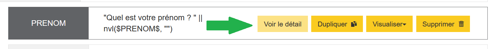
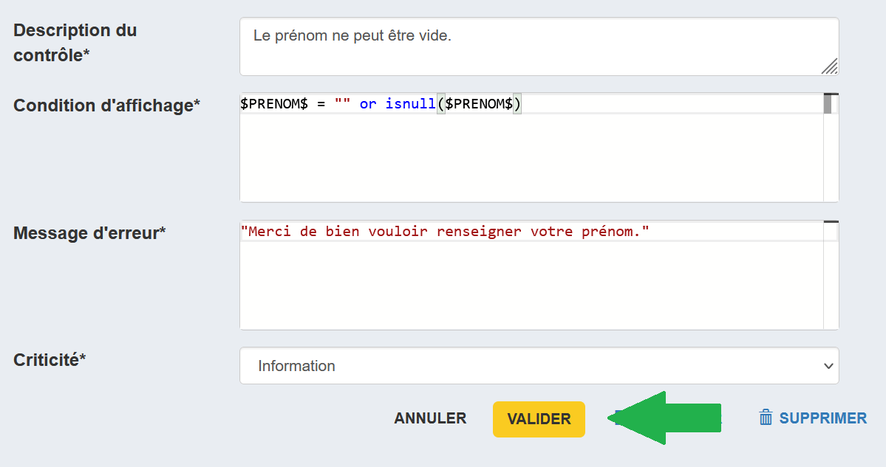
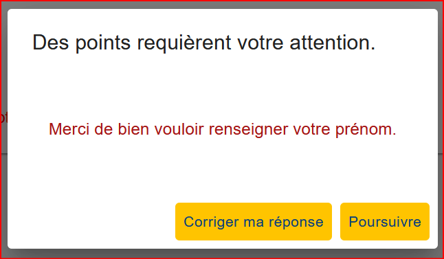

# Ajout d'un contrôle

On souhaite pouvoir s'assurer d'une bonne qualité de réponse aux différentes questions que l'on propose. Pour cela, on peut utiliser le mécanisme de contrôle inhérent aux outils de l'atelier.

!!!note

    Actuellement, seuls les contrôles de format - par exemple une valeur minimum dans un champ numérique - sont bloquants. Les contrôles de cohérence comme celui que l'on s'apprête à créer ne bloque pas le déroulement du questionnaire.

Ici, on va créer un contrôle affichant un message d'incitation si l'on ne donne pas son prénom.

Pour cela, on va modifier la question dont l'identifiant est PRENOM (en cliquant sur _Voir le détail).



On choisit ensuite l'onglet _Contrôles_.

Pour créer un contrôle, il faut remplir quatre champs :

- _Description du contrôle_ Un texte permettant de décrire le contrôle,
- _Condition d'affichage_ Une expression VTL qui déclenche le contrôle,
- _Message d'erreur_ Le texte qui s'affiche lorsque l'erreur est levée,
- _Criticité_ Un champ informatif sur le degré d'importance de l'erreur (actuellement n'a aucune incidence sur l'affichage).

On veut déclencher le contrôle en cas de non-réponse, on va tester dans notre cas :

- si l'on n'est jamais entré dans le champ de réponse (la variable est `null` au sens VTL),
- si l'on est entré dans le champ mais qu'on n'a rien saisi (la variable est égale à une chaîne de caractères vide, ou `""`).

L'expression VTL sera donc :

    ```vtl
    $PRENOM$ = "" or isnull($PRENOM$)
    ```

!!!note

    On notera l'utilisation de la fonction `isnull` qui permet de détecter si une variable n'a pas été valorisée (cf. guide VTL).

On aura une configuration sensiblement similaire à :point_down:



Lors du parcours du questionnaire, si vous ne remplissez pas la réponse à la question sur le prénom vous devriez voir apparaître le message du contrôle :


