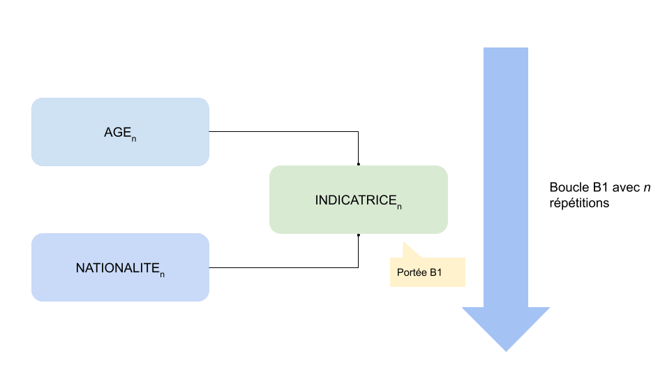

# Les boucles

Une boucle est une répétition d'un ensemble de séquences ou de sous-séquences du questionnaire.

On peut concevoir dans Pogues deux types de boucles :

1. des boucles qui s'appuient sur des valeurs (des nombres fixes ou issus de variables),
2. des boucles qui s'appuient sur une autre boucle ou sur un tableau, que l'on appelle une _boucle liée_.

Quel que soit son type, une boucle sera créée en cliquant dans la barre d'actions sur le bouton _+ Boucle_.

## Boucle sur valeurs

Pour créer une telle boucle, il faut remplir les champs suivants :

- _Identifiant_, par exemple B_LE_NOM_DE_MA_BOUCLE
- _Minimum_, la valeur minimum de répétition
- _Maximum_, la valeur maximum de répétition
- _Début_, l'élément par lequel commence la boucle (une séquence ou une sous-séquence donc)
- _Fin_, l'élément avec lequel termine la boucle - une séquence si on a commencé par une séquence, une sous-séquence dans l'autre cas.

## Boucle liée

Pour créer une boucle liée, je remplis :

- _Identifiant_, par exemple B_LE_NOM_DE_MA_BOUCLE
- _Basé sur_, en allant chercher une structure répétée, c'est-à-dire une boucle ou un tableau
- _Sauf_, permet d'exclure certaines répétitions de la boucle
- _Début_, l'élément par lequel commence la boucle (une séquence ou une sous-séquence donc)
- _Fin_, l'élément avec lequel termine la boucle - une séquence si on a commencé par une séquence, une sous-séquence dans l'autre cas.

!!! tip
    Un élément __important__ des boucles liées : si je crée une boucle B2 liée à une boucle B1, toutes les variables collectées dans les occurences de B1 seront disponibles lors des répétitions de B2.

## Portée des variables

Les variables calculées ou externes possédent un paramètre de _Portée_. A quoi cela correspond-il ?

Il s'agit de préciser si une variable est calculée ou injectée (dans le cas d'une variable externe) au sein d'une boucle.

Imaginons une boucle `B1` sur un ensemble de questions relatives à des individus. Je veux pouvoir pour chacun d'eux créer une indicatrice permettant de savoir si l'individu est dans le champs en vérifiant son âge (variable collectée `AGE`) et sa nationalité (`NATIONALITE`).

Pour cela, je crée une variable calculée `INDICATRICE` de portée `B1` dont la formule s'appuie pour chaque occurence de la boucle (chaque individu) sur les variables `AGE` et `NATIONALITE` (de chaque individu).



## Exclusion

Le champ _Sauf_ permet d'exclure dans une boucle liée certaines des répétitions.

En reprenant l'exmple du paragraphe précédent, on pourrait par exemple exclure les mineurs avec la formule VTL :

```vtl
AGE < 18
```

Ou mieux, exclure les individus hors champs en nous appuyant sur l'indicatrice calculée ! :smiley:
