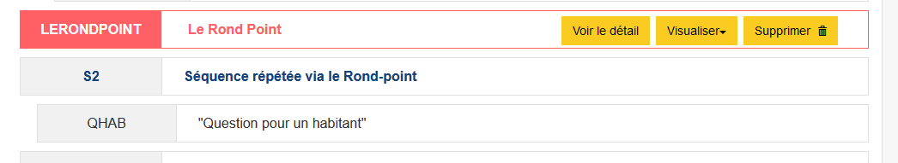
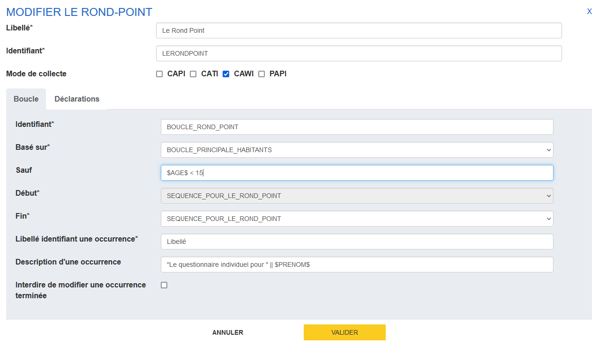
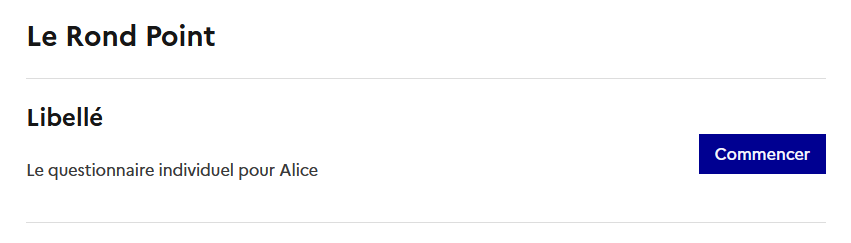

# Le Rond-point

:material-test-tube: Cette fonctionnalité est en cours de recette et sera déployée prochainement.

Le _Rond-point_ est un composant de questionnaire permettant d'organiser une navigation non-linéaire pour les séquences répétées.

Le cas typique d'utilisation est pour permettre la réponse non-ordonnée à des questionnaires individuels après le questionnement au niveau ménage. C'est cet exemple que nous allons dérouler dans la suite de ce document. Bien sûr, d'autres cas de figure sont possibles, par exemple pour la réponse à des questions de niveau "établissement" après avoir collecté des informations au niveau "entreprise".

## Anatomie du Rond-point

### Dans Pogues

Le Rond-point se matérialise dans la vision structurelle du questionnaire avant la ou les séquences sur laquelle il va permettre de naviguer.

Le Rond-point exploite une boucle principale (par exemple : collecte des informations sur les habitants) pour créer sa navigation non-linéaire. Les concepts mobilisés sont très proches de ceux mis en oeuvre pour [les boucles](24-boucles.md).

Pour ajouter un comportement de type _Rond-point_ dans Pogues:

1. il faut cliquer sur _+ Rond-point_ dans la barre des actions
2. dans la fenêtre modale qui s'ouvre, on donne un libellé et un identifiant (_NB_ le libellé sera affiché comme titre dans le questionnaire web)
3. l'onglet _Boucle_ va permettre de décrire ce qu'on propose à la réponse via le Rond-point, le fonctionnement est similaire à celui d'une boucle simple :point_down:
4. on donne un identifiant,
5. on définit [la boucle principale](24-boucles.md#boucle-liée) qu'on exploite
6. on peut ajouter dans _Sauf_ une formule pour exclure du questionnement - par exemple `$AGE$ < 18` pour exclure les mineurs (cf. plus bas)
7. les champs _Début_ et _Fin_ permettre de préciser quelles parties questionnaires sont à remplir à travers le Rond-point
8. _Libellé identifiant une occurrence_ permet d'afficher par exemple le prénom de l'habitant qui va répondre à un questionnaire individuel
9. _Description d'une occurrence_ permet d'ajouter un texte descriptif pour chaque item du Rond-point (cf. plus bas)
10. Enfin la dernière option, _Interdire de modifier une occurrence terminée_, si elle est cochée, empêchera de modifier une occurrence du Rond-point déjà remplie.

Voici un exemple de Rond-point finalisé dans Pogues:

#### Usage du Sauf

L'usage suit la même logique que pour les boucles : on utilise des variables, notamment des variables de boucles, pour permettre ou pas la réponse à une occurrence du Rond-point.

#### Usage de la description d'une occurrence

Ce champ va permettre de décrire chaque item, et pour ce faire on peut utiliser une expression VTL et des variables de boucle. Par exemple:

`"Le questionnaire individuel pour " || $PRENOM$`

donnera ce visuel:

### Dans le questionnaire web

!!!warning

    Le Rond-point est uniquement disponible pour l'orchestrateur web Stromae DSFR

...
