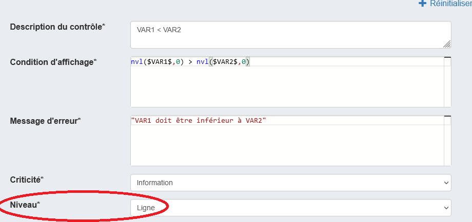

# Les tableaux dynamiques

On peut vouloir créer des tableaux dont on ne connait pas à l'avance le nombre de lignes (Tableau dynamique). Ces tableaux se présenteront : 

- sans en-tête de lignes en première colonne
- avec un bouton _Ajouter une ligne_ (sous le tableau)
- et un bouton _Supprimer une ligne_ (la dernière).

Pour ce faire, on créera une question de type Tableau avec pour axe principal une liste.

Axe d'information principal :  

- choisir Liste
- indiquer le nombre de lignes minimum (aujourd'hui un nombre, à terme un champ VTL)
- indiquer le nombre de lignes maximum (borné à 300).

Information(s) mesurée(s) : renseigner une information de type _Réponse simple_ ou _Réponse à choix unique_

Valider

## Calculer des totaux de lignes ou de colonnes

Ces totaux peuvent être ensuite utilisées dans deslibellés, des filtres ou des contrôles

- cf. [Total en ligne](https://inseefr.github.io/Bowie/pogues/Le%20guide/Tableaux/3-cases-non-collectees/#total-en-ligne)
- cf. [Total en colonne](https://inseefr.github.io/Bowie/pogues/Le%20guide/Tableaux/3-cases-non-collectees/#total-en-colonne)

## Contrôles

Dans l'onglet Contrôles, décrire classiquement le contrôle en VTL mais préciser son niveau : si le contrôle concerne les informations relatives à une ligne du tableau, préciser "Niveau : ligne"

## Préremplir un tableau avec des données non collectées

Pogues permet de préremplir certaines colonnes des tableaux dynamiques, que ce soit par de la donnée externe ou par des variables calculées. Ces colonnes ne sont alors pas modifiables en collecte.

[Spécifier des données collectées](https://inseefr.github.io/Bowie/pogues/Le%20guide/Tableaux/3-cases-non-collectees)

## Supprimer une ligne qui n'est pas la dernière

Impossible. 
